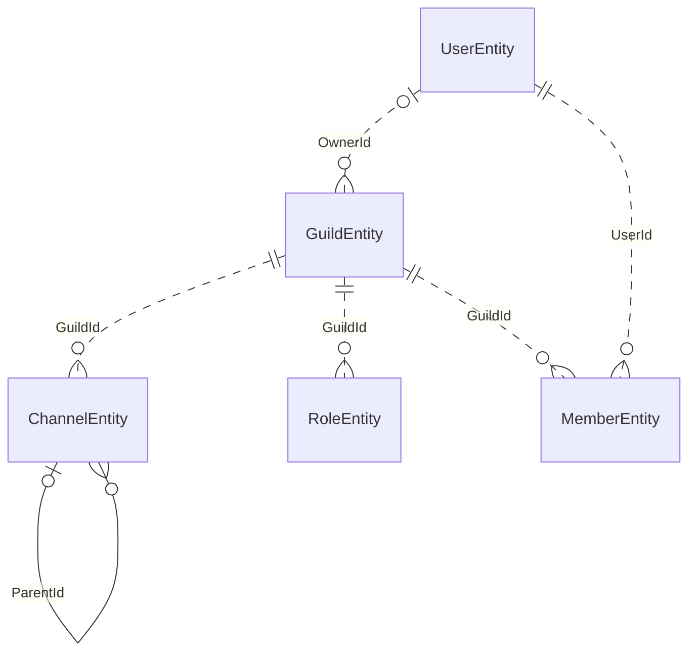

# Core Graph

`Persistord.Core` ships two abstract base contexts: `DiscordDbContext` for conventions only, and `DiscordGraphDbContext` for conventions plus a five-entity skeleton of Discord's object graph.

Derive whichever base class matches your context.

## DiscordDbContext

`DiscordDbContext` applies only Persistord's conventions and maps no entity types.
Derive it when your context owns its own resources and never mirrors Discord's
guild/channel/user/member/role graph:

```csharp
public sealed class MyBotContext : DiscordDbContext
{
    public MyBotContext(DbContextOptions<MyBotContext> options) : base(options) { }

    protected override void OnModelCreating(ModelBuilder modelBuilder)
    {
        base.OnModelCreating(modelBuilder);   // snowflake convention only
        // apply optional modules here
    }
}
```

`ConfigureConventions()` registers the `ulong ↔ long` snowflake converters
globally. See [Snowflake Conversion](snowflake-conversion.md).

## DiscordGraphDbContext

`DiscordGraphDbContext` derives from `DiscordDbContext` and adds the five
skeleton `DbSet`s. Derive it when your context mirrors Discord's guild, channel,
user, member and role objects:

```csharp
public sealed class MyBotContext : DiscordGraphDbContext
{
    public MyBotContext(DbContextOptions<MyBotContext> options) : base(options) { }

    protected override void OnModelCreating(ModelBuilder modelBuilder)
    {
        base.OnModelCreating(modelBuilder);   // core skeleton + snowflake convention
        // apply optional modules here
    }
}
```

The base implementation calls `ApplyCoreGraph()` (which wires the core entity
type configurations). Call `ApplyCoreGraph()` yourself from a plain
`DiscordDbContext` if you'd rather opt in without the extra base class.

Upgrading from `1.0.0-beta2`, where `DiscordDbContext` still mapped the skeleton? See [Upgrading](upgrading.md).

## Skeleton DbSets

`DiscordGraphDbContext` exposes these `DbSet`s directly — no declaration needed
in your derived class:

```csharp
public DbSet<GuildEntity>   Guilds   => Set<GuildEntity>();
public DbSet<ChannelEntity> Channels => Set<ChannelEntity>();
public DbSet<UserEntity>    Users    => Set<UserEntity>();
public DbSet<MemberEntity>  Members  => Set<MemberEntity>();
public DbSet<RoleEntity>    Roles    => Set<RoleEntity>();
```

## Relationships

A solid line is a foreign key the model configures; a dotted line is a snowflake id column that
refers to another entity with no foreign key. `ChannelEntity.ParentId` is the skeleton's only
foreign key.



## Entity shapes

All entities are plain POCOs. They carry no Discord client library types.

### GuildEntity

| Property | Type | Notes |
| --- | --- | --- |
| `Id` | `ulong` | Primary key, snowflake |
| `Name` | `string?` | Guild name, when the consumer mirrors it |
| `OwnerId` | `ulong?` | Snowflake of the guild owner, when the consumer mirrors it |
| `JoinedAt` | `DateTimeOffset?` | When the bot joined the guild, when the consumer records it |
| `LeftAt` | `DateTimeOffset?` | When the bot left, or was removed from, the guild; `null` means still in it |

`GuildEntity` is the tenant root every `IGuildScoped` row hangs off. `Name` and
`OwnerId` are now optional — a bot that owns resources rather than mirroring
Discord can store just an id and the lifecycle stamps. Call
`ApplyGuildRoot(cascade, filterLeftGuilds)` last in `OnModelCreating` to
register the root: with `cascade: true` (the default) it adds a cascading
foreign key from every `IGuildScoped` entity's `GuildId` to the guild row, so
deleting a guild deletes everything scoped to it and the guild row becomes a
prerequisite for scoped rows; pass `cascade: false` when scoped rows may
outlive their guild row. `filterLeftGuilds: true` adds a global query filter
that hides guilds with a non-null `LeftAt` from ordinary queries (use
`IgnoreQueryFilters()` to see them).

> [!IMPORTANT]
> None of the five skeleton entities below implements `IGuildScoped`. This is deliberate —
> marking them would move an existing consumer's migrations — and a consumer cannot retrofit the
> interface onto Persistord's own types. The practical effect: `ApplyGuildRoot` wires no cascading
> foreign key for `ChannelEntity`, `UserEntity`, `MemberEntity` or `RoleEntity`, and
> `PurgeGuildAsync` does not delete them. A consumer who mirrors Discord's graph and wants those
> rows purged with their guild must delete them itself.

### ChannelEntity

| Property | Type | Notes |
| --- | --- | --- |
| `Id` | `ulong` | Primary key, snowflake |
| `GuildId` | `ulong` | Indexed, not a foreign key — see [GuildEntity](#guildentity) above |
| `ParentId` | `ulong?` | Nullable self-referencing FK — categories own channels, channels own threads |
| `Type` | enum | Channel kind: `Text`, `Voice`, `Category` or `Thread` |
| `Name` | `string` | Channel name |

`Type` is a plain enum column holding the channel's kind; there is no subclass per kind. The
self-referencing `ParentId` models the category → channel → thread hierarchy.

### UserEntity

| Property | Type | Notes |
| --- | --- | --- |
| `Id` | `ulong` | Primary key, snowflake |
| `Username` | `string` | Discord username |
| `GlobalName` | `string?` | Display name (distinct from per-guild nickname) |

### MemberEntity

| Property | Type | Notes |
| --- | --- | --- |
| `GuildId` | `ulong` | Part of composite primary key |
| `UserId` | `ulong` | Part of composite primary key |
| `Nickname` | `string?` | Guild-specific nickname |
| `JoinedAt` | `DateTimeOffset?` | When the member joined the guild |

`MemberEntity` uses a composite primary key `(GuildId, UserId)`.

### RoleEntity

| Property | Type | Notes |
| --- | --- | --- |
| `Id` | `ulong` | Primary key, snowflake |
| `GuildId` | `ulong` | Indexed, not a foreign key — see [GuildEntity](#guildentity) above |
| `Name` | `string` | Role name |
| `Permissions` | `ulong` | Discord permission bitfield |
| `Color` | `int` | Role color as an integer |

## See also

- [Snowflake Conversion](snowflake-conversion.md) — how `ulong` IDs are stored as `long`.
- [Messages](messages.md) — the `MessageEntity` module that builds on the core graph.
- [Guild Lifecycle](guild-lifecycle.md) — `ApplyGuildRoot` and `PurgeGuildAsync` in a bot's event handlers.
- [Upgrading](upgrading.md) — what changed for the skeleton since `1.0.0-beta2`.
