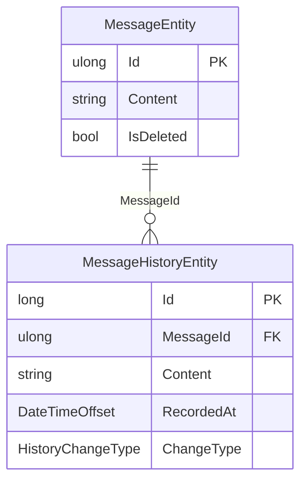

# History

`Persistord.History` records every change to a message as a new, full-content row.

It depends on `Persistord.Messages` and therefore `Persistord.Core`.

Apply both modules in `OnModelCreating` — the history module requires the messages
table to be present:

```csharp
protected override void OnModelCreating(ModelBuilder modelBuilder)
{
    base.OnModelCreating(modelBuilder);
    modelBuilder.ApplyMessagesModule();   // required: history has a real FK to messages
    modelBuilder.ApplyHistoryModule();
}
```

Then expose the `DbSet` on your derived context:

```csharp
public DbSet<MessageHistoryEntity> MessageHistory => Set<MessageHistoryEntity>();
```

## What it records

Every change to a message is appended as a new row. Each row is a **full content
snapshot** at that point in time — not a diff. The row is tagged with:

- `HistoryChangeType` — one of `Created`, `Edited`, or `Deleted`.
- `RecordedAt` — the timestamp when the change was recorded.

Rows are indexed on `(MessageId, RecordedAt)` for efficient chronological lookups.

## MessageHistoryEntity shape

```csharp
public class MessageHistoryEntity
{
    public long Id { get; set; }                     // surrogate PK
    public ulong MessageId { get; set; }             // FK → MessageEntity.Id
    public string? Content { get; set; }             // full snapshot at this point
    public DateTimeOffset RecordedAt { get; set; }
    public HistoryChangeType ChangeType { get; set; }
}

public enum HistoryChangeType { Created, Edited, Deleted }
```

## Relationship to messages

`MessageHistoryEntity` holds a **real foreign key** to `MessageEntity` configured
with `DeleteBehavior.Restrict`. Because messages are soft-deleted (see
[Soft-delete & Query Filters](soft-delete-and-query-filters.md)), the parent row is
never physically removed from the database. History rows — including the row that
logs the deletion — always keep a valid reference.



> [!IMPORTANT]
> History requires the Messages table to be persisted. It is not a standalone audit log: call
> `ApplyMessagesModule()` whenever you call `ApplyHistoryModule()`, because the history foreign key
> points at the messages table.

## See also

- [Messages](messages.md) — `MessageEntity` shape and the modules `History` builds on.
- [Soft-delete & Query Filters](soft-delete-and-query-filters.md) — why soft-delete
  is required to keep the history FK valid.
