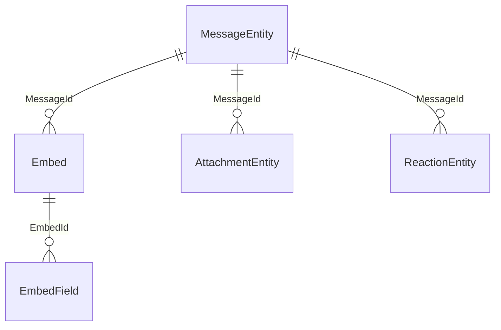

# Messages

`Persistord.Messages` adds `MessageEntity` and its embeds, attachments and reactions to your context.

Apply the module in `OnModelCreating`:

```csharp
protected override void OnModelCreating(ModelBuilder modelBuilder)
{
    base.OnModelCreating(modelBuilder);   // DiscordDbContext maps nothing; see ConfigureConventions
    modelBuilder.ApplyMessagesModule();   // messages, embeds, attachments, reactions
}
```

Then expose the `DbSet` on your derived context:

```csharp
public DbSet<MessageEntity> Messages => Set<MessageEntity>();
```

## MessageEntity shape

```csharp
public class MessageEntity
{
    public ulong Id { get; set; }                 // PK, snowflake
    public ulong ChannelId { get; set; }
    public ulong AuthorId { get; set; }
    public string? Content { get; set; }
    public DateTimeOffset? EditedAt { get; set; }

    // Soft-delete
    public bool IsDeleted { get; set; }
    public DateTimeOffset? DeletedAt { get; set; }

    public List<Embed> Embeds { get; } = [];
    public List<AttachmentEntity> Attachments { get; } = [];
    public List<ReactionEntity> Reactions { get; } = [];
}
```

## Embeds are relational

`Embed` is an entity of its own: an EF-generated `long Id` and a `MessageId` foreign key back to
its message, in the `Embed` table. Its `EmbedFooter` and `EmbedAuthor` are owned types, stored as
columns of the embed's own row, and its `EmbedField`s are a relational child with their own
EF-generated key, in the `EmbedField` table.

This keeps the model portable across every provider, SQLite included.



Every line is a foreign key `ApplyMessagesModule()` configures; each cascades from its parent.

### Embed model

```csharp
public class Embed
{
    public long Id { get; set; }                  // EF-generated
    public ulong MessageId { get; set; }          // FK → MessageEntity.Id
    public string? Title { get; set; }
    public string? Description { get; set; }
    public int? Color { get; set; }
    public EmbedFooter? Footer { get; set; }   // owned
    public EmbedAuthor? Author { get; set; }   // owned
    public List<EmbedField> Fields { get; } = [];
}
```

> [!NOTE]
> Mapping `Embeds` as a JSON column is not supported. `ApplyMessagesModule()` configures `Embed` as
> a keyed entity, and EF Core rejects reconfiguring it as owned (`OwnsMany(...).ToJson()`) with an
> `InvalidOperationException`.

## Attachments and reactions

`AttachmentEntity` and `ReactionEntity` are relational children of `MessageEntity`.

- `AttachmentEntity.Id` is the **caller-supplied Discord snowflake** — never
  store-generated. You set it from the attachment's ID in the gateway event.
- `ReactionEntity.Id` is a **surrogate key** generated by EF Core.

Both carry a `MessageId` foreign key back to the parent `MessageEntity`.

## See also

- [Soft-delete & Query Filters](soft-delete-and-query-filters.md) — how soft-delete
  works and how to read deleted messages.
- [History](history.md) — the append-only history module that builds on `MessageEntity`.
- [Recipes](recipes.md#log-a-message-create-edit-and-delete) — logging a message's create, edit and delete.
