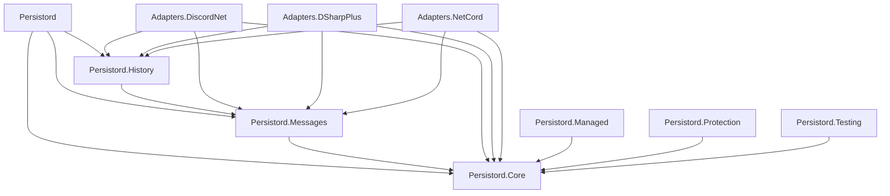

# Packages

Persistord ships ten NuGet packages: a meta package, three packages that make up
the library-neutral mirror stack it bundles, three Discord-library adapters, and
three opt-in packages installed separately. This page lists what each one adds,
what it depends on, how the packages fit together, and how to decide which ones
your bot needs.

## The matrix

| Package | Adds | Depends on |
| --- | --- | --- |
| [`Persistord`](../../src/Persistord/README.md) ([NuGet](https://www.nuget.org/packages/Persistord)) | meta package — bundles Core, Messages, and History | Core, Messages, History |
| [`Persistord.Core`](../../src/Persistord.Core/README.md) ([NuGet](https://www.nuget.org/packages/Persistord.Core)) | snowflake conversion, base `DiscordDbContext`, opt-in skeleton graph (`DiscordGraphDbContext`), guild root, upsert, purge | — |
| [`Persistord.Messages`](../../src/Persistord.Messages/README.md) ([NuGet](https://www.nuget.org/packages/Persistord.Messages)) | `MessageEntity` (soft-delete), embeds, attachments, reactions | Core |
| [`Persistord.History`](../../src/Persistord.History/README.md) ([NuGet](https://www.nuget.org/packages/Persistord.History)) | append-only `MessageHistoryEntity` with a real FK to messages | Messages |
| [`Persistord.Adapters.DiscordNet`](../../src/Persistord.Adapters.DiscordNet/README.md) ([NuGet](https://www.nuget.org/packages/Persistord.Adapters.DiscordNet)) | `.To*Entity()` mappers from [Discord.Net](https://github.com/discord-net/Discord.Net) types | Core, Messages, History |
| [`Persistord.Adapters.DSharpPlus`](../../src/Persistord.Adapters.DSharpPlus/README.md) ([NuGet](https://www.nuget.org/packages/Persistord.Adapters.DSharpPlus)) | `.To*Entity()` mappers from [DSharpPlus](https://github.com/DSharpPlus/DSharpPlus) types | Core, Messages, History |
| [`Persistord.Adapters.NetCord`](../../src/Persistord.Adapters.NetCord/README.md) ([NuGet](https://www.nuget.org/packages/Persistord.Adapters.NetCord)) | `.To*Entity()` mappers from [NetCord](https://netcord.dev) types | Core, Messages, History |
| [`Persistord.Managed`](../../src/Persistord.Managed/README.md) ([NuGet](https://www.nuget.org/packages/Persistord.Managed)) | records of the categories, channels, anchored messages, and webhooks a bot creates and owns | Core |
| [`Persistord.Protection`](../../src/Persistord.Protection/README.md) ([NuGet](https://www.nuget.org/packages/Persistord.Protection)) | encrypts `[Protected]` string columns at rest via ASP.NET Core Data Protection | Core |
| [`Persistord.Testing`](../../src/Persistord.Testing/README.md) ([NuGet](https://www.nuget.org/packages/Persistord.Testing)) | in-memory SQLite fixtures and EF Core model assertions for tests | Core |

The core packages are independent of any Discord client library. Install an
adapter **only** if you use that library — `Persistord.Adapters.DiscordNet` for
Discord.Net, `Persistord.Adapters.DSharpPlus` for DSharpPlus,
`Persistord.Adapters.NetCord` for NetCord.

## Dependency graph

`Persistord.Core` sits at the root — every other package depends on it, directly
or transitively — and depends on nothing itself. `Messages` depends on `Core`;
`History` depends on `Messages` (not directly on `Core`); each adapter depends on
all three of `Core`, `Messages`, and `History`, since a mapper needs all three
entity sets to produce. `Managed`, `Protection`, and `Testing` each depend on
`Core` alone, independently of the `Messages`/`History` chain and of each other.

## Which packages do you need?

Start from `Persistord`, the meta package — it gives you the library-neutral
mirror stack (`Core`, `Messages`, `History`) in one reference, and is the
recommended starting point for most bots. From there:

- **Add exactly one adapter** if you use a Discord client library:
  `Persistord.Adapters.DiscordNet` for Discord.Net,
  `Persistord.Adapters.DSharpPlus` for DSharpPlus, or
  `Persistord.Adapters.NetCord` for NetCord. See
  [Choosing an Adapter](adapters.md) if you're unsure which.
- **Add `Persistord.Managed`** if your bot *owns* Discord resources —
  creates categories, channels, anchored messages, or webhooks — rather than
  only mirroring resources Discord itself owns.
- **Add `Persistord.Protection`** if you store secrets in a column and want
  them encrypted at rest.
- **Add `Persistord.Testing`** in test projects only, for in-memory SQLite
  fixtures and model assertions.

## Why three packages stay out of the meta package

`Persistord.Managed`, `Persistord.Protection`, and `Persistord.Testing` are
opt-in and deliberately **not** part of the `Persistord` meta package: a bot
that only mirrors Discord never owns resources, encrypts a column, or needs
test fixtures. The meta package stays the library-neutral mirror stack (Core,
Messages, History) and nothing more — this is a deliberate decision recorded
in the root [README](https://github.com/HandyS11/Persistord#packages), not an
oversight or a package left off a future roadmap.

## See also

- [Introduction](introduction.md#packages) — a prose walkthrough of the same
  ten packages.
- [Getting Started](getting-started.md) — installing Persistord and writing
  your first records.
- [Choosing an Adapter](adapters.md) — comparing the three Discord-library
  adapters in depth.
