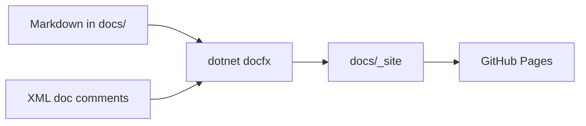
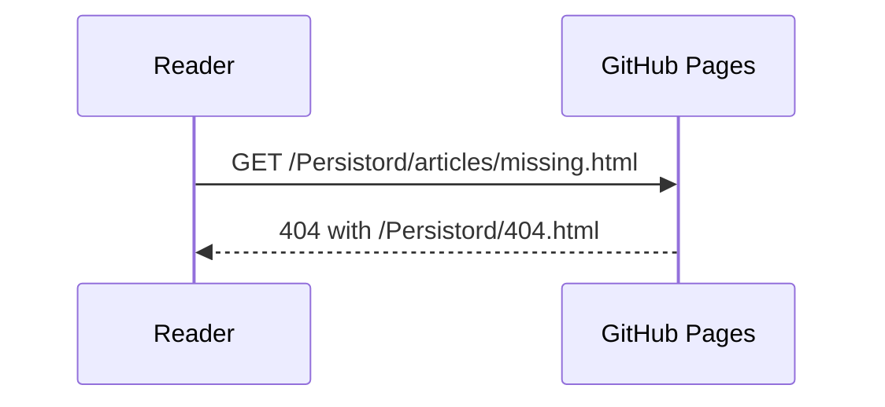
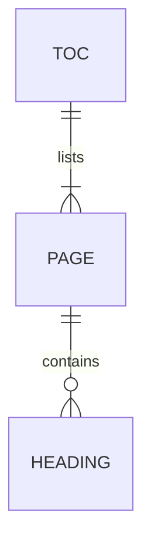

# Component Reference

This page shows each component the Persistord theme styles, with the Markdown that produces it.
It is also the page `docs/tools/site-check` uses to verify the theme, so keep every component on it.

## Headings

Articles use `##` for sections, `###` for subsections, and `####` sparingly. The page title is the
only `#`.

### A third-level heading

Subsections sit under a section and appear indented in the "In this article" rail.

#### A fourth-level heading

Use a fourth level only for short labelled groups inside a subsection.

## Inline elements

Body text carries `inline code` for identifiers such as `DiscordGraphDbContext`, and
[links to other guides](../articles/getting-started.md). Long signatures in inline code wrap without
breaking their tint: `public static Task<TEntity> UpsertAsync<TEntity>(this DbSet<TEntity> set, Expression<Func<TEntity, bool>> naturalKey, Func<TEntity> create, Action<TEntity> update, CancellationToken cancellationToken = default)`.

## Code blocks

Fence code with a language so it is highlighted and labelled:

```csharp
public sealed class MyBotContext : DiscordGraphDbContext
{
    public MyBotContext(DbContextOptions<MyBotContext> options) : base(options) { }

    public DbSet<MessageEntity> Messages => Set<MessageEntity>();

    protected override void OnModelCreating(ModelBuilder modelBuilder)
    {
        base.OnModelCreating(modelBuilder);   // core skeleton + snowflake convention
        modelBuilder.ApplyMessagesModule();   // omit if you don't persist messages
    }
}
```

```json
{
  "Database": {
    "Provider": "PostgreSQL",
    "Host": "localhost",
    "Port": 5432
  }
}
```

```bash
dotnet add package Persistord
dotnet ef migrations add Initial
```

API pages are generated from XML doc comments, so public members carry them:

```csharp
/// <summary>Renamed to <see cref="ApplyCoreGraph"/>.</summary>
[Obsolete("Renamed to ApplyCoreGraph. This forwarder is kept for one release and will be removed.")]
public static ModelBuilder ApplyCoreConfiguration(this ModelBuilder modelBuilder) =>
    modelBuilder.ApplyCoreGraph();
```

## Lists

Use a bulleted list for parallel items, and a numbered list only when the order matters.

```markdown
- Guilds, channels, and roles
- Members and users

1. Add the package.
2. Derive your context from `DiscordGraphDbContext`.
```

- Guilds, channels, and roles
- Members and users

1. Add the package.
2. Derive your context from `DiscordGraphDbContext`.

## Callouts

Use a callout only for text that is already a note or a warning, and at most about two per page.

```markdown
> [!NOTE]
> Supporting information the reader may skip.
```

> [!NOTE]
> Supporting information the reader may skip.

<!-- -->

> [!TIP]
> A better way to do what the page describes.

<!-- -->

> [!IMPORTANT]
> Something the reader must know to succeed.

<!-- -->

> [!WARNING]
> Something that will go wrong if ignored.

<!-- -->

> [!CAUTION]
> Something that risks data loss or a security problem.

## Tabs

Use tabs only when the reader picks exactly one option. Reuse tab ids across pages so a reader's
choice carries over.

```markdown
# [PostgreSQL](#tab/postgresql)

Content for PostgreSQL.

# [SQLite](#tab/sqlite)

Content for SQLite.

---
```

# [PostgreSQL](#tab/postgresql)

```bash
dotnet add package Npgsql.EntityFrameworkCore.PostgreSQL
```

# [SQL Server](#tab/sqlserver)

```bash
dotnet add package Microsoft.EntityFrameworkCore.SqlServer
```

# [SQLite](#tab/sqlite)

```bash
dotnet add package Microsoft.EntityFrameworkCore.Sqlite
```

---

## Tables

| Component | Markdown | Use it for |
| --- | --- | --- |
| Callout | `> [!NOTE]` | An existing note or warning |
| Tabs | `# [Label](#tab/id)` | One choice among alternatives |
| Diagram | a `mermaid` fence | Relationships and sequences |

## Diagrams

Mermaid diagrams follow the light and dark themes automatically.







## Quotations

> Quote external sources sparingly; prefer a link and a one-line summary.
