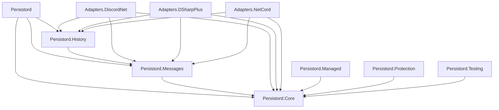

# Documentation Site Theme and Content Expansion — Implementation Plan

> **For agentic workers:** REQUIRED SUB-SKILL: Use superpowers:subagent-driven-development (recommended) or superpowers:executing-plans to implement this plan task-by-task. Steps use checkbox (`- [ ]`) syntax for tracking.

**Goal:** Give Persistord a custom DocFX theme derived from `icon.png` and close the documentation gaps, so every shipped package has a guide and the site reads as a sibling of RustPlusApi, RustMapsApi, DotnetTokenKiller, and ProjGraph.

**Architecture:** A layered override template (`docs/templates/persistord`) appended after DocFX's `default` and `modern` templates. It overrides only Bootstrap custom properties (`--bs-*`) and documented DocFX selectors, and uses only DocFX's documented `main.js` extension points, so a DocFX upgrade cannot break it through an undocumented seam. Content is expanded in place — no existing article body is rewritten.

**Tech Stack:** DocFX 2.78.5 (via `dotnet tool restore`), Bootstrap 5 custom properties (supplied by the `modern` template), vanilla ES modules, self-hosted Inter and JetBrains Mono woff2.

**Spec:** `docs/superpowers/specs/2026-09-10-docs-site-theme-design.md`

## Global Constraints

- **Never reach outside the documented API.** CSS overrides `--bs-*` custom properties and documented DocFX selectors only. `main.js` uses only `defaultTheme`, `iconLinks`, `mermaid`, and `start`.
- **No third-party origin at page load.** Fonts are vendored and committed. No `@import` or `<link>` to a CDN in the built site.
- **The colour rule:** violet marks *persisted* things (rows, columns, keys, migrations, anything reaching the database). Lavender marks *Discord* things (gateway payloads, snowflake ids, events). Anything else is chrome, and chrome is never accented.
- **Both themes are designed, not derived.** Light mode is cool paper with violet darkened to hold contrast on white — never a mechanical inversion of the dark ramp.
- **Brand colours, sampled from `icon.png`:** ink `#181a27`, violet `#3d26b8` / `#4635c2`, mid-violet `#8685f4`, pale lavender `#e0dfff`.
- **Motion budget:** exactly one non-user-triggered animation on the entire site (the landing page snowflake), wrapped in `prefers-reduced-motion: reduce`.
- **Repository facts:** repo `https://github.com/HandyS11/Persistord`, default branch `develop`, licence MIT, 10 published packages, DocFX config at `docs/docfx.json`.
- **Do not modify** `.github/workflows/Documentation.yml`. It already runs `dotnet docfx docs/docfx.json`.
- **Do not rewrite** the 19 existing article bodies. They gain cross-links and TOC regrouping only.
- **Verify every documented signature against source.** No method signature, source type, or version range may be written from memory.
- Markdown lint config (`.markdownlint.json`) already sets `MD013: false`, `MD033: false`, `MD041: false`, so long lines and inline HTML are permitted.

---

## File Structure

**Created:**

| Path | Responsibility |
| --- | --- |
| `docs/templates/persistord/public/main.css` | All theme styling: tokens, base elements, landing components |
| `docs/templates/persistord/public/main.js` | Theme default, icon links, Mermaid config, copy buttons |
| `docs/templates/persistord/public/fonts/*.woff2` | Five vendored faces |
| `docs/packages/toc.yml` | Navigation into the ten package READMEs |
| `docs/samples/toc.yml` | Navigation into `samples/README.md` |
| `docs/api/index.md` | API reference landing page (tracked; siblings are generated) |
| `docs/license.md` | MIT text, linked from the footer |
| `docs/articles/adapters.md` | Adapter overview and cross-library comparison |
| `docs/articles/dsharpplus-adapter.md` | DSharpPlus guide |
| `docs/articles/netcord-adapter.md` | NetCord guide |
| `docs/articles/packages.md` | Package matrix, dependency graph, install decision guide |

**Modified:**

| Path | Change |
| --- | --- |
| `docs/docfx.json` | Template list, resource entry, content entries, global metadata |
| `docs/toc.yml` | Five top-level tabs |
| `docs/articles/toc.yml` | Adapters group, `packages.md` entry, emoji headings |
| `docs/index.md` | Replaced with a `layout: landing` page |
| `.gitignore` | `docs/api/` → `docs/api/*` plus a negation |
| `src/Persistord.Core/Interception/TimestampInterceptor.cs` | Two XML doc comments (comment text only) |

---

## Task 1: Make the build warning-clean and gate it

The whole plan's safety net is `--warningsAsErrors`. It cannot be switched on while the build emits pre-existing warnings, so this comes first.

**Files:**
- Modify: `src/Persistord.Core/Interception/TimestampInterceptor.cs:31` and `:41`
- Modify: `docs/docfx.json` (remove the dead `images/**` resource glob)

**Interfaces:**
- Consumes: nothing.
- Produces: a warning-clean `dotnet docfx docs/docfx.json --warningsAsErrors` that every later task uses as its check.

- [ ] **Step 1: Establish the failing check**

Run: `dotnet tool restore && dotnet docfx docs/docfx.json --warningsAsErrors`

Expected: FAILS. Two `InvalidCref` warnings for `"O:DbContext.SaveChanges"` and `"O:DbContext.SaveChangesAsync"`, plus `No files are found with glob pattern images/**`.

Background, so you do not go looking for a typo: **the invalid cref is not in this repository.** Both members carry `/// <inheritdoc />`. EF Core 10.0.0 ships `<see cref="O:DbContext.SaveChanges" />` inside `ISaveChangesInterceptor.SavingChanges`, and `<inheritdoc />` pulls it in through the chain. Confirm for yourself if you like:

```bash
grep -n 'O:DbContext.SaveChanges' \
  ~/.nuget/packages/microsoft.entityframeworkcore/10.0.0/lib/net10.0/Microsoft.EntityFrameworkCore.xml
```

The only fix available is to stop inheriting the broken documentation.

- [ ] **Step 2: Replace the inherited docs on both members**

In `src/Persistord.Core/Interception/TimestampInterceptor.cs`, replace the `/// <inheritdoc />` above `SavingChanges` with:

```csharp
    /// <summary>
    /// Stamps timestamps on tracked entities at the start of a synchronous save.
    /// </summary>
    /// <param name="eventData">Contextual information about the context being saved.</param>
    /// <param name="result">The current interception result, passed through unchanged.</param>
    /// <returns>The <paramref name="result" /> value passed in; this interceptor never suppresses the save.</returns>
```

And the `/// <inheritdoc />` above `SavingChangesAsync` with:

```csharp
    /// <summary>
    /// Stamps timestamps on tracked entities at the start of an asynchronous save.
    /// </summary>
    /// <param name="eventData">Contextual information about the context being saved.</param>
    /// <param name="result">The current interception result, passed through unchanged.</param>
    /// <param name="cancellationToken">A token to observe while waiting for the save to complete.</param>
    /// <returns>The <paramref name="result" /> value passed in; this interceptor never suppresses the save.</returns>
```

This is a strict improvement to the published reference: those members currently render EF Core's generic interceptor prose, which says nothing about stamping timestamps.

- [ ] **Step 3: Remove the dead resource glob**

In `docs/docfx.json`, delete the `resource` array's only entry (`{ "files": [ "images/**" ] }`), leaving `"resource": []` for now. Task 2 replaces it with the real one.

- [ ] **Step 4: Verify the check now passes**

Run: `dotnet docfx docs/docfx.json --warningsAsErrors`
Expected: PASS, `0 warning(s)  0 error(s)`.

- [ ] **Step 5: Confirm no library behaviour changed**

Run: `dotnet test tests/Persistord.Core.Tests`
Expected: PASS. Only comment text was edited, so any failure here means something else was touched.

- [ ] **Step 6: Commit**

```bash
git add src/Persistord.Core/Interception/TimestampInterceptor.cs docs/docfx.json
git commit -m "docs: make the docfx build warning-clean

EF Core 10 ships an unresolvable O: cref in ISaveChangesInterceptor, which
<inheritdoc /> pulled into TimestampInterceptor. Documents both overrides
explicitly instead, and drops a resource glob matching nothing, so the build
can be gated with --warningsAsErrors."
```

---

## Task 2: Theme skeleton and DocFX wiring

Gets the template loading and the brand assets on the page, before any styling opinion.

**Files:**
- Create: `docs/templates/persistord/public/main.css` (minimal marker only)
- Create: `docs/templates/persistord/public/main.js`
- Create: `docs/templates/persistord/public/fonts/` (five `.woff2`)
- Modify: `docs/docfx.json`

**Interfaces:**
- Consumes: Task 1's warning-clean build.
- Produces: `--pd-*` token namespace reserved in `main.css`; `.pd-copy` button contract wired in `main.js` (a button whose `parentElement` contains a `<code>`), consumed by Task 7's install strips.

- [ ] **Step 1: Vendor the fonts**

```bash
mkdir -p docs/templates/persistord/public/fonts
cd docs/templates/persistord/public/fonts
for f in inter@latest/latin-400-normal inter@latest/latin-600-normal \
         inter@latest/latin-700-normal jetbrains-mono@latest/latin-400-normal \
         jetbrains-mono@latest/latin-700-normal; do
  out=$(echo "$f" | sed 's|@latest/|-|').woff2
  curl -sSLf "https://cdn.jsdelivr.net/fontsource/fonts/$f.woff2" -o "$out"
done
ls -la
```

Expected: five files — `inter-latin-400-normal.woff2`, `inter-latin-600-normal.woff2`, `inter-latin-700-normal.woff2`, `jetbrains-mono-latin-400-normal.woff2`, `jetbrains-mono-latin-700-normal.woff2` — roughly 21–25 KB each, ~115 KB total. A zero-byte file means the CDN path is wrong; do not proceed with one.

- [ ] **Step 2: Write a marker stylesheet**

`docs/templates/persistord/public/main.css` — just enough to prove the template loads. Task 3 replaces the body of this file.

```css
/*
 * Persistord documentation theme.
 *
 * Layered on top of docfx's `default` + `modern` templates. Overrides stay on
 * Bootstrap custom properties (`--bs-*`) and documented docfx selectors so a
 * docfx upgrade shifts as little as possible underneath us.
 */

:root {
  --pd-theme-loaded: 1;
}
```

- [ ] **Step 3: Write the theme behaviour**

`docs/templates/persistord/public/main.js`:

```js
/*
 * Persistord documentation theme behaviour.
 *
 * Uses only docfx's documented `main.js` extension points (`defaultTheme`,
 * `iconLinks`, `mermaid`, `start`) so a docfx upgrade does not break it.
 */

const COPY_SHORTCUT = /Mac|iPhone|iPad/.test(navigator.userAgent)
  ? '⌘C'
  : 'Ctrl+C'

/**
 * Puts a node's text under the user's selection, ready for a manual copy.
 * Returns whether the selection was actually made, so the caller can avoid
 * telling the user to press a copy shortcut over an empty selection.
 */
function selectContents(node) {
  /* getSelection() is null when the window has no associated document. */
  const selection = window.getSelection()
  if (!selection) {
    return false
  }

  const range = document.createRange()
  range.selectNodeContents(node)
  selection.removeAllRanges()
  selection.addRange(range)
  return true
}

/** Copies the adjacent command, then reports the result on the button itself. */
function wireCopyButtons() {
  for (const button of document.querySelectorAll('.pd-copy')) {
    const code = button.parentElement?.querySelector('code')
    if (!code) {
      continue
    }

    const label = button.textContent
    let revertTimer

    /* Every outcome reverts to the original label, so the button can never be
       left showing a stale message. */
    const report = (message, copied, revertAfterMs) => {
      clearTimeout(revertTimer)
      button.textContent = message
      button.dataset.copied = copied
      revertTimer = setTimeout(() => {
        button.textContent = label
        button.dataset.copied = 'false'
      }, revertAfterMs)
    }

    button.addEventListener('click', async () => {
      try {
        await navigator.clipboard.writeText(code.textContent.trim())
        report('Copied', 'true', 1600)
      } catch {
        /* Clipboard access can be refused - over plain HTTP, or by permission.
           Select the command first so the shortcut has something to act on, and
           fall back to asking for a manual selection when even that is
           unavailable. Either way the button reports something. */
        const selected = selectContents(code)
        report(
          selected ? `Press ${COPY_SHORTCUT}` : 'Select to copy',
          'false',
          4000
        )
      }
    })
  }
}

export default {
  defaultTheme: 'dark',

  /* docfx merges this over its own `{ startOnLoad, theme }`, picking the base
     theme from the current light/dark setting. Only theme-agnostic values are
     set here: anything with a fixed lightness would be wrong in one of the two
     themes, so surfaces and text are left to mermaid's own ramp. */
  mermaid: {
    fontFamily:
      "'Persistord Mono', ui-monospace, 'SFMono-Regular', Consolas, monospace",
  },

  iconLinks: [
    {
      icon: 'github',
      href: 'https://github.com/HandyS11/Persistord',
      title: 'Source on GitHub',
    },
    {
      icon: 'box-seam',
      href: 'https://www.nuget.org/packages/Persistord',
      title: 'Package on NuGet',
    },
  ],

  start: () => {
    if (document.readyState === 'loading') {
      document.addEventListener('DOMContentLoaded', wireCopyButtons, {
        once: true,
      })
    } else {
      wireCopyButtons()
    }
  },
}
```

- [ ] **Step 4: Wire the template into DocFX**

In `docs/docfx.json`, set `build.template` to `[ "default", "modern", "templates/persistord" ]`, restore `build.resource` to pull the icon from the repo root, and extend `build.globalMetadata`:

```json
    "resource": [
      { "src": "..", "files": [ "icon.png" ] }
    ],
    "output": "_site",
    "template": [ "default", "modern", "templates/persistord" ],
    "globalMetadata": {
      "_appName": "Persistord",
      "_appTitle": "Persistord",
      "_appLogoPath": "icon.png",
      "_appFaviconPath": "icon.png",
      "_appFooter": "<div class=\"pd-footer\"><span>Persistord &mdash; the EF Core model your Discord bot keeps rewriting</span><nav><a href=\"https://github.com/HandyS11/Persistord\">GitHub</a><a href=\"https://www.nuget.org/packages/Persistord\">NuGet</a><a href=\"https://github.com/HandyS11/Persistord/releases\">Releases</a><a href=\"https://github.com/HandyS11/Persistord/blob/develop/LICENSE\">MIT licence</a></nav></div>",
      "_enableSearch": true,
      "pdf": false,
      "_gitContribute": {
        "repo": "https://github.com/HandyS11/Persistord",
        "branch": "develop"
      }
    }
```

- [ ] **Step 5: Verify the assets ship and the chrome renders**

```bash
dotnet docfx docs/docfx.json --warningsAsErrors
ls docs/_site/public/main.css docs/_site/public/main.js docs/_site/public/fonts/
ls docs/_site/icon.png
grep -c 'pd-footer' docs/_site/index.html
grep -o 'blob/develop[^"]*' docs/_site/articles/getting-started.html | head -1
```

Expected: build passes; `main.css`, `main.js`, and five font files present under `_site/public/`; `icon.png` at the site root; `pd-footer` appears in `index.html`; an `Edit this page` href resolving under `blob/develop`.

- [ ] **Step 6: Confirm no third-party origin crept in**

```bash
grep -rEo 'https?://[^"'"'"')]*' docs/_site/public/main.css docs/_site/index.html \
  | grep -vE 'github\.com|nuget\.org|handys11|w3\.org|schema\.org' | sort -u
```

Expected: no CDN or font-host URL.

- [ ] **Step 7: Commit**

```bash
git add docs/templates docs/docfx.json
git commit -m "docs: add the Persistord docfx template shell

Vendors Inter and JetBrains Mono, wires a third template layer after default
and modern, and turns on the logo, favicon, footer, edit links, and GitHub and
NuGet icon links. Styling opinion lands in the next commit."
```

---

## Task 3: The design system

Tokens, both themes, typography, base elements. No landing-page components yet — those arrive in Task 7 once the pages they link to exist.

**Files:**
- Modify: `docs/templates/persistord/public/main.css`

**Interfaces:**
- Consumes: the `--pd-*` namespace reserved in Task 2.
- Produces: tokens `--pd-void`, `--pd-surface`, `--pd-surface-raised`, `--pd-hairline`, `--pd-hairline-strong`, `--pd-ink`, `--pd-ink-dim`, `--pd-mute`, `--pd-violet`, `--pd-violet-soft`, `--pd-violet-wash`, `--pd-lavender`, `--pd-radius`, `--pd-measure`, `--pd-sans`, `--pd-mono`. Task 7 styles components using only these.

- [ ] **Step 1: Replace `main.css` with the design system**

```css
/*
 * Persistord documentation theme.
 *
 * Layered on top of docfx's `default` + `modern` templates. Overrides stay on
 * Bootstrap custom properties (`--bs-*`) and documented docfx selectors so a
 * docfx upgrade shifts as little as possible underneath us.
 *
 * Colour is semantic here, not decorative:
 *   violet    - persisted things: rows, columns, keys, migrations
 *   lavender  - Discord things: gateway payloads, snowflakes, events
 * If it does not reach the database and did not come off the gateway, it is
 * chrome, and chrome is never accented.
 *
 * The ramp is sampled from icon.png: ink #181a27, violet #3d26b8 / #4635c2,
 * mid-violet #8685f4, pale lavender #e0dfff.
 */

@font-face {
  font-family: 'Persistord Sans';
  font-style: normal;
  font-weight: 400;
  font-display: swap;
  src: url('./fonts/inter-latin-400-normal.woff2') format('woff2');
}

@font-face {
  font-family: 'Persistord Sans';
  font-style: normal;
  font-weight: 600;
  font-display: swap;
  src: url('./fonts/inter-latin-600-normal.woff2') format('woff2');
}

@font-face {
  font-family: 'Persistord Sans';
  font-style: normal;
  font-weight: 700;
  font-display: swap;
  src: url('./fonts/inter-latin-700-normal.woff2') format('woff2');
}

@font-face {
  font-family: 'Persistord Mono';
  font-style: normal;
  font-weight: 400;
  font-display: swap;
  src: url('./fonts/jetbrains-mono-latin-400-normal.woff2') format('woff2');
}

@font-face {
  font-family: 'Persistord Mono';
  font-style: normal;
  font-weight: 700;
  font-display: swap;
  src: url('./fonts/jetbrains-mono-latin-700-normal.woff2') format('woff2');
}

/* ---------------------------------------------------------------- tokens -- */

:root {
  --pd-sans: 'Persistord Sans', system-ui, -apple-system, 'Segoe UI', Roboto,
    'Helvetica Neue', Arial, sans-serif;
  --pd-mono: 'Persistord Mono', ui-monospace, 'SFMono-Regular', 'Cascadia Mono',
    Consolas, monospace;

  --pd-radius: 10px;
  --pd-measure: 72ch;
}

[data-bs-theme='dark'] {
  --pd-void: #0d0f1a;
  --pd-surface: #161a2b;
  --pd-surface-raised: #1e2338;
  --pd-hairline: #242a44;
  --pd-hairline-strong: #363e63;
  --pd-ink: #dfe1f2;
  --pd-ink-dim: #9aa0c4;
  --pd-mute: #6f769b;

  --pd-violet: #8685f4;
  --pd-violet-soft: #a9a8f8;
  --pd-violet-wash: rgba(134, 133, 244, 0.13);
  --pd-lavender: #e0dfff;

  --bs-body-bg: var(--pd-void);
  --bs-body-color: var(--pd-ink);
  --bs-body-bg-rgb: 13, 15, 26;
  --bs-body-color-rgb: 223, 225, 242;
  --bs-emphasis-color: #fff;
  --bs-secondary-color: var(--pd-ink-dim);
  --bs-border-color: var(--pd-hairline);
  --bs-heading-color: #eef0ff;
  --bs-code-color: var(--pd-violet-soft);
  --bs-link-color: #9c9bf7;
  --bs-link-color-rgb: 156, 155, 247;
  --bs-link-hover-color: #c0bffb;
  --bs-link-hover-color-rgb: 192, 191, 251;
}

/* The light theme is designed, not derived: cool paper rather than an inverted
   copy of the dark ramp, with the violet darkened far enough to hold contrast
   on white. */
[data-bs-theme='light'] {
  --pd-void: #f6f6fb;
  --pd-surface: #fff;
  --pd-surface-raised: #eeeef8;
  --pd-hairline: #dcdcec;
  --pd-hairline-strong: #b9b9d4;
  --pd-ink: #14162a;
  --pd-ink-dim: #4a4d6e;
  --pd-mute: #6d7093;

  --pd-violet: #4635c2;
  --pd-violet-soft: #3d26b8;
  --pd-violet-wash: rgba(70, 53, 194, 0.08);
  --pd-lavender: #3d26b8;

  --bs-body-bg: var(--pd-void);
  --bs-body-color: var(--pd-ink);
  --bs-body-bg-rgb: 246, 246, 251;
  --bs-body-color-rgb: 20, 22, 42;
  --bs-secondary-color: var(--pd-ink-dim);
  --bs-border-color: var(--pd-hairline);
  --bs-heading-color: #0b0d1c;
  --bs-code-color: #4635c2;
  --bs-link-color: #4635c2;
  --bs-link-hover-color: #3d26b8;
  --bs-link-color-rgb: 70, 53, 194;
  --bs-link-hover-color-rgb: 61, 38, 184;
}

/* ------------------------------------------------------------------ base -- */

body {
  font-family: var(--pd-sans);
  background-color: var(--pd-void);
  -webkit-font-smoothing: antialiased;
}

code,
pre,
kbd,
samp,
.text-monospace {
  font-family: var(--pd-mono);
}

h1,
h2,
h3,
h4,
h5,
h6 {
  font-weight: 600;
  letter-spacing: -0.012em;
}

h1 {
  font-weight: 700;
  letter-spacing: -0.021em;
}

article.content h2 {
  margin-top: 2.4rem;
  padding-top: 1.6rem;
  border-top: 1px solid var(--pd-hairline);
}

article.content > p,
article.content > ul,
article.content > ol {
  max-width: var(--pd-measure);
}

/* -------------------------------------------------------------- surfaces -- */

header .navbar,
footer {
  background-color: var(--pd-surface) !important;
  border-color: var(--pd-hairline) !important;
}

.navbar-brand > img {
  height: 26px;
  width: 26px;
  border-radius: 6px;
}

pre {
  background-color: var(--pd-surface);
  border: 1px solid var(--pd-hairline);
  border-radius: var(--pd-radius);
  padding: 0.9rem 1.1rem;
}

:not(pre) > code {
  background-color: var(--pd-violet-wash);
  border-radius: 5px;
  padding: 0.13em 0.36em;
  font-size: 0.9em;
}

table.table {
  --bs-table-bg: transparent;
  --bs-table-border-color: var(--pd-hairline);
}

table.table th {
  color: var(--pd-ink);
  font-weight: 600;
}

blockquote {
  border-left: 3px solid var(--pd-violet);
  padding-left: 1rem;
  color: var(--pd-ink-dim);
}

/* The active TOC entry is the one thing in the sidebar that earns an accent:
   it is a position marker, not decoration. */
.toc .nav > li > a:hover,
.toc .nav > li > a:focus {
  color: var(--pd-violet-soft);
}

.toc .nav > li.active > a {
  color: var(--pd-violet-soft);
  border-left: 2px solid var(--pd-violet);
  padding-left: 0.5rem;
  margin-left: -0.5rem;
}

/* ---------------------------------------------------------------- footer -- */

.pd-footer {
  display: flex;
  flex-wrap: wrap;
  gap: 0.6rem 1.4rem;
  align-items: center;
  justify-content: space-between;
  font-size: 0.9rem;
}

.pd-footer nav {
  display: flex;
  flex-wrap: wrap;
  gap: 1.1rem;
}

.pd-footer a {
  color: var(--pd-ink-dim);
  text-decoration: none;
}

.pd-footer a:hover {
  color: var(--pd-violet-soft);
  text-decoration: underline;
}
```

- [ ] **Step 2: Confirm the file is clean ASCII**

A single non-ASCII character inside a hex colour silently invalidates that declaration, and the theme degrades in one mode only — the kind of defect a screenshot in the *other* mode will not reveal.

```bash
grep -nP '[^\x00-\x7F]' docs/templates/persistord/public/main.css || echo "clean ASCII"
```

Expected: `clean ASCII`.

- [ ] **Step 3: Build and check both themes render**

```bash
dotnet docfx docs/docfx.json --warningsAsErrors
```

Expected: PASS.

- [ ] **Step 4: Screenshot both themes**

Serve the site (`dotnet docfx docs/docfx.json --serve --port 8080`) and capture `http://localhost:8080/articles/getting-started.html` in dark and light. Toggle with the navbar theme control, or set `localStorage.theme` before load.

Check: body text, headings, inline code, table borders, and the active TOC entry are all legible in **both**. Light mode is the one that regresses unnoticed — look at it properly.

- [ ] **Step 5: Verify contrast**

For each theme, confirm body text against `--pd-void` and both accents against their background meet WCAG AA (4.5:1 for body text, 3:1 for large text and UI borders). The dark pairing `#dfe1f2` on `#0d0f1a` and the light pairing `#14162a` on `#f6f6fb` are the two that matter most.

- [ ] **Step 6: Commit**

```bash
git add docs/templates/persistord/public/main.css
git commit -m "docs: give the site a designed light and dark theme

Tokens sampled from icon.png, with violet reserved for persisted things and
lavender for Discord things. Light mode is cool paper with the violet darkened
to hold contrast on white, not an inversion of the dark ramp."
```

---

## Task 4: Site structure

Five top-level tabs, and the package READMEs and samples pulled onto the site. Done before the content tasks so the new pages have somewhere to live.

**Files:**
- Create: `docs/packages/toc.yml`, `docs/samples/toc.yml`, `docs/api/index.md`, `docs/license.md`
- Modify: `docs/toc.yml`, `docs/docfx.json`, `.gitignore`

**Interfaces:**
- Consumes: Task 1's build gate.
- Produces: site paths `src/<Package>/README.html` (ten of them), `samples/README.html`, `api/index.html`, `license.html`. Task 6's `packages.md` and Task 7's landing page link to these exact paths.

- [ ] **Step 1: Un-ignore the hand-written API landing page**

`.gitignore` line 416 is `docs/api/`. A negation under it is inert — git does not descend into an excluded directory. Replace that single line with:

```gitignore
docs/api/*
!docs/api/index.md
```

- [ ] **Step 2: Write the top-level TOC**

`docs/toc.yml`:

```yaml
- name: Guides
  href: articles/
- name: Packages
  href: packages/
- name: Samples
  href: samples/
- name: Development
  href: development/
- name: API Reference
  href: api/
```

- [ ] **Step 3: Write the packages TOC**

`docs/packages/toc.yml`. Hrefs resolve from this file's own directory, so `../../` reaches the repository root:

```yaml
- name: 📦 The stack
- name: Persistord
  href: ../../src/Persistord/README.md
- name: Persistord.Core
  href: ../../src/Persistord.Core/README.md
- name: Persistord.Messages
  href: ../../src/Persistord.Messages/README.md
- name: Persistord.History
  href: ../../src/Persistord.History/README.md

- name: 🔌 Adapters
- name: Persistord.Adapters.DiscordNet
  href: ../../src/Persistord.Adapters.DiscordNet/README.md
- name: Persistord.Adapters.DSharpPlus
  href: ../../src/Persistord.Adapters.DSharpPlus/README.md
- name: Persistord.Adapters.NetCord
  href: ../../src/Persistord.Adapters.NetCord/README.md

- name: 🧩 Opt-in
- name: Persistord.Managed
  href: ../../src/Persistord.Managed/README.md
- name: Persistord.Protection
  href: ../../src/Persistord.Protection/README.md
- name: Persistord.Testing
  href: ../../src/Persistord.Testing/README.md
```

- [ ] **Step 4: Write the samples TOC**

`docs/samples/toc.yml`:

```yaml
- name: 🗺️ Overview
- name: All samples
  href: ../../samples/README.md
```

- [ ] **Step 5: Write the API landing page**

`docs/api/index.md`:

```markdown
# API Reference

Generated from the XML documentation comments in each shipped package.

## Where to start

| Namespace | Holds |
| --- | --- |
| `Persistord.Core` | `DiscordDbContext`, `DiscordGraphDbContext`, upsert, purge, guild-root, and model-builder extensions |
| `Persistord.Core.Entities` | The six core entities and `ChannelType` |
| `Persistord.Core.Conversions` | The `ulong` ↔ `long` snowflake converters |
| `Persistord.Core.Conventions` | `SnowflakeKeyConvention`, `GuildScopeConvention` |
| `Persistord.Core.Abstractions` | `ICreatedAt`, `IUpdatedAt`, `IGuildScoped`, `ProtectedAttribute` |
| `Persistord.Messages.Entities` | `MessageEntity` and its embed, attachment, and reaction children |
| `Persistord.History.Entities` | `MessageHistoryEntity`, `HistoryChangeType` |
| `Persistord.Managed.Entities` | `ManagedResource` and the categories, channels, messages, and webhooks a bot owns |
| `Persistord.Adapters.*` | The `.To*Entity()` mappers, one namespace per Discord library |
| `Persistord.Testing` | In-memory SQLite fixtures and EF Core model assertions |

New to the library? Read [Getting Started](../articles/getting-started.md) first — the
reference below assumes you know what a `DiscordDbContext` is.
```

- [ ] **Step 6: Write the licence page**

`docs/license.md` — an H1 followed by the verbatim text of `LICENSE`:

```bash
{ echo "# Licence"; echo; echo '```text'; cat LICENSE; echo '```'; } > docs/license.md
```

- [ ] **Step 7: Teach DocFX about the new content**

In `docs/docfx.json`, extend `build.content` with two entries — one for the new TOCs, one pulling files from the repository root:

```json
      { "files": [ "packages/toc.yml", "samples/toc.yml" ] },
      { "src": "..", "files": [ "src/*/README.md", "samples/README.md" ] }
```

The existing `{ "files": [ "articles/**.md", "articles/**/toc.yml", "toc.yml", "*.md" ] }` entry already picks up `license.md`, and the first entry already lists `api/index.md`.

- [ ] **Step 8: Verify every tab resolves**

```bash
dotnet docfx docs/docfx.json --warningsAsErrors
ls docs/_site/src/*/README.html | wc -l
ls docs/_site/samples/README.html docs/_site/api/index.html docs/_site/license.html
```

Expected: build passes with zero warnings — this is the step that catches a wrong `../../` depth, which DocFX reports as `InvalidFileLink`. Ten package README pages, plus the samples, API, and licence pages.

- [ ] **Step 9: Confirm the gitignore change behaves**

```bash
git status --porcelain docs/api/
```

Expected: `?? docs/api/index.md` and nothing else. Generated `.yml` files must stay invisible.

- [ ] **Step 10: Commit**

```bash
git add docs/toc.yml docs/packages docs/samples docs/api/index.md docs/license.md docs/docfx.json .gitignore
git commit -m "docs: put the packages, samples, and licence on the site

Adds Packages and Samples tabs pulling the ten per-package READMEs and the
samples walkthrough in from the repository root, plus an API landing page for
the reference tab and a licence page for the footer to link."
```

---

## Task 5: Adapter documentation

Two shipped packages have no guide at all. This is the largest real content gap.

**Files:**
- Create: `docs/articles/adapters.md`, `docs/articles/dsharpplus-adapter.md`, `docs/articles/netcord-adapter.md`
- Modify: `docs/articles/toc.yml`

**Interfaces:**
- Consumes: Task 4's site structure.
- Produces: `articles/adapters.md`, `articles/dsharpplus-adapter.md`, `articles/netcord-adapter.md` — linked from Task 6's `packages.md` and Task 7's landing page.

- [ ] **Step 1: Re-derive the mapper surface from source**

Never write a signature from memory. Run this and use its output as the source of truth for all three guides:

```bash
for p in DiscordNet DSharpPlus NetCord; do
  echo "=== $p ==="
  grep -ohE "public static [A-Za-z<>?, ]+ To[A-Za-z]+\([^)]*\)" \
    src/Persistord.Adapters.$p/*.cs | sed 's/public static //' | sort -u
done
grep -iE "Discord.Net|DSharpPlus|NetCord" Directory.Packages.props
```

Expected at the time of writing — confirm it still holds:

```text
=== DiscordNet ===   (all seven bind interfaces; no extra parameters)
=== DSharpPlus ===   ToMemberEntity(this DiscordMember member, ulong guildId)
                     ToRoleEntity(this DiscordRole role, ulong guildId)
=== NetCord ===      (all seven; base gateway/REST types)

Discord.Net  [3.20.1, 4.0.0)
DSharpPlus   [4.5.3, 5.0.0)
NetCord      [1.0.0-beta.19, 2.0.0)
```

The two DSharpPlus signatures taking `ulong guildId` are the single most important difference across the three adapters. `DiscordMember` and `DiscordRole` do not expose their guild id — it is internal, and `DiscordMember.Guild` throws for an uncached member — while `MemberEntity.GuildId` is half of a composite primary key. Every guide and the comparison must reflect this.

- [ ] **Step 2: Write the DSharpPlus guide**

`docs/articles/dsharpplus-adapter.md`. Mirror the structure of the existing `discord-net-adapter.md` (install → usage → mapper table → what mappers leave alone → versioning → see-also), and add the two sections DSharpPlus needs. Source the content from `src/Persistord.Adapters.DSharpPlus/README.md`, which already documents all of it accurately — including the channel-type collapsing table (fourteen DSharpPlus kinds onto Persistord's four, unrecognised kinds falling back to `Text`) and the three coverage gaps:

- `UserEntity.GlobalName` stays `null` — DSharpPlus 4.5.x has no `global_name` equivalent, and `DiscordMember.DisplayName` is a different concept that throws on an uncached member.
- `ChannelEntity.GuildId` is `0` for DM and group-DM channels.
- `ToUserEntity()` throws `NullReferenceException` on an uncached `DiscordMember`, because `DiscordMember` overrides `Username` to resolve through the client cache.

Include the versioning note: `[4.5.3, 5.0.0)` is a floor, not a pin; 4.5.3 is the latest *listed* stable (5.0.0 exists but is unlisted, and `5.0.0-nightly-*` is the in-progress v5 rewrite); and 4.5.x targets `netstandard2.0`, so it brings `Newtonsoft.Json` in transitively — DSharpPlus's dependency, not Persistord's.

- [ ] **Step 3: Write the NetCord guide**

`docs/articles/netcord-adapter.md`, same structure, sourced from `src/Persistord.Adapters.NetCord/README.md`. NetCord-specific points:

- Each mapper binds the base type both gateway and REST variants derive from, so `Gateway.Guild` and `Gateway.Message` map through the same methods as their `Rest*` counterparts.
- The channel-type collapsing table: NetCord expresses a channel's kind through its *class* rather than a property, so `PublicGuildThread` / `PrivateGuildThread` / `AnnouncementGuildThread` / `ForumGuildThread` → `Thread`; `VoiceGuildChannel` / `StageGuildChannel` → `Voice`; `CategoryGuildChannel` → `Category`; everything else → `Text`.
- Versioning: NetCord has **no stable release** — every published version is a prerelease, so this adapter carries a prerelease dependency. A local `dotnet pack` without a version override fails with **NU5104**; pass one explicitly (`dotnet pack -p:Version=1.0.0-beta.1`). CD is unaffected because release tags are themselves prerelease.

- [ ] **Step 4: Write the comparison page**

`docs/articles/adapters.md`. It explains what an adapter is and why it is a separate package (the core packages never reference a Discord client library, so you install at most one), then compares the three on the axes that genuinely differ — and only those. Do not invent a capability ranking: **no adapter maps an entity the others cannot.**

The real axes:

| | Discord.Net | DSharpPlus | NetCord |
| --- | --- | --- | --- |
| Binds to | Interfaces (`IGuild`, `IMessage`, …) | Concrete classes (`DiscordGuild`, …) | Base gateway/REST types (`RestGuild`, …) |
| Gateway *and* REST | Yes, via interfaces | Single class per entity | Yes, via base types |
| Extra parameters | none | `ToMemberEntity(guildId)`, `ToRoleEntity(guildId)` | none |
| Version range | `[3.20.1, 4.0.0)` | `[4.5.3, 5.0.0)` | `[1.0.0-beta.19, 2.0.0)` |
| Transitive weight | — | `Newtonsoft.Json` (netstandard2.0) | prerelease-only |

Close with a short "no adapter fits" section: the mappers are ordinary extension methods over public data fields, so hand-mapping is a supported path — construct the entity and set the properties yourself.

- [ ] **Step 5: Regroup the articles TOC**

`docs/articles/toc.yml` — add the Adapters group, add `packages.md` (created in Task 6) to Get Started, and add emoji headings to match the sibling sites. Keep every existing entry and filename so no URL changes:

```yaml
- name: 🚀 Get Started
- name: Introduction
  href: introduction.md
- name: Getting Started
  href: getting-started.md
- name: Packages
  href: packages.md
- name: Migrations
  href: migrations.md

- name: 📖 Guides
- name: Snowflake Conversion
  href: snowflake-conversion.md
- name: Core Graph
  href: core-graph.md
- name: Messages
  href: messages.md
- name: Soft-delete & Query Filters
  href: soft-delete-and-query-filters.md
- name: History
  href: history.md
- name: DbContext Lifetime
  href: dbcontext-lifetime.md
- name: Managed Resources
  href: managed-resources.md
- name: Protection
  href: protection.md
- name: Testing
  href: testing.md
- name: Providers
  href: providers.md
- name: Guild Lifecycle
  href: guild-lifecycle.md
- name: Upsert
  href: upsert.md

- name: 🔌 Adapters
- name: Choosing an Adapter
  href: adapters.md
- name: Discord.Net
  href: discord-net-adapter.md
- name: DSharpPlus
  href: dsharpplus-adapter.md
- name: NetCord
  href: netcord-adapter.md

- name: 🧰 Resources
- name: Samples
  href: samples.md
- name: Recipes
  href: recipes.md
- name: Troubleshooting
  href: troubleshooting.md
```

- [ ] **Step 6: Cross-link the existing Discord.Net guide**

Add `adapters.md` to the "See also" list at the bottom of `docs/articles/discord-net-adapter.md`. This is the only edit to an existing article body in the whole plan.

- [ ] **Step 7: Verify**

```bash
dotnet docfx docs/docfx.json --warningsAsErrors
ls docs/_site/articles/adapters.html docs/_site/articles/dsharpplus-adapter.html \
   docs/_site/articles/netcord-adapter.html
```

Expected: build passes. Task 6 creates `packages.md`; until then the TOC entry added in Step 5 will produce an `InvalidFileLink` warning — so either create a one-line `packages.md` stub now and fill it in Task 6, or defer Step 5's `packages.md` line to Task 6. Pick one; do not leave the build failing.

- [ ] **Step 8: Re-verify every documented signature**

Re-run Step 1's command and diff its output against the mapper tables you just wrote. Every method name, source type, extra parameter, and version range must match. This is the acceptance criterion from spec §4.3.

- [ ] **Step 9: Commit**

```bash
git add docs/articles/
git commit -m "docs: document the DSharpPlus and NetCord adapters

Both ship as packages with no guide. Adds one guide each, mirroring the
Discord.Net article, plus a comparison page covering the axes that actually
differ - notably that DSharpPlus takes an explicit guild id on ToMemberEntity
and ToRoleEntity because DiscordMember and DiscordRole do not expose one."
```

---

## Task 6: The packages page

The packaging story currently exists only in the root README.

**Files:**
- Create (or fill the stub from Task 5): `docs/articles/packages.md`

**Interfaces:**
- Consumes: Task 4's `src/<Package>/README.html` paths, Task 5's `adapters.md`.
- Produces: `articles/packages.md`, linked from Task 7's landing page CTA.

- [ ] **Step 1: Write the page**

`docs/articles/packages.md` contains:

1. **The matrix** — one row per package: what it adds, what it depends on, and its NuGet link. Take the content from the table in the root `README.md`, which is current.
2. **A dependency graph** as Mermaid (the `modern` template renders it; `main.js` already sets the font):

````markdown

````

3. **An install decision guide** — start from `Persistord` (the meta package); add exactly one adapter if you use Discord.Net, DSharpPlus, or NetCord; add `.Managed` if your bot *owns* Discord resources rather than mirroring them; add `.Protection` if you store secrets; add `.Testing` in test projects only.
4. **Why three packages are excluded from the meta package** — `.Managed`, `.Protection`, and `.Testing` are opt-in because a bot that only mirrors Discord never owns resources, encrypts a column, or needs test fixtures. The meta package stays the library-neutral mirror stack (Core, Messages, History) and nothing more. This is a deliberate decision recorded in the root README; state it as such.

Link each package name to its page under the Packages tab (`../src/Persistord.Core/README.md` and so on) and to its NuGet listing.

- [ ] **Step 2: Verify the Mermaid graph renders**

```bash
dotnet docfx docs/docfx.json --warningsAsErrors
```

Then serve and open `http://localhost:8080/articles/packages.html`. Expected: a rendered diagram, not a raw code block. If it renders as code, the `mermaid` key in `main.js` is not reaching DocFX — check Task 2 Step 3.

- [ ] **Step 3: Verify the dependency graph is truthful**

```bash
grep -A3 'ProjectReference' src/Persistord/*.csproj src/Persistord.Adapters.*/*.csproj \
  src/Persistord.Managed/*.csproj src/Persistord.Protection/*.csproj src/Persistord.Testing/*.csproj
```

Every edge in the Mermaid graph must correspond to a real `ProjectReference` or `PackageReference`. Fix the diagram, not the code.

- [ ] **Step 4: Commit**

```bash
git add docs/articles/packages.md docs/articles/toc.yml
git commit -m "docs: add a packages page

Puts the package matrix, the dependency graph, and the install decision guide
on the site instead of only in the root README, including why Managed,
Protection, and Testing stay out of the meta package."
```

---

## Task 7: The landing page

Last, so every link it makes points at a page that already exists.

**Files:**
- Modify: `docs/index.md` (replaced wholesale)
- Modify: `docs/templates/persistord/public/main.css` (append the landing components)

**Interfaces:**
- Consumes: every page created in Tasks 4–6; the `--pd-*` tokens from Task 3; the `.pd-copy` contract from Task 2.
- Produces: the site's front door. Nothing consumes it.

- [ ] **Step 1: Write the landing page**

`docs/index.md`, beginning with the front matter that switches off the article chrome:

```markdown
---
title: Persistord
layout: landing
---
```

Then these sections, as inline HTML (permitted — `.markdownlint.json` sets `MD033: false`):

1. **`<section class="pd-hero">`** — `<h1>` "Every Discord bot rewrites the same tables. Persistord ships them." A `<p class="pd-hero-lede">` naming EF Core 10, the six core entities, and the two refusals (it never picks your database provider, never references a Discord library). Three `<a class="pd-btn">`: "Get started" → `articles/getting-started.md`, "Browse packages" → `articles/packages.md`, "View source" → the GitHub repo. Give the first `class="pd-btn pd-btn-primary"`.

2. **`<section class="pd-transform">`** — three columns: `gateway event` → `.ToMessageEntity()` → `messages` row. Mark the id with `<span class="pd-snowflake">` on the left and `<span class="pd-row-id">` on the right. Per the colour rule, the left id is lavender (it came off the gateway) and the right is violet (it is in a column).

   **Do not claim the id changes value.** An earlier draft of this design had the snowflake `1234567890123456789` landing as `-8211653183586094899`. That is false, and the library's own [`snowflake-conversion.md`](../../articles/snowflake-conversion.md) says so: *"Discord snowflakes remain below `long.MaxValue` until roughly the year 2084, so signed storage is safe in practice."* Verify for yourself:

   ```bash
   python3 -c "
   u = 1234567890123456789
   print('>= 2^63?', u >= (1 << 63))
   print('stored as:', u - (1 << 64) if u >= (1 << 63) else u)"
   ```

   Expected: `>= 2^63? False`, and the value unchanged. No real Discord snowflake reaches 2^63 before September 2084, so a hero built on a sign flip would be fiction, and would contradict the guide it links to.

   **The true claim is stronger and is what the panes must show:** no relational provider has an unsigned 64-bit column, so EF Core cannot map a `ulong` at all — you do not get a wrong number, you get a model that will not build. `DiscordDbContext` registers `UlongToLongConverter` in `ConfigureConventions`, so *every* `ulong` and `ulong?` in your model converts globally and you never annotate an id. The cast is `unchecked`, so it is bit-faithful across all 2^64 values — including the ones above 2^63 that a Steam64 id or another non-Discord `ulong` can actually reach today.

   So: use a realistic snowflake (`1547396186112000000` is a valid one for 2026), show it unchanged in a `BIGINT` column, and annotate underneath: **"`BIGINT` is signed; there is no unsigned 64-bit column. The same 64 bits go in and come back out — for every `ulong`, not just the ones that fit."**

3. **`<div class="pd-install">`** — `<span class="pd-prompt">$</span><code>dotnet add package Persistord</code><button class="pd-copy" type="button">Copy</button>`. The button contract is what Task 2's `main.js` wires: a `.pd-copy` whose `parentElement` contains a `<code>`.

4. **`<dl class="pd-stats">`** — 3 Discord libraries · 6 core entities · 0 provider dependencies · 10 packages.

5. **`<section class="pd-section">` Packages** — `<div class="pd-packages">` with three labelled groups: *the stack* (`Persistord`, `.Core`, `.Messages`, `.History`), *adapters — pick at most one* (`.Adapters.DiscordNet`, `.Adapters.DSharpPlus`, `.Adapters.NetCord`), *opt-in* (`.Managed`, `.Protection`, `.Testing`). Every one of the ten links to its NuGet page.

6. **`<section class="pd-section">` What you get** — cards for snowflake conversion, core graph, upsert, soft-delete & query filters, history, guild purge, managed resources, protection, testing fixtures. Each links to its guide under `articles/`.

7. **`<section class="pd-section">` Where to go next** — `<div class="pd-next">` of `<a>` cards, each `<strong>` title plus `<span>` description, into Getting Started, Core Graph, Choosing an Adapter, Providers, Recipes, Troubleshooting, and the API reference.

- [ ] **Step 2: Append the landing components to `main.css`**

Style every class introduced above using only the Task 3 tokens — no new raw hex values. Required: `.pd-hero`, `.pd-hero-lede`, `.pd-btn`, `.pd-btn-primary`, `.pd-transform`, `.pd-pane`, `.pd-pane-bar`, `.pd-snowflake`, `.pd-row-id`, `.pd-install`, `.pd-prompt`, `.pd-copy`, `.pd-stats`, `.pd-stat`, `.pd-section`, `.pd-packages`, `.pd-package`, `.pd-next`.

Two rules that are easy to get wrong:

```css
/* The landing page is the one place that escapes the reading measure. */
body[data-layout='landing'] article.content > p {
  max-width: none;
}

/* The site's entire motion budget: the snowflake crossing the transform.
   Everything else on the site is static. */
@media (prefers-reduced-motion: no-preference) {
  .pd-transform[data-draw='running'] .pd-snowflake {
    animation: pd-carry 900ms ease-out both;
  }
}

@keyframes pd-carry {
  from {
    background-color: var(--pd-violet-wash);
  }
  to {
    background-color: transparent;
  }
}
```

The `.pd-copy` button must show its state, since `main.js` sets `data-copied`:

```css
.pd-copy[data-copied='true'] {
  color: var(--pd-violet-soft);
  border-color: var(--pd-violet);
}
```

- [ ] **Step 3: Build**

```bash
dotnet docfx docs/docfx.json --warningsAsErrors
grep -c 'data-layout="landing"' docs/_site/index.html
```

Expected: build passes; the grep returns `1`. If it returns `0`, the front matter `layout: landing` is not being read.

- [ ] **Step 4: Verify every landing link resolves**

```bash
python3 - <<'PY'
import os, re, html
site = 'docs/_site'
src = open(f'{site}/index.html', encoding='utf-8').read()
bad = []
for href in re.findall(r'href="([^"#]+)', src):
    if href.startswith(('http', 'mailto:', '//')):
        continue
    target = os.path.normpath(os.path.join(site, href.split('?')[0]))
    if not os.path.exists(target):
        bad.append(href)
print('broken:', bad or 'none')
PY
```

Expected: `broken: none`.

- [ ] **Step 5: Verify all ten packages are named**

```bash
for p in Persistord Persistord.Core Persistord.Messages Persistord.History \
         Persistord.Adapters.DiscordNet Persistord.Adapters.DSharpPlus \
         Persistord.Adapters.NetCord Persistord.Managed Persistord.Protection \
         Persistord.Testing; do
  grep -q "packages/$p\"" docs/_site/index.html || echo "MISSING: $p"
done; echo "checked"
```

Expected: no `MISSING` lines.

- [ ] **Step 6: Check both themes and 375 px**

Serve and screenshot `http://localhost:8080/` in dark and light, then at 375 px width. Check: the three transform columns stack rather than overflow; the button row wraps; the package groups reflow; no horizontal scrollbar.

- [ ] **Step 7: Check the copy button and reduced motion**

Click the install strip's Copy button — it must report `Copied` and revert. Then re-load with `prefers-reduced-motion: reduce` emulated: the page must render the panes in their final state with no animation.

- [ ] **Step 8: Commit**

```bash
git add docs/index.md docs/templates/persistord/public/main.css
git commit -m "docs: give the site a landing page

Leads with the gateway-event-to-row transform, since the snowflake round-trip
is the sharpest idea in the library, and names all ten packages - nine of which
the old index page never mentioned."
```

---

## Task 8: Full-site verification

**Files:** none modified unless a defect is found.

**Interfaces:**
- Consumes: everything.
- Produces: the evidence for the spec's §6.3 acceptance criteria.

- [ ] **Step 1: Clean build from scratch**

```bash
rm -rf docs/_site docs/api docs/obj
dotnet docfx docs/docfx.json --warningsAsErrors
```

Expected: `0 warning(s)  0 error(s)`. A clean build matters — a stale `_site` can hide a missing content entry.

- [ ] **Step 2: Crawl every internal link**

```bash
python3 - <<'PY'
import os, re
site = 'docs/_site'
bad = []
for root, _, files in os.walk(site):
    for name in files:
        if not name.endswith('.html'):
            continue
        path = os.path.join(root, name)
        for href in re.findall(r'href="([^"#]+)', open(path, encoding='utf-8', errors='ignore').read()):
            if href.startswith(('http', 'mailto:', '//', 'javascript:')):
                continue
            target = os.path.normpath(os.path.join(root, href.split('?')[0]))
            if not os.path.exists(target):
                bad.append((os.path.relpath(path, site), href))
for b in sorted(set(bad)):
    print('BROKEN', *b)
print('total broken:', len(set(bad)))
PY
```

Expected: `total broken: 0`.

- [ ] **Step 3: Confirm no third-party origin**

```bash
grep -rEoh 'https?://[^"'"'"')]*' docs/_site/public/*.css docs/_site/public/*.js \
  | grep -vE 'github\.com|nuget\.org|handys11|w3\.org|schema\.org|localhost' | sort -u
```

Expected: empty. Fonts must resolve to `./fonts/*.woff2`, never a CDN.

- [ ] **Step 4: Screenshot the four page types in both themes**

Landing (`/`), a guide (`/articles/getting-started.html`), a package README (`/src/Persistord.Core/README.html`), and an API page (`/api/Persistord.Core.DiscordDbContext.html`) — each in dark and light. Eight screenshots. Check for unstyled blocks, unreadable text, and overflow.

- [ ] **Step 5: Confirm the ten packages are two clicks from the landing page**

Spec §4.3. From `/`, the Packages tab reaches all ten READMEs; the landing page's package group links reach all ten NuGet listings. Verify by clicking, not by reading the HTML.

- [ ] **Step 6: Confirm no existing article URL moved**

```bash
git show f446685:docs/articles/toc.yml | grep -oE 'href: .*\.md' | sed 's|href: ||' | sort > /tmp/before.txt
for f in $(cat /tmp/before.txt); do
  test -f "docs/_site/articles/${f%.md}.html" || echo "MOVED: $f"
done; echo "checked"
```

Expected: no `MOVED` lines. Every pre-existing article URL must still resolve.

- [ ] **Step 7: Commit any fixes**

If Steps 1–6 found nothing, there is nothing to commit — say so rather than inventing a change.

---

## Self-Review

**Spec coverage:**

| Spec section | Task |
| --- | --- |
| §1 Theme package | Task 2 |
| §2 Colour, typography, motion | Task 3 (tokens, both themes); Task 7 (the one animation) |
| §3 Landing page | Task 7 |
| §4 New documentation pages | Task 4 (`api/index.md`, `license.md`); Task 5 (adapters); Task 6 (`packages.md`) |
| §5 Site structure | Task 4 (top-level, packages, samples); Task 5 (articles regroup) |
| §6 Build and verification | Task 1 (step 0 prerequisites and the gate); Task 8 (full pass) |
| §6.3 acceptance | Task 8 Steps 1–6 |

**Known sequencing hazard:** Task 5 Step 5 adds a TOC entry for `packages.md`, which Task 6 creates. Task 5 Step 7 calls this out and requires resolving it in one of two named ways rather than leaving the build red.

**Corrected from the spec:** spec §3.2 describes the hero as showing `1234567890123456789` landing as `-8211653183586094899`. That is false — the value is below 2^63 and round-trips unchanged, and no Discord snowflake reaches 2^63 before 2084. Task 7 Step 1 replaces it with the accurate and stronger claim (there is no unsigned 64-bit column at all) and requires the executor to verify the arithmetic. The spec has been amended to match.

**Naming consistency:** the `--pd-*` token set defined in Task 3 is the only vocabulary Task 7 uses. The `.pd-copy` / `data-copied` contract is defined in Task 2 and consumed in Task 7. Font families are `'Persistord Sans'` and `'Persistord Mono'` in both `main.css` and `main.js`.
