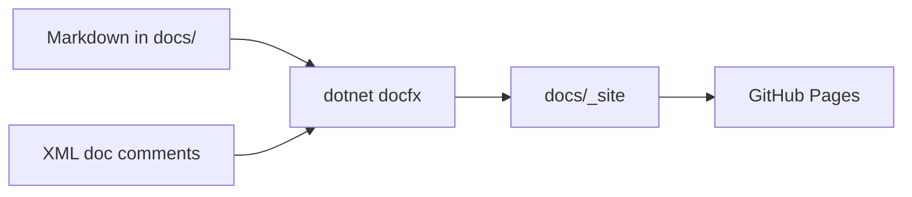
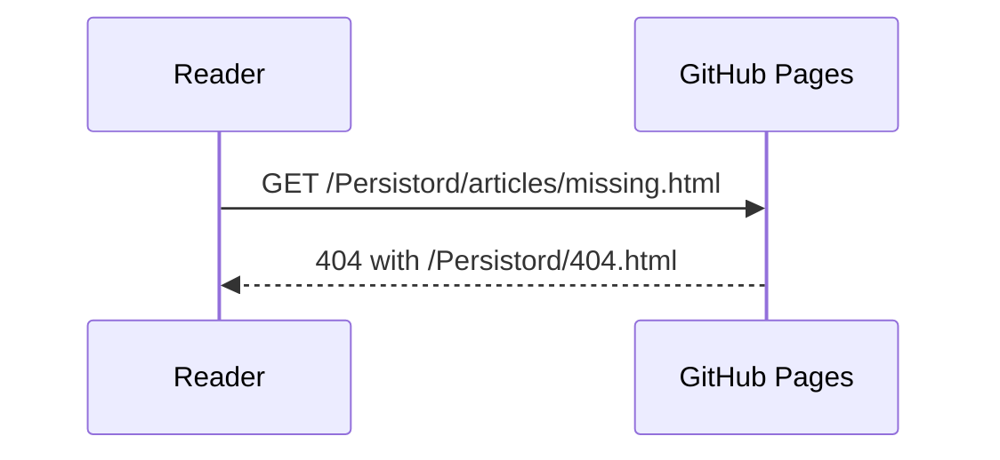
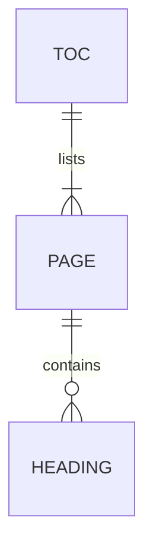

# Docs Site Revamp — PR 1: Design System and Page Frame — Implementation Plan

> **For agentic workers:** REQUIRED SUB-SKILL: Use superpowers:subagent-driven-development (recommended) or superpowers:executing-plans to implement this plan task-by-task. Steps use checkbox (`- [ ]`) syntax for tracking.

**Goal:** Replace the Persistord DocFX theme's stylesheet with a token-based design system derived from `icon.png`, restyle every page type DocFX emits (article, API reference, package README, 404), and add the site infrastructure (sitemap, `lang`, descriptions, 404) — verified by a committed Playwright test harness.

**Architecture:** The theme stays a layered DocFX template (`docs/templates/persistord`) that overrides **no** `.tmpl` file. `main.css` becomes an entry point that `@import`s focused stylesheets (tokens, base, chrome, components, API, README, landing, 404). `main.js` keeps to DocFX's documented extension points and adds small DOM enhancements inside `start()`. A Node + Playwright harness in `docs/tools/site-check` serves the built `_site` exactly as GitHub Pages does and asserts computed styles, contrast, links, and keyboard behaviour; each task writes its failing tests first.

**Tech Stack:** DocFX 2.78.5 (`dotnet docfx`, pinned in `.config/dotnet-tools.json`), Bootstrap 5 custom properties (from DocFX `modern`), vanilla CSS with `@import` / `color-mix()` / `:has()` / `:where()`, vanilla ES modules, Node ≥ 22 with the built-in `node:test` runner, Playwright 1.63.0 (Chromium).

**Spec:** `docs/superpowers/specs/2026-09-14-docs-site-revamp-design.md` — sections 1, 2, 5, 6 (PR 1 row of its Delivery table).

## Global Constraints

- **No template overrides.** Never add a `.tmpl`, `.tmpl.partial`, or `layout/` file under `docs/templates/persistord`. Everything styles markup DocFX `modern` 2.78.5 already emits.
- **`main.js` extension points only:** `defaultTheme`, `iconLinks`, `mermaid`, `configureHljs`, `start`. DOM enhancements live inside `start()`.
- **Every colour is a token.** Colours are declared only in `docs/templates/persistord/public/css/tokens.css`. Any other stylesheet that writes a hex, `rgb()`, or `hsl()` value fails `tests/tokens.test.mjs`.
- **Gradient budget:** `var(--pd-gradient-fill)` / `var(--pd-gradient-ink)` are consumed only by `#navbar .navbar-nav .nav-link.active::after`, `.toc li.active:not(:has(li.active)) > a::before`, and `.pd-btn-primary` in PR 1. (The landing wordmark joins in PR 2.)
- **Palette (spec 1.2):** dark page `#0f1019`, surface `#181a27`, raised `#20233a`, hairline `#2d3050`, text `#e6e6f2`, muted `#9a9cb8`, accent `#8685f4`; light page `#f7f7fb`, surface `#ffffff`, raised `#f0f0f8`, hairline `#e2e2ee`, text `#181a27`, muted `#5b5d78`, accent `#4635c2`; `--pd-gradient-fill: linear-gradient(135deg, #3d26b8, #6258d8)`; `--pd-gradient-ink` dark `linear-gradient(135deg, #8685f4, #b8b6f5)`, light `linear-gradient(135deg, #3d26b8, #6258d8)`.
- **Contrast is the contract:** WCAG AA — 4.5:1 for text, 3:1 for large text and UI boundaries — in both themes. A token that fails is adjusted in `tokens.css`, never excused in a test.
- **Type scale (spec 1.2):** body 16px / 1.7; h1 2.25rem/700/−0.02em; h2 1.5rem/600/−0.01em; h3 1.2rem/600; h4 1rem/600; code 0.875em. Radii 6px small, 12px containers. Shell max 1440px; landing column 1120px; sidebar 260px; affix 220px. Motion 150ms ease.
- **Theme default:** `defaultTheme: 'auto'` (follow the OS).
- **No third-party origin for theme assets.** Fonts stay vendored. README shield badges are the one accepted deviation.
- **Do not modify** `.github/workflows/Documentation.yml`, any `src/*/README.md`, `samples/README.md`, or any `docs/articles/*.md` (article content is PR 3).
- **DocFX build gate:** `dotnet docfx docs/docfx.json --warningsAsErrors` exits 0.
- **Repository facts:** repo `https://github.com/HandyS11/Persistord`, branch `docs/site-revamp` off `develop`, Pages base URL `https://handys11.github.io/Persistord/`, licence MIT.
- **Markdown lint:** `.markdownlint.json` disables MD013, MD033, MD041. Run `npx --no-install markdownlint-cli2 <file>` on every Markdown file you touch.
- **Commits** end with the trailer `Co-Authored-By: Claude Opus 5 (1M context) <noreply@anthropic.com>`.

---

## File Structure

### Created

| Path | Responsibility |
| --- | --- |
| `docs/tools/site-check/package.json` | Harness manifest: pinned Playwright, `build` / `build:fast` / `test` / `shots` scripts |
| `docs/tools/site-check/package-lock.json` | Lockfile generated by `npm install` |
| `docs/tools/site-check/.gitignore` | Ignores `out/` (screenshots) |
| `docs/tools/site-check/lib/color.mjs` | Colour parsing, compositing, WCAG contrast |
| `docs/tools/site-check/lib/server.mjs` | Static server for `docs/_site` under `/Persistord/`, answering misses with `404.html` + status 404 like GitHub Pages |
| `docs/tools/site-check/lib/site.mjs` | Browser + server lifecycle, per-call contexts (theme, viewport, motion), `computed()` and `tokens()` readers |
| `docs/tools/site-check/tests/harness.test.mjs` | Harness self-checks and component-page corpus check |
| `docs/tools/site-check/tests/tokens.test.mjs` | Token contrast, gradient-stop contrast, no hard-coded colours, gradient budget |
| `docs/tools/site-check/tests/typography.test.mjs` | Type scale, body font, OS-following theme default |
| `docs/tools/site-check/tests/chrome.test.mjs` | Shell width, landing column, navbar, `/` shortcut, sidebar, affix, breadcrumb, prev/next, edit link, footer |
| `docs/tools/site-check/tests/components.test.mjs` | Code blocks, labels, copy button, inline code, callouts, tabs, tables, syntax contrast, Mermaid |
| `docs/tools/site-check/tests/api.test.mjs` | API reference page styling |
| `docs/tools/site-check/tests/readme.test.mjs` | README page treatment, sources untouched, emoji-free sidebar labels |
| `docs/tools/site-check/tests/infra.test.mjs` | Sitemap, `lang`, description counts, styled 404 |
| `docs/tools/site-check/tests/crawl.test.mjs` | Internal links resolve; no third-party theme assets |
| `docs/tools/site-check/tests/keyboard.test.mjs` | Focus indicators; reduced motion |
| `docs/tools/site-check/shots.mjs` | Screenshot matrix into `out/` |
| `docs/development/components.md` | Contributor-facing component reference; the visual test corpus |
| `docs/templates/persistord/public/css/fonts.css` | Vendored `@font-face` rules (moved from `main.css`) |
| `docs/templates/persistord/public/css/tokens.css` | All tokens, both themes, `--bs-*` mapping |
| `docs/templates/persistord/public/css/base.css` | Type scale, links, inline code, focus |
| `docs/templates/persistord/public/css/chrome.css` | Shell, navbar, search, sidebar, affix, breadcrumb, prev/next, edit link, footer |
| `docs/templates/persistord/public/css/components.css` | Code blocks, syntax colours, callouts, tabs, tables, anchors, Mermaid, images, blockquotes |
| `docs/templates/persistord/public/css/api.css` | API reference pages |
| `docs/templates/persistord/public/css/readme.css` | Package README pages |
| `docs/templates/persistord/public/css/landing.css` | Landing page, ported onto tokens (PR 2 rewrites it) |
| `docs/templates/persistord/public/css/not-found.css` | Static 404 page |
| `docs/404.html` | Self-contained 404, shipped as a resource with absolute `/Persistord/` asset paths |

### Modified

| Path | Change |
| --- | --- |
| `docs/templates/persistord/public/main.css` | Becomes the entry point: header comment (file map, gradient budget, DocFX selector dependencies) + `@import`s |
| `docs/templates/persistord/public/main.js` | `defaultTheme: 'auto'`; sans Mermaid font; `start()` adds `/` search shortcut, affix tracking, code-block language labels |
| `docs/docfx.json` | New `_appFooter` HTML (3 depth variants); `sitemap`; `_lang`; `fileMetadata._description`; `404.html` resource |
| `docs/development/toc.yml` | Adds "Component Reference" |
| `docs/development/index.md` | `description` front matter; "Checking the site" section |
| `docs/articles/toc.yml`, `docs/packages/toc.yml`, `docs/samples/toc.yml` | Emoji removed from group labels (labels only — no entries added, removed, or reordered) |

---

### Task 1: Verification harness and component reference page

**Files:**

- Create: `docs/tools/site-check/package.json`, `docs/tools/site-check/.gitignore`, `docs/tools/site-check/lib/color.mjs`, `docs/tools/site-check/lib/server.mjs`, `docs/tools/site-check/lib/site.mjs`, `docs/tools/site-check/tests/harness.test.mjs`, `docs/development/components.md`
- Generate: `docs/tools/site-check/package-lock.json`
- Modify: `docs/development/toc.yml`, `docs/development/index.md`

**Interfaces:**

- Produces (`lib/color.mjs`): `parseColor(value: string) => [r, g, b, a]` (channels 0–1); `over(fg, bg) => [r, g, b, 1]`; `luminance(rgb) => number`; `contrast(a, b) => number`; `sameColor(a, b, tolerance = 1.5 / 255) => boolean`.
- Produces (`lib/server.mjs`): `SITE_ROOT: string` (absolute path of `docs/_site`); `BASE = '/Persistord/'`; `startServer() => Promise<{ origin, url(path) => string, close() }>`.
- Produces (`lib/site.mjs`): `THEMES = ['light', 'dark']`; `launchSite() => Promise<{ server, open(path, options), close() }>` where `open` options are `{ theme = 'light' | 'dark' | null, colorScheme = 'light', width = 1440, height = 900, reducedMotion = 'no-preference' }` and it returns `{ page, response, close() }`; `computed(page, selector, properties: string[], pseudo = null) => Promise<Record<string, string>>`; `tokens(page, names: string[]) => Promise<Record<string, string>>` reading `--pd-<name>`.
- Produces: page `development/components.html` containing every component (five callouts, a tab group, a table, C#/JSON/Bash code blocks, three Mermaid diagrams, a blockquote, h1–h4).

- [ ] **Step 1: Create the harness manifest and ignore file**

`docs/tools/site-check/package.json`:

```json
{
  "name": "persistord-site-check",
  "private": true,
  "description": "Builds and verifies the Persistord documentation site: layout, contrast, links, 404, keyboard.",
  "type": "module",
  "engines": {
    "node": ">=22"
  },
  "scripts": {
    "build": "cd ../../.. && dotnet tool restore && dotnet docfx docs/docfx.json --warningsAsErrors",
    "build:fast": "cd ../../.. && dotnet docfx build docs/docfx.json --warningsAsErrors",
    "test": "node --test --test-concurrency=1 \"tests/*.test.mjs\"",
    "shots": "node shots.mjs"
  },
  "devDependencies": {
    "playwright": "1.63.0"
  }
}
```

`docs/tools/site-check/.gitignore`:

```gitignore
out/
```

(`node_modules/` is already ignored by the root `.gitignore`.)

- [ ] **Step 2: Install dependencies**

Run:

```bash
cd docs/tools/site-check && npm install && npx playwright install chromium
```

Expected: `package-lock.json` created; Chromium reported installed or already present.

- [ ] **Step 3: Write the colour library**

`docs/tools/site-check/lib/color.mjs`:

```js
/**
 * Colour maths for the contrast checks. Channels are 0-1 floats; alpha is the
 * fourth element. WCAG 2.x relative luminance and contrast ratio.
 */

const alphaOf = raw =>
  raw === undefined ? 1 : raw.endsWith('%') ? Number(raw.slice(0, -1)) / 100 : Number(raw)

/** Parses a hex token or any colour string getComputedStyle returns. */
export function parseColor(value) {
  const text = value.trim()

  let match = /^#([0-9a-f]{6})$/i.exec(text)
  if (match) {
    return [0, 2, 4].map(i => parseInt(match[1].slice(i, i + 2), 16) / 255).concat(1)
  }

  match = /^rgba?\(\s*([\d.]+)[,\s]+([\d.]+)[,\s]+([\d.]+)(?:\s*[,/]\s*([\d.]+%?))?\s*\)$/i.exec(text)
  if (match) {
    return [match[1], match[2], match[3]].map(v => Number(v) / 255).concat(alphaOf(match[4]))
  }

  match = /^color\(srgb\s+([\d.]+)\s+([\d.]+)\s+([\d.]+)(?:\s*\/\s*([\d.]+%?))?\s*\)$/i.exec(text)
  if (match) {
    return [match[1], match[2], match[3]].map(Number).concat(alphaOf(match[4]))
  }

  throw new Error(`Unparseable colour: "${value}"`)
}

/** Composites a translucent foreground over an opaque background. */
export function over([r, g, b, a], [br, bg, bb]) {
  return [r * a + br * (1 - a), g * a + bg * (1 - a), b * a + bb * (1 - a), 1]
}

const linear = c => (c <= 0.04045 ? c / 12.92 : ((c + 0.055) / 1.055) ** 2.4)

export function luminance([r, g, b]) {
  return 0.2126 * linear(r) + 0.7152 * linear(g) + 0.0722 * linear(b)
}

export function contrast(a, b) {
  const [high, low] = [luminance(a), luminance(b)].sort((x, y) => y - x)
  return (high + 0.05) / (low + 0.05)
}

export function sameColor(a, b, tolerance = 1.5 / 255) {
  return a.every((channel, i) => Math.abs(channel - b[i]) <= tolerance)
}
```

- [ ] **Step 4: Write the static server**

`docs/tools/site-check/lib/server.mjs`:

```js
import { createServer } from 'node:http'
import { readFile, stat } from 'node:fs/promises'
import { extname, join, normalize } from 'node:path'
import { fileURLToPath } from 'node:url'

export const SITE_ROOT = fileURLToPath(new URL('../../../_site/', import.meta.url))
export const BASE = '/Persistord/'

const TYPES = {
  '.css': 'text/css; charset=utf-8',
  '.html': 'text/html; charset=utf-8',
  '.ico': 'image/x-icon',
  '.js': 'text/javascript; charset=utf-8',
  '.json': 'application/json; charset=utf-8',
  '.png': 'image/png',
  '.svg': 'image/svg+xml',
  '.woff2': 'font/woff2',
  '.xml': 'application/xml; charset=utf-8',
}

async function resolveFile(pathname) {
  const relative = decodeURIComponent(pathname.slice(BASE.length))
  const candidate = normalize(join(SITE_ROOT, relative))
  if (!candidate.startsWith(SITE_ROOT)) {
    return null
  }
  try {
    const info = await stat(candidate)
    if (!info.isDirectory()) {
      return candidate
    }
    const index = join(candidate, 'index.html')
    await stat(index)
    return index
  } catch {
    return null
  }
}

/**
 * Serves docs/_site under /Persistord/, the path GitHub Pages publishes it at.
 * Like Pages, every miss is answered with the site's own 404.html and status
 * 404 - served at the missing URL, which is what makes relative asset links
 * on a 404 page break at depth.
 */
export async function startServer() {
  const server = createServer(async (request, response) => {
    const { pathname } = new URL(request.url, 'http://localhost')
    const file = pathname.startsWith(BASE) ? await resolveFile(pathname) : null

    if (file) {
      response.writeHead(200, { 'content-type': TYPES[extname(file)] ?? 'application/octet-stream' })
      response.end(await readFile(file))
      return
    }

    const notFound = await readFile(join(SITE_ROOT, '404.html')).catch(() => 'Not found')
    response.writeHead(404, { 'content-type': TYPES['.html'] })
    response.end(notFound)
  })

  await new Promise(resolve => server.listen(0, '127.0.0.1', resolve))
  const origin = `http://127.0.0.1:${server.address().port}`

  return {
    origin,
    url: path => `${origin}${BASE}${path.replace(/^\//, '')}`,
    close: () => new Promise(resolve => server.close(resolve)),
  }
}
```

- [ ] **Step 5: Write the browser helpers**

`docs/tools/site-check/lib/site.mjs`:

```js
import { chromium } from 'playwright'
import { startServer } from './server.mjs'

export const THEMES = ['light', 'dark']

/**
 * One server and one browser per test file. Every `open()` gets a fresh
 * context, so a theme, viewport, or motion preference never leaks into the
 * next assertion.
 */
export async function launchSite() {
  const server = await startServer()
  const browser = await chromium.launch()

  async function open(path, options = {}) {
    const {
      theme = 'light',
      colorScheme = 'light',
      width = 1440,
      height = 900,
      reducedMotion = 'no-preference',
    } = options

    const context = await browser.newContext({
      viewport: { width, height },
      colorScheme,
      reducedMotion,
    })

    /* docfx reads localStorage.theme before first paint; `theme: null` leaves it
       unset so the page falls back to main.js's defaultTheme. */
    if (theme) {
      await context.addInitScript(value => localStorage.setItem('theme', value), theme)
    }

    const page = await context.newPage()
    const response = await page.goto(server.url(path), { waitUntil: 'networkidle' })
    await page.evaluate(() => document.fonts.ready)

    return { page, response, close: () => context.close() }
  }

  return {
    server,
    open,
    close: async () => {
      await browser.close()
      await server.close()
    },
  }
}

/** Reads computed style properties (kebab-case) from the first match. */
export function computed(page, selector, properties, pseudo = null) {
  return page.$eval(
    selector,
    (element, [names, pseudoElement]) => {
      const style = getComputedStyle(element, pseudoElement)
      return Object.fromEntries(names.map(name => [name, style.getPropertyValue(name)]))
    },
    [properties, pseudo]
  )
}

/** Reads design tokens (`--pd-<name>`) from the root element. */
export function tokens(page, names) {
  return page.evaluate(list => {
    const style = getComputedStyle(document.documentElement)
    return Object.fromEntries(list.map(name => [name, style.getPropertyValue(`--pd-${name}`).trim()]))
  }, names)
}
```

- [ ] **Step 6: Write the failing harness test**

`docs/tools/site-check/tests/harness.test.mjs`:

```js
import assert from 'node:assert/strict'
import { after, before, test } from 'node:test'
import { contrast, parseColor } from '../lib/color.mjs'
import { launchSite } from '../lib/site.mjs'

let site

before(async () => {
  site = await launchSite()
})

after(async () => {
  await site.close()
})

test('contrast maths matches the WCAG reference values', () => {
  assert.equal(contrast(parseColor('#000000'), parseColor('#ffffff')).toFixed(1), '21.0')
  assert.equal(contrast(parseColor('#767676'), parseColor('#ffffff')).toFixed(2), '4.54')
})

test('parses every colour syntax getComputedStyle returns', () => {
  assert.deepEqual(parseColor('rgb(255, 0, 51)'), [1, 0, 0.2, 1])
  assert.deepEqual(parseColor('rgba(0, 0, 0, 0.5)'), [0, 0, 0, 0.5])
  assert.deepEqual(parseColor('rgb(255 255 255 / 0.25)'), [1, 1, 1, 0.25])
  assert.deepEqual(parseColor('color(srgb 0.5 0.25 1)'), [0.5, 0.25, 1, 1])
})

test('serves the built site under the GitHub Pages prefix', async () => {
  const { page, response, close } = await site.open('articles/introduction.html')
  try {
    assert.equal(response.status(), 200)
    assert.match(await page.title(), /^Introduction/)
  } finally {
    await close()
  }
})

test('answers a missing path with status 404, as GitHub Pages does', async () => {
  const response = await fetch(site.server.url('articles/missing/deeper.html'))
  assert.equal(response.status, 404)
})

test('the component reference page exercises every styled component', async () => {
  const { page, close } = await site.open('development/components.html')
  try {
    await page.waitForSelector('pre.mermaid svg')
    const required = [
      '.alert.NOTE',
      '.alert.TIP',
      '.alert.IMPORTANT',
      '.alert.WARNING',
      '.alert.CAUTION',
      '.tabGroup [role="tab"]',
      '.table-responsive > table',
      'pre > code.lang-csharp',
      'pre > code.lang-json',
      'pre > code.lang-bash',
      'article blockquote',
      'article h3',
      'article h4',
    ]
    for (const selector of required) {
      assert.ok(await page.$(selector), `components page is missing ${selector}`)
    }
    assert.equal(await page.locator('pre.mermaid svg').count(), 3)
  } finally {
    await close()
  }
})
```

- [ ] **Step 7: Build the site and run the test to verify it fails**

Run:

```bash
cd docs/tools/site-check && npm run build && node --test tests/harness.test.mjs
```

Expected: the build exits 0. Four tests pass; `the component reference page exercises every styled component` FAILS — `development/components.html` does not exist (the server answers 404 and `waitForSelector('pre.mermaid svg')` times out).

- [ ] **Step 8: Write the component reference page**

`docs/development/components.md`:

````markdown
---
description: Every Markdown component this documentation site styles, with the syntax that produces it. Use it when writing docs, and as the visual test corpus for the theme.
---

# Component Reference

This page shows each component the Persistord theme styles, with the Markdown that produces it.
It is also the page `docs/tools/site-check` uses to verify the theme, so keep every component on it.

## Headings

Articles use `##` for sections, `###` for subsections, and `####` sparingly. The page title is the
only `#`.

### A third-level heading

Subsections sit under a section and appear indented in the "In this article" rail.

#### A fourth-level heading

Use a fourth level only for short labelled groups inside a subsection.

## Inline elements

Body text carries `inline code` for identifiers such as `DiscordGraphDbContext`, and
[links to other guides](../articles/getting-started.md). Long signatures in inline code wrap without
breaking their tint: `public static Task<TEntity> UpsertAsync<TEntity>(this DbSet<TEntity> set, Expression<Func<TEntity, bool>> naturalKey, Func<TEntity> create, Action<TEntity> update, CancellationToken cancellationToken = default)`.

## Code blocks

Fence code with a language so it is highlighted and labelled:

```csharp
public sealed class MyBotContext : DiscordGraphDbContext
{
    public MyBotContext(DbContextOptions<MyBotContext> options) : base(options) { }

    public DbSet<MessageEntity> Messages => Set<MessageEntity>();

    protected override void OnModelCreating(ModelBuilder modelBuilder)
    {
        base.OnModelCreating(modelBuilder);   // core skeleton + snowflake convention
        modelBuilder.ApplyMessagesModule();   // omit if you don't persist messages
    }
}
```

```json
{
  "Database": {
    "Provider": "PostgreSQL",
    "Host": "localhost",
    "Port": 5432
  }
}
```

```bash
dotnet add package Persistord
dotnet ef migrations add Initial
```

## Callouts

Use a callout only for text that is already a note or a warning, and at most about two per page.

~~~markdown
> [!NOTE]
> Supporting information the reader may skip.
~~~

> [!NOTE]
> Supporting information the reader may skip.

> [!TIP]
> A better way to do what the page describes.

> [!IMPORTANT]
> Something the reader must know to succeed.

> [!WARNING]
> Something that will go wrong if ignored.

> [!CAUTION]
> Something that risks data loss or a security problem.

## Tabs

Use tabs only when the reader picks exactly one option. Reuse tab ids across pages so a reader's
choice carries over.

~~~markdown
# [PostgreSQL](#tab/postgresql)

Content for PostgreSQL.

# [SQLite](#tab/sqlite)

Content for SQLite.

---
~~~

# [PostgreSQL](#tab/postgresql)

```bash
dotnet add package Npgsql.EntityFrameworkCore.PostgreSQL
```

# [SQL Server](#tab/sqlserver)

```bash
dotnet add package Microsoft.EntityFrameworkCore.SqlServer
```

# [SQLite](#tab/sqlite)

```bash
dotnet add package Microsoft.EntityFrameworkCore.Sqlite
```

---

## Tables

| Component | Markdown | Use it for |
| --- | --- | --- |
| Callout | `> [!NOTE]` | An existing note or warning |
| Tabs | `# [Label](#tab/id)` | One choice among alternatives |
| Diagram | a `mermaid` fence | Relationships and sequences |

## Diagrams

Mermaid diagrams follow the light and dark themes automatically.







## Quotations

> Quote external sources sparingly; prefer a link and a one-line summary.
````

- [ ] **Step 9: Register the page and document the harness**

`docs/development/toc.yml` becomes:

```yaml
- name: Building & Contributing
  href: index.md
- name: Component Reference
  href: components.md
```

In `docs/development/index.md`, insert this front matter as the first lines of the file (above `# Building & Contributing`):

```markdown
---
description: Build, test, format, and mutation-test Persistord locally, and check this documentation site before pushing.
---

```

Then append this to the end of the `## Docs (This Site)` section (after the `--serve` code block):

````markdown
### Checking the site

`docs/tools/site-check` builds the site and verifies it in a real browser: layout, contrast in both
themes, internal links, the 404 page, and keyboard focus. It needs Node 22 or later.

```bash
cd docs/tools/site-check
npm ci
npx playwright install chromium   # first run only
npm run build                     # dotnet docfx docs/docfx.json --warningsAsErrors
npm test
npm run shots                     # screenshot matrix into docs/tools/site-check/out/
```

`npm run build:fast` skips API metadata generation and rebuilds in a few seconds once a full build
has run. When writing pages, see the [Component Reference](components.md) for the syntax of every
styled component.
````

- [ ] **Step 10: Rebuild and run the test to verify it passes**

Run:

```bash
cd docs/tools/site-check && npm run build:fast && node --test tests/harness.test.mjs
```

Expected: build exits 0 with `0 warning(s)`; all 5 tests PASS.

- [ ] **Step 11: Lint and commit**

```bash
npx --no-install markdownlint-cli2 docs/development/components.md docs/development/index.md
git add docs/tools/site-check docs/development
git commit -m "docs: add site-check harness and component reference page

Co-Authored-By: Claude Opus 5 (1M context) <noreply@anthropic.com>"
```

---

### Task 2: Tokens, fonts, base typography, and the stylesheet split

**Files:**

- Create: `docs/templates/persistord/public/css/fonts.css`, `css/tokens.css`, `css/base.css`, `css/landing.css`, `docs/tools/site-check/tests/tokens.test.mjs`, `docs/tools/site-check/tests/typography.test.mjs`
- Modify: `docs/templates/persistord/public/main.css` (full rewrite), `docs/templates/persistord/public/main.js:84-94`

**Interfaces:**

- Consumes: `launchSite`, `computed`, `tokens`, `THEMES` (Task 1); `parseColor`, `contrast` (Task 1).
- Produces tokens used by every later task: `--pd-page`, `--pd-surface`, `--pd-raised`, `--pd-hairline`, `--pd-heading`, `--pd-heading-rgb`, `--pd-text`, `--pd-muted`, `--pd-muted-rgb`, `--pd-accent`, `--pd-accent-rgb`, `--pd-accent-hover`, `--pd-accent-wash`, `--pd-selection`, `--pd-gradient-fill`, `--pd-gradient-ink`, `--pd-on-fill`, `--pd-note`, `--pd-tip`, `--pd-warning`, `--pd-caution`, `--pd-code-keyword`, `--pd-code-string`, `--pd-code-number`, `--pd-code-comment`, `--pd-code-title`, `--pd-code-attr`, `--pd-snowflake`, `--pd-snowflake-wash`, `--pd-row-id`, `--pd-row-id-wash`, `--pd-sans`, `--pd-mono`, `--pd-radius-sm`, `--pd-radius`, `--pd-measure`, `--pd-shell-width`, `--pd-landing-width`, `--pd-sidebar-width`, `--pd-affix-width`, `--pd-header-height`, `--pd-ease`.
- Produces: `main.css` `@import` order — `fonts, tokens, base, chrome, components, api, readme, landing, not-found`. Later tasks create the files this task does not; `@import` of a missing file is ignored by browsers but **each task must create its file before its tests**.

- [ ] **Step 1: Write the failing token tests**

`docs/tools/site-check/tests/tokens.test.mjs`:

```js
import assert from 'node:assert/strict'
import { readdir, readFile } from 'node:fs/promises'
import { after, before, test } from 'node:test'
import { contrast, parseColor } from '../lib/color.mjs'
import { THEMES, launchSite, tokens } from '../lib/site.mjs'

const CSS_DIR = new URL('../../../templates/persistord/public/css/', import.meta.url)

const stripComments = css => css.replace(/\/\*[\s\S]*?\*\//g, '')

async function themeStylesheets() {
  const names = (await readdir(CSS_DIR)).filter(name => name.endsWith('.css'))
  return Promise.all(
    names.map(async name => ({
      name,
      css: stripComments(await readFile(new URL(name, CSS_DIR), 'utf8')),
    }))
  )
}

/* [foreground, background] - every pairing text is actually set in. */
const TOKEN_PAIRS = [
  ['heading', 'page'],
  ['text', 'page'],
  ['text', 'surface'],
  ['text', 'raised'],
  ['muted', 'page'],
  ['muted', 'surface'],
  ['muted', 'raised'],
  ['accent', 'page'],
  ['accent', 'surface'],
  ['accent', 'raised'],
]

const GRADIENT_USES = new Set([
  '#navbar .navbar-nav .nav-link.active::after',
  '.toc li.active:not(:has(li.active)) > a::before',
  '.pd-btn-primary',
])

let site

before(async () => {
  site = await launchSite()
})

after(async () => {
  await site.close()
})

for (const theme of THEMES) {
  test(`${theme}: text, muted, and accent tokens meet WCAG AA on every surface`, async () => {
    const { page, close } = await site.open('development/components.html', { theme })
    try {
      const names = [...new Set(TOKEN_PAIRS.flat())]
      const values = await tokens(page, names)
      for (const [fg, bg] of TOKEN_PAIRS) {
        const ratio = contrast(parseColor(values[fg]), parseColor(values[bg]))
        assert.ok(ratio >= 4.5, `${theme}: --pd-${fg} on --pd-${bg} is ${ratio.toFixed(2)}:1`)
      }
    } finally {
      await close()
    }
  })

  test(`${theme}: every gradient stop holds contrast in its role`, async () => {
    const { page, close } = await site.open('development/components.html', { theme })
    try {
      const values = await tokens(page, ['gradient-fill', 'gradient-ink', 'on-fill', 'page'])
      const stops = value => value.match(/#[0-9a-f]{6}/gi) ?? []

      assert.ok(stops(values['gradient-fill']).length >= 2, '--pd-gradient-fill has no stops')
      for (const stop of stops(values['gradient-fill'])) {
        const ratio = contrast(parseColor(values['on-fill']), parseColor(stop))
        assert.ok(ratio >= 4.5, `${theme}: --pd-on-fill on fill stop ${stop} is ${ratio.toFixed(2)}:1`)
      }

      assert.ok(stops(values['gradient-ink']).length >= 2, '--pd-gradient-ink has no stops')
      for (const stop of stops(values['gradient-ink'])) {
        const ratio = contrast(parseColor(stop), parseColor(values.page))
        assert.ok(ratio >= 4.5, `${theme}: ink stop ${stop} on --pd-page is ${ratio.toFixed(2)}:1`)
      }
    } finally {
      await close()
    }
  })
}

test('no stylesheet except tokens.css hard-codes a colour', async () => {
  const offenders = []
  for (const { name, css } of await themeStylesheets()) {
    if (name === 'tokens.css') {
      continue
    }
    for (const match of css.matchAll(/:[^;{}]*?(#[0-9a-f]{3,8}\b|\b(?:rgba?|hsla?)\()/gi)) {
      offenders.push(`${name}: ${match[0].trim()}`)
    }
  }
  assert.deepEqual(offenders, [])
})

test('gradient tokens are consumed only by the sanctioned elements', async () => {
  const unsanctioned = []
  for (const { name, css } of await themeStylesheets()) {
    for (const block of css.split('}')) {
      const parts = block.split('{')
      if (parts.length < 2 || !parts.at(-1).includes('var(--pd-gradient-')) {
        continue
      }
      for (const selector of parts.at(-2).split(',')) {
        const normalised = selector.trim().replace(/\s+/g, ' ')
        if (!GRADIENT_USES.has(normalised)) {
          unsanctioned.push(`${name}: ${normalised}`)
        }
      }
    }
  }
  assert.deepEqual(unsanctioned, [])
})
```

`docs/tools/site-check/tests/typography.test.mjs`:

```js
import assert from 'node:assert/strict'
import { after, before, test } from 'node:test'
import { computed, launchSite } from '../lib/site.mjs'

const PAGE = 'development/components.html'

let site

before(async () => {
  site = await launchSite()
})

after(async () => {
  await site.close()
})

test('article headings follow the fixed type scale', async () => {
  const { page, close } = await site.open(PAGE)
  try {
    const sizes = {}
    for (const tag of ['h1', 'h2', 'h3', 'h4']) {
      sizes[tag] = (await computed(page, `.content article ${tag}`, ['font-size']))['font-size']
    }
    assert.deepEqual(sizes, { h1: '36px', h2: '24px', h3: '19.2px', h4: '16px' })

    const h1 = await computed(page, '.content article h1', ['font-weight', 'letter-spacing'])
    assert.equal(h1['font-weight'], '700')
    assert.equal(h1['letter-spacing'], '-0.72px')
  } finally {
    await close()
  }
})

test('body text uses the vendored sans at 16px with a 1.7 line height', async () => {
  const { page, close } = await site.open(PAGE)
  try {
    const body = await computed(page, 'body', ['font-family', 'font-size', 'line-height'])
    assert.match(body['font-family'], /^"Persistord Sans"/)
    assert.equal(body['font-size'], '16px')
    assert.equal(body['line-height'], '27.2px')
    assert.equal(await page.evaluate(() => document.fonts.check('16px "Persistord Sans"')), true)
  } finally {
    await close()
  }
})

for (const scheme of ['light', 'dark']) {
  test(`with no stored choice the theme follows an OS ${scheme} preference`, async () => {
    const { page, close } = await site.open(PAGE, { theme: null, colorScheme: scheme })
    try {
      await page.waitForFunction(
        expected => document.documentElement.getAttribute('data-bs-theme') === expected,
        scheme,
        { timeout: 5000 }
      )
    } finally {
      await close()
    }
  })
}
```

- [ ] **Step 2: Run the tests to verify they fail**

Run:

```bash
cd docs/tools/site-check && node --test tests/tokens.test.mjs tests/typography.test.mjs
```

Expected: FAIL — token tests throw `Unparseable colour: ""` (no `--pd-page` yet) and the stylesheet scans throw `ENOENT` for `css/`; `article headings follow the fixed type scale` fails (DocFX's viewport-relative sizes); `follows an OS light preference` times out (current `defaultTheme: 'dark'`).

- [ ] **Step 3: Move the font faces into `css/fonts.css`**

`docs/templates/persistord/public/css/fonts.css` (paths are relative to this file, so they climb one level):

```css
/* Vendored faces - the site never loads a font from a third-party host. */

@font-face {
  font-family: 'Persistord Sans';
  font-style: normal;
  font-weight: 400;
  font-display: swap;
  src: url('../fonts/inter-latin-400-normal.woff2') format('woff2');
}

@font-face {
  font-family: 'Persistord Sans';
  font-style: normal;
  font-weight: 600;
  font-display: swap;
  src: url('../fonts/inter-latin-600-normal.woff2') format('woff2');
}

@font-face {
  font-family: 'Persistord Sans';
  font-style: normal;
  font-weight: 700;
  font-display: swap;
  src: url('../fonts/inter-latin-700-normal.woff2') format('woff2');
}

@font-face {
  font-family: 'Persistord Mono';
  font-style: normal;
  font-weight: 400;
  font-display: swap;
  src: url('../fonts/jetbrains-mono-latin-400-normal.woff2') format('woff2');
}

@font-face {
  font-family: 'Persistord Mono';
  font-style: normal;
  font-weight: 700;
  font-display: swap;
  src: url('../fonts/jetbrains-mono-latin-700-normal.woff2') format('woff2');
}
```

- [ ] **Step 4: Write the tokens**

`docs/templates/persistord/public/css/tokens.css`:

```css
/*
 * Design tokens. Every colour on the site resolves to a token declared here;
 * site-check (tests/tokens.test.mjs) fails if any other stylesheet writes one.
 *
 * Sampled from icon.png: ink tile #181a27, tile rim #303050, bubble gradient
 * #3d26b8 -> #6258d8 -> #8685f4, highlight #e0dfff. Values move only when the
 * contrast suite demands it, and the reason is recorded next to the value.
 *
 * The icon's full gradient cannot be one token: white on its light end is
 * 3.15:1, and its dark end is 1.96:1 on the dark page. It is split into
 * --pd-gradient-fill, which carries white labels (every stop >= 5.38:1), and
 * the per-theme --pd-gradient-ink, whose stops stay >= 4.5:1 on that theme's
 * page (gradient text and indicator bars).
 *
 * Both themes are designed; neither is derived from the other.
 */

:root {
  --pd-sans: 'Persistord Sans', system-ui, -apple-system, 'Segoe UI', Roboto,
    'Helvetica Neue', Arial, sans-serif;
  --pd-mono: 'Persistord Mono', ui-monospace, 'SFMono-Regular', 'Cascadia Mono',
    Consolas, monospace;

  --pd-radius-sm: 6px;
  --pd-radius: 12px;
  --pd-measure: 72ch;
  --pd-shell-width: 1440px;
  --pd-landing-width: 1120px;
  --pd-sidebar-width: 260px;
  --pd-affix-width: 220px;
  --pd-header-height: 60px;
  --pd-ease: 150ms ease;

  --pd-on-fill: #ffffff;
  --pd-gradient-fill: linear-gradient(135deg, #3d26b8, #6258d8);
}

[data-bs-theme='dark'] {
  color-scheme: dark;

  --pd-page: #0f1019;
  --pd-surface: #181a27;
  --pd-raised: #20233a;
  --pd-hairline: #2d3050;
  --pd-heading: #f3f3fb;
  --pd-heading-rgb: 243, 243, 251;
  --pd-text: #e6e6f2;
  --pd-muted: #9a9cb8;
  --pd-muted-rgb: 154, 156, 184;
  --pd-accent: #8685f4;
  --pd-accent-rgb: 134, 133, 244;
  --pd-accent-hover: #b8b6f5;
  --pd-accent-wash: rgb(134 133 244 / 0.12);
  --pd-selection: rgb(134 133 244 / 0.35);
  --pd-gradient-ink: linear-gradient(135deg, #8685f4, #b8b6f5);

  --pd-note: #9d9cf7;
  --pd-tip: #4fd1c0;
  --pd-warning: #f0b54f;
  --pd-caution: #f58398;

  --pd-code-keyword: #aeadf9;
  --pd-code-string: #7fd6c6;
  --pd-code-number: #f2bd72;
  --pd-code-comment: #8588a8;
  --pd-code-title: #e0dfff;
  --pd-code-attr: #a5c8f0;

  /* Landing proof panes only: the snowflake came off the gateway, the row id
     is in a column. The icon's own #e0dfff is luminance-identical to body
     text, so the snowflake mark is darkened to separate from it. */
  --pd-snowflake: #b7b5ff;
  --pd-snowflake-wash: rgb(183 181 255 / 0.13);
  --pd-row-id: #8685f4;
  --pd-row-id-wash: rgb(134 133 244 / 0.13);

  --bs-body-bg: var(--pd-page);
  --bs-body-bg-rgb: 15, 16, 25;
  --bs-body-color: var(--pd-text);
  --bs-body-color-rgb: 230, 230, 242;
  --bs-emphasis-color: var(--pd-heading);
  --bs-emphasis-color-rgb: var(--pd-heading-rgb);
  --bs-secondary-color: var(--pd-muted);
  --bs-secondary-color-rgb: var(--pd-muted-rgb);
  --bs-tertiary-color: var(--pd-muted);
  --bs-tertiary-color-rgb: var(--pd-muted-rgb);
  --bs-secondary-bg: var(--pd-raised);
  --bs-tertiary-bg: var(--pd-surface);
  --bs-border-color: var(--pd-hairline);
  --bs-heading-color: var(--pd-heading);
  --bs-code-color: var(--pd-text);
  --bs-link-color: var(--pd-accent);
  --bs-link-color-rgb: var(--pd-accent-rgb);
  --bs-link-hover-color: var(--pd-accent-hover);
  --bs-link-hover-color-rgb: 184, 182, 245;
  --bs-focus-ring-color: rgb(134 133 244 / 0.4);
}

[data-bs-theme='light'] {
  color-scheme: light;

  --pd-page: #f7f7fb;
  --pd-surface: #ffffff;
  --pd-raised: #f0f0f8;
  --pd-hairline: #e2e2ee;
  --pd-heading: #0f1019;
  --pd-heading-rgb: 15, 16, 25;
  --pd-text: #181a27;
  --pd-muted: #5b5d78;
  --pd-muted-rgb: 91, 93, 120;
  --pd-accent: #4635c2;
  --pd-accent-rgb: 70, 53, 194;
  --pd-accent-hover: #3d26b8;
  --pd-accent-wash: rgb(70 53 194 / 0.08);
  --pd-selection: rgb(70 53 194 / 0.2);
  --pd-gradient-ink: linear-gradient(135deg, #3d26b8, #6258d8);

  --pd-note: #4635c2;
  --pd-tip: #0f766e;
  --pd-warning: #9a5b06;
  --pd-caution: #be123c;

  --pd-code-keyword: #4635c2;
  --pd-code-string: #0f766e;
  --pd-code-number: #9a5b06;
  --pd-code-comment: #6a6d88;
  --pd-code-title: #6d28d9;
  --pd-code-attr: #334155;

  --pd-snowflake: #7c3aed;
  --pd-snowflake-wash: rgb(124 58 237 / 0.08);
  --pd-row-id: #4635c2;
  --pd-row-id-wash: rgb(70 53 194 / 0.08);

  --bs-body-bg: var(--pd-page);
  --bs-body-bg-rgb: 247, 247, 251;
  --bs-body-color: var(--pd-text);
  --bs-body-color-rgb: 24, 26, 39;
  --bs-emphasis-color: var(--pd-heading);
  --bs-emphasis-color-rgb: var(--pd-heading-rgb);
  --bs-secondary-color: var(--pd-muted);
  --bs-secondary-color-rgb: var(--pd-muted-rgb);
  --bs-tertiary-color: var(--pd-muted);
  --bs-tertiary-color-rgb: var(--pd-muted-rgb);
  --bs-secondary-bg: var(--pd-raised);
  --bs-tertiary-bg: var(--pd-surface);
  --bs-border-color: var(--pd-hairline);
  --bs-heading-color: var(--pd-heading);
  --bs-code-color: var(--pd-text);
  --bs-link-color: var(--pd-accent);
  --bs-link-color-rgb: var(--pd-accent-rgb);
  --bs-link-hover-color: var(--pd-accent-hover);
  --bs-link-hover-color-rgb: 61, 38, 184;
  --bs-focus-ring-color: rgb(70 53 194 / 0.35);
}
```

- [ ] **Step 5: Write the base typography**

`docs/templates/persistord/public/css/base.css`:

```css
/*
 * Base typography. Sizes are fixed in rem: docfx's defaults grow h1-h4 with
 * the viewport (calc(1.375rem + 1.5vw)), which is what flattened the heading
 * hierarchy. Selectors are wrapped in :where() so the landing page's own
 * component rules (.pd-hero h1, .pd-section > h2) outrank them without
 * !important, while they still beat docfx's bare h1-h4 rules by source order.
 */

html {
  scroll-padding-top: calc(var(--pd-header-height) + 1rem);
}

body {
  background-color: var(--pd-page);
  color: var(--pd-text);
  font-family: var(--pd-sans);
  font-size: 1rem;
  line-height: 1.7;
  -webkit-font-smoothing: antialiased;
  -moz-osx-font-smoothing: grayscale;
}

::selection {
  background-color: var(--pd-selection);
}

code,
kbd,
pre,
samp,
.font-monospace {
  font-family: var(--pd-mono);
}

h1,
h2,
h3,
h4,
h5,
h6 {
  color: var(--pd-heading);
  font-weight: 600;
}

:where(.content article) h1 {
  margin: 0 0 1rem;
  font-size: 2.25rem;
  font-weight: 700;
  letter-spacing: -0.02em;
  line-height: 1.15;
}

:where(.content article) h2 {
  margin: 3rem 0 1rem;
  font-size: 1.5rem;
  letter-spacing: -0.01em;
  line-height: 1.3;
}

:where(.content article) h3 {
  margin: 2.25rem 0 0.75rem;
  font-size: 1.2rem;
  line-height: 1.4;
}

:where(.content article) h4 {
  margin: 1.75rem 0 0.5rem;
  font-size: 1rem;
  line-height: 1.5;
}

:where(.content article) > p,
:where(.content article) > ul,
:where(.content article) > ol {
  max-width: var(--pd-measure);
}

:where(.content article) a {
  text-decoration-thickness: 1px;
  text-underline-offset: 0.2em;
}

:where(.content article) a:hover {
  text-decoration-thickness: 2px;
}

/* A faint tint and no border: a long signature wraps across lines as one
   continuous span instead of a stack of pills. */
:not(pre) > code {
  padding: 0.12em 0.36em;
  border-radius: var(--pd-radius-sm);
  background-color: var(--pd-accent-wash);
  color: var(--pd-heading);
  font-size: 0.875em;
  -webkit-box-decoration-break: clone;
  box-decoration-break: clone;
}

/* Focus is state, not decoration, so it takes the accent everywhere. Bootstrap
   replaces outlines with a blue box-shadow on .btn and .nav-link; those are
   brought back in line here. */
:focus-visible,
.btn:focus-visible,
.nav-link:focus-visible {
  outline: 2px solid var(--pd-accent);
  outline-offset: 2px;
  box-shadow: none;
}
```

- [ ] **Step 6: Port the landing page onto the tokens**

`docs/templates/persistord/public/css/landing.css`:

```css
/*
 * Landing page (docs/index.md, `layout: landing`) and the button and copy
 * strip it uses. Ported onto the design tokens in PR 1 of the revamp; PR 2
 * rewrites the page. The .pd-snowflake / .pd-row-id marks are the only place
 * the old gateway-vs-column colour rule survives.
 */

/* ------------------------------------------------------------- container -- */

/* The container-xxl padding supplies half of each 24px gutter; the article
   supplies the other half. */
body[data-layout='landing'] > main > .content > article {
  width: 100%;
  max-width: calc(var(--pd-landing-width) + 1.5rem);
  margin-inline: auto;
  padding-inline: 0.75rem;
}

/* ------------------------------------------------------------------ hero -- */

.pd-hero {
  padding: 2.8rem 0 2.6rem;
}

.pd-hero h1 {
  margin: 0;
  max-width: 24ch;
  font-size: clamp(2rem, 1.1rem + 3.2vw, 3.25rem);
  line-height: 1.08;
}

.pd-hero-lede {
  margin: 1.15rem 0 0;
  max-width: 64ch;
  color: var(--pd-muted);
  font-size: 1.1rem;
  line-height: 1.62;
}

.pd-hero-actions {
  display: flex;
  flex-wrap: wrap;
  gap: 0.7rem;
  margin-top: 1.9rem;
}

/* --------------------------------------------------------------- buttons -- */

/* A secondary button's boundary is its whole affordance, so it takes --pd-muted
   (>= 5.7:1 on page and surface in both themes) rather than a hairline. */
.pd-btn {
  display: inline-flex;
  align-items: center;
  padding: 0.6rem 1.15rem;
  border: 1px solid var(--pd-muted);
  border-radius: var(--pd-radius);
  background-color: var(--pd-surface);
  color: var(--pd-text);
  font-size: 0.96rem;
  font-weight: 600;
  text-decoration: none;
  transition: background-color var(--pd-ease), border-color var(--pd-ease);
}

.pd-btn:hover,
.pd-btn:focus-visible {
  border-color: var(--pd-text);
  background-color: var(--pd-raised);
  color: var(--pd-text);
  text-decoration: none;
}

.pd-btn-primary {
  border-color: transparent;
  background-image: var(--pd-gradient-fill);
  color: var(--pd-on-fill);
}

.pd-btn-primary:hover,
.pd-btn-primary:focus-visible {
  border-color: transparent;
  box-shadow: 0 0 0 3px var(--pd-accent-wash);
  color: var(--pd-on-fill);
}

/* ------------------------------------------------------------- transform -- */

.pd-panes {
  display: grid;
  grid-template-columns: repeat(3, minmax(0, 1fr));
  gap: 0.85rem;
}

@media (max-width: 900px) {
  .pd-panes {
    grid-template-columns: minmax(0, 1fr);
  }
}

.pd-pane {
  display: flex;
  flex-direction: column;
  min-width: 0;
  margin: 0;
  overflow: hidden;
  border: 1px solid var(--pd-hairline);
  border-radius: var(--pd-radius);
  background-color: var(--pd-surface);
}

.pd-pane-bar {
  display: block;
  padding: 0.5rem 0.9rem;
  border-bottom: 1px solid var(--pd-hairline);
  background-color: var(--pd-raised);
  color: var(--pd-muted);
  font-family: var(--pd-mono);
  font-size: 0.74rem;
  letter-spacing: 0.06em;
  text-transform: uppercase;
}

.pd-pane pre {
  margin: 0;
  padding: 0.85rem 0.9rem;
  overflow-x: auto;
  border: 0;
  border-radius: 0;
  background-color: transparent;
  color: var(--pd-muted);
  font-size: 0.8rem;
  line-height: 1.6;
}

.pd-snowflake {
  padding: 0 0.18em;
  border-radius: 4px;
  color: var(--pd-snowflake);
}

.pd-row-id {
  padding: 0 0.18em;
  border-radius: 4px;
  background-color: var(--pd-row-id-wash);
  color: var(--pd-row-id);
}

/* The site's whole motion budget: a wash fading out from behind the snowflake,
   in place. The mark never moves - a value that travelled between panes would
   imply it was carried and changed. */
@media (prefers-reduced-motion: no-preference) {
  .pd-transform .pd-snowflake {
    animation: pd-carry 900ms ease-out both;
  }
}

@keyframes pd-carry {
  from {
    background-color: var(--pd-snowflake-wash);
  }

  to {
    background-color: transparent;
  }
}

/* --------------------------------------------------------------- install -- */

.pd-install {
  display: flex;
  flex-wrap: wrap;
  align-items: center;
  gap: 0.6rem;
  max-width: 34rem;
  margin: 0 0 2.6rem;
  padding: 0.5rem 0.6rem 0.5rem 1rem;
  border: 1px solid var(--pd-hairline);
  border-radius: var(--pd-radius);
  background-color: var(--pd-surface);
}

.pd-prompt {
  color: var(--pd-muted);
  font-family: var(--pd-mono);
  user-select: none;
}

.pd-install > code {
  flex: 1 1 auto;
  min-width: 0;
  padding: 0;
  overflow-x: auto;
  background-color: transparent;
  color: var(--pd-text);
  font-size: 0.94rem;
  white-space: nowrap;
}

.pd-copy {
  flex: 0 0 auto;
  padding: 0.34rem 0.75rem;
  border: 1px solid var(--pd-muted);
  border-radius: var(--pd-radius-sm);
  background-color: var(--pd-raised);
  color: var(--pd-muted);
  font-family: var(--pd-sans);
  font-size: 0.84rem;
  font-weight: 600;
  white-space: nowrap;
  cursor: pointer;
}

.pd-copy:hover {
  border-color: var(--pd-text);
  color: var(--pd-text);
}

.pd-copy[data-copied='true'] {
  border-color: var(--pd-accent);
  color: var(--pd-accent);
}

/* ----------------------------------------------------------------- stats -- */

.pd-stats {
  display: grid;
  grid-template-columns: repeat(auto-fit, minmax(9.5rem, 1fr));
  gap: 1px;
  margin: 0 0 3rem;
  padding: 0;
  overflow: hidden;
  border: 1px solid var(--pd-hairline);
  border-radius: var(--pd-radius);
  background-color: var(--pd-hairline);
}

.pd-stat {
  padding: 1.05rem 1.2rem;
  background-color: var(--pd-surface);
}

.pd-stat dt {
  color: var(--pd-text);
  font-family: var(--pd-mono);
  font-size: 1.85rem;
  font-weight: 700;
  line-height: 1;
}

.pd-stat dd {
  margin: 0.4rem 0 0;
  color: var(--pd-muted);
  font-size: 0.86rem;
}

/* -------------------------------------------------------------- sections -- */

.pd-section {
  margin: 0 0 3.2rem;
}

.pd-section > h2 {
  margin: 0 0 0.55rem;
  font-size: 1.5rem;
}

.pd-section > p {
  margin: 0 0 1.5rem;
  max-width: 74ch;
  color: var(--pd-muted);
}

.pd-section > .pd-note {
  margin: 1.15rem 0 0;
  max-width: 78ch;
  color: var(--pd-muted);
  font-size: 0.92rem;
  line-height: 1.65;
}

.pd-section > .pd-note strong {
  color: var(--pd-text);
}

/* ------------------------------------------------------ packages, cards -- */

.pd-packages {
  display: grid;
  grid-template-columns: repeat(auto-fit, minmax(16rem, 1fr));
  gap: 1.5rem;
}

.pd-package-group > h3 {
  margin: 0 0 0.65rem;
  color: var(--pd-muted);
  font-size: 0.76rem;
  font-weight: 600;
  letter-spacing: 0.09em;
  text-transform: uppercase;
}

.pd-package-group > ul {
  display: grid;
  gap: 0.5rem;
  margin: 0;
  padding: 0;
  list-style: none;
}

.pd-package,
.pd-card {
  display: block;
  position: relative;
  height: 100%;
  padding: 0.75rem 0.95rem;
  border: 1px solid var(--pd-hairline);
  border-radius: var(--pd-radius);
  background-color: var(--pd-surface);
  color: var(--pd-text);
  text-decoration: none;
  transition: background-color var(--pd-ease), border-color var(--pd-ease);
}

.pd-package:hover,
.pd-package:focus-visible,
.pd-card:hover,
.pd-card:focus-visible {
  border-color: var(--pd-muted);
  background-color: var(--pd-raised);
  color: var(--pd-text);
  text-decoration: none;
}

.pd-package > code,
.pd-card > strong {
  display: block;
  font-size: 0.95rem;
  font-weight: 600;
  overflow-wrap: anywhere;
}

.pd-package.external > code {
  padding-right: 1.3rem;
}

/* Package names and API names in running landing copy read as texture here,
   so the inline-code tint is dropped. */
.pd-hero-lede code,
.pd-note code,
.pd-package code,
.pd-card code {
  padding: 0;
  background-color: transparent;
  color: inherit;
  font-size: 0.94em;
}

.pd-package.external::after {
  position: absolute;
  top: 0.8rem;
  right: 0.85rem;
  margin: 0;
  color: var(--pd-muted);
}

.pd-package > span,
.pd-card > span {
  display: block;
  margin-top: 0.25rem;
  color: var(--pd-muted);
  font-size: 0.85rem;
  line-height: 1.5;
}

.pd-cards,
.pd-next {
  display: grid;
  grid-template-columns: repeat(auto-fit, minmax(15.5rem, 1fr));
  gap: 0.8rem;
}
```

- [ ] **Step 7: Rewrite `main.css` as the entry point**

Replace the whole of `docs/templates/persistord/public/main.css` with:

```css
/*
 * Persistord documentation theme - entry point.
 *
 * Layered after docfx's `default` + `modern` templates (docs/docfx.json).
 * No .tmpl file is overridden: everything styles markup docfx 2.78.5 already
 * emits, and main.js uses only its documented extension points. docfx is
 * pinned (`rollForward: false` in .config/dotnet-tools.json); upgrading it
 * means re-running docs/tools/site-check (npm test, npm run shots) and
 * re-checking the selector list below.
 *
 * Files, in cascade order:
 *   fonts.css       vendored Inter + JetBrains Mono
 *   tokens.css      every colour and size, both themes, and the --bs-* mapping
 *   base.css        type scale, links, inline code, focus
 *   chrome.css      shell, navbar, search, sidebar, affix, breadcrumb, prev/next, footer
 *   components.css  code blocks, callouts, tabs, tables, anchors, mermaid, images
 *   api.css         API reference pages
 *   readme.css      package README pages mounted from src/<Package>/README.md
 *   landing.css     the landing page
 *   not-found.css   the static 404 page
 *
 * Gradient budget: --pd-gradient-* is consumed by exactly three elements - the
 * landing wordmark, the primary button, and the active-page indicator (sidebar
 * bar and navbar underline). tests/tokens.test.mjs enforces the list.
 *
 * docfx markup this theme depends on:
 *   body[data-layout], body[data-yaml-mime]
 *   body > header.bg-body, .navbar-brand > #logo, #navbar .navbar-nav .nav-link(.active)
 *   #search, #search-query, #navbar form.icons
 *   main > .toc-offcanvas, #toc span.name-only, .toc li(.active) > a, .toc form.filter
 *   main > .affix, .affix h5, .affix a.link-body-emphasis / a.link-secondary
 *   #breadcrumb .breadcrumb, .contribution a.edit-link, .next-article > div(.prev|.next) > span + a
 *   pre > code.hljs, pre > .code-action, .hljs-*
 *   .alert.NOTE / .TIP / .IMPORTANT / .WARNING / .CAUTION > h5
 *   .tabGroup > .nav-tabs .nav-link(.active), .tabGroup > section.card
 *   .table-responsive > table.table, .anchorjs-link, pre.mermaid > svg
 *   article .facts, .codewrapper, dl.typelist, dl.parameters, dl.jumplist,
 *   h2.section, h3[data-uid], h4.section, .header-action
 *   footer > .container-xxl
 */

@import url('./css/fonts.css');
@import url('./css/tokens.css');
@import url('./css/base.css');
@import url('./css/chrome.css');
@import url('./css/components.css');
@import url('./css/api.css');
@import url('./css/readme.css');
@import url('./css/landing.css');
@import url('./css/not-found.css');
```

(`chrome.css`, `components.css`, `api.css`, `readme.css`, and `not-found.css` are created by Tasks 3–7. Until then the browser skips those imports, and the sidebar, footer, and code blocks look stock — expected within the branch.)

- [ ] **Step 8: Follow the OS theme and give Mermaid the sans face**

In `docs/templates/persistord/public/main.js`, replace:

```js
  defaultTheme: 'dark',

  /* docfx merges this over its own `{ startOnLoad, theme }`, picking the base
     theme from the current light/dark setting. Only theme-agnostic values are
     set here: anything with a fixed lightness would be wrong in one of the two
     themes, so surfaces and text are left to mermaid's own ramp. */
  mermaid: {
    fontFamily:
      "'Persistord Mono', ui-monospace, 'SFMono-Regular', Consolas, monospace",
  },
```

with:

```js
  /* Follow the reader's OS preference; both themes are designed. */
  defaultTheme: 'auto',

  /* docfx merges this over its own `{ startOnLoad, theme }`. Only the font is
     set here - colours come from components.css, which recolours the rendered
     SVG from the design tokens so a diagram follows a theme switch. */
  mermaid: {
    fontFamily:
      "'Persistord Sans', system-ui, -apple-system, 'Segoe UI', Roboto, sans-serif",
  },
```

- [ ] **Step 9: Rebuild and run the tests to verify they pass**

Run:

```bash
cd docs/tools/site-check && npm run build:fast && node --test tests/tokens.test.mjs tests/typography.test.mjs tests/harness.test.mjs
```

Expected: all PASS. If a contrast assertion fails, adjust **the token in `tokens.css`** (keeping it as close to the icon-sampled value as the ratio allows) and add a one-line comment beside it stating the measured ratio.

- [ ] **Step 10: Commit**

```bash
git add docs/templates/persistord/public docs/tools/site-check/tests
git commit -m "docs(theme): token-based design system and base typography

Split main.css into focused stylesheets, derive the palette from icon.png,
fix the heading scale, and follow the OS theme by default.

Co-Authored-By: Claude Opus 5 (1M context) <noreply@anthropic.com>"
```

---

### Task 3: Page frame — shell, navbar, sidebar, affix, breadcrumb, prev/next, footer

**Files:**

- Create: `docs/templates/persistord/public/css/chrome.css`, `docs/tools/site-check/tests/chrome.test.mjs`
- Modify: `docs/templates/persistord/public/main.js` (add `wireSearchShortcut`, `trackAffix`, extend `start`), `docs/docfx.json` (`_appFooter` global value and both `fileMetadata._appFooter` values)

**Interfaces:**

- Consumes: tokens from Task 2; `launchSite`, `computed`, `tokens`, `THEMES`, `parseColor`, `sameColor`.
- Produces: `.pd-current` class and `aria-current="location"` on the affix link for the section being read; footer markup `.pd-footer > .pd-footer-links > nav.pd-footer-group > p.pd-footer-title + ul` and `.pd-footer-meta`; `main.js` function `onReady(callback)` used by later tasks.

- [ ] **Step 1: Write the failing chrome tests**

`docs/tools/site-check/tests/chrome.test.mjs`:

```js
import assert from 'node:assert/strict'
import { after, before, test } from 'node:test'
import { parseColor, sameColor } from '../lib/color.mjs'
import { THEMES, computed, launchSite, tokens } from '../lib/site.mjs'

const ARTICLE = 'articles/upsert.html'

let site

before(async () => {
  site = await launchSite()
})

after(async () => {
  await site.close()
})

const horizontalBox = (page, selector) =>
  page.$eval(selector, element => {
    const rect = element.getBoundingClientRect()
    const style = getComputedStyle(element)
    const viewport = document.documentElement.clientWidth
    return {
      left: rect.left,
      right: viewport - rect.right,
      width: rect.width,
      contentWidth: rect.width - parseFloat(style.paddingLeft) - parseFloat(style.paddingRight),
    }
  })

test('the page shell is capped at 1440px and centred on wide screens', async () => {
  const { page, close } = await site.open(ARTICLE, { width: 1920 })
  try {
    const box = await horizontalBox(page, 'body > main')
    assert.ok(box.width <= 1440, `shell is ${box.width}px wide`)
    assert.ok(Math.abs(box.left - box.right) <= 2, `shell is off-centre: ${box.left}px / ${box.right}px`)
  } finally {
    await close()
  }
})

test('the landing page content sits in a centred 1120px column', async () => {
  const { page, close } = await site.open('index.html')
  try {
    const box = await horizontalBox(page, 'body > main > .content > article')
    assert.ok(box.contentWidth <= 1120, `landing column is ${box.contentWidth}px wide`)
    assert.ok(Math.abs(box.left - box.right) <= 2, `landing column is off-centre: ${box.left}px / ${box.right}px`)
  } finally {
    await close()
  }
})

test('the brand mark and wordmark are separated', async () => {
  const { page, close } = await site.open(ARTICLE)
  try {
    const gap = await page.$eval('.navbar-brand', brand => {
      const logo = brand.querySelector('#logo')
      const text = [...brand.childNodes].find(node => node.nodeType === Node.TEXT_NODE && node.textContent.trim())
      const start = text.textContent.indexOf(text.textContent.trim())
      const range = document.createRange()
      range.setStart(text, start)
      range.setEnd(text, start + 1)
      return range.getBoundingClientRect().left - logo.getBoundingClientRect().right
    })
    assert.ok(gap >= 8, `brand gap is ${gap}px`)
  } finally {
    await close()
  }
})

test('the active navbar tab is underlined with the gradient', async () => {
  const { page, close } = await site.open(ARTICLE)
  try {
    await page.waitForSelector('#navbar .nav-link.active')
    const after = await computed(page, '#navbar .nav-link.active', ['background-image', 'height'], '::after')
    assert.match(after['background-image'], /linear-gradient/)
    assert.equal(after.height, '2px')
  } finally {
    await close()
  }
})

test('the header is translucent over a backdrop blur', async () => {
  const { page, close } = await site.open(ARTICLE)
  try {
    const header = await computed(page, 'body > header', ['background-color', 'backdrop-filter'])
    assert.ok(parseColor(header['background-color'])[3] < 1, `header background is ${header['background-color']}`)
    assert.match(header['backdrop-filter'], /blur/)
  } finally {
    await close()
  }
})

test('pressing / focuses search, but not while typing in another field', async () => {
  const { page, close } = await site.open(ARTICLE)
  try {
    await page.waitForSelector('#search-query:not([disabled])', { timeout: 15000 })
    await page.waitForSelector('.toc form.filter input')

    await page.keyboard.press('/')
    assert.equal(await page.evaluate(() => document.activeElement?.id), 'search-query')

    await page.focus('.toc form.filter input')
    await page.keyboard.press('/')
    assert.equal(await page.evaluate(() => document.activeElement?.matches('.toc form.filter input')), true)
  } finally {
    await close()
  }
})

test('sidebar group labels are small uppercase captions and the sidebar is 260px', async () => {
  const { page, close } = await site.open(ARTICLE)
  try {
    await page.waitForSelector('#toc span.name-only')
    const label = await computed(page, '#toc span.name-only', ['text-transform', 'font-size'])
    assert.equal(label['text-transform'], 'uppercase')
    assert.ok(parseFloat(label['font-size']) <= 12, `label is ${label['font-size']}`)

    const width = await page.$eval('main > .toc-offcanvas', element => element.getBoundingClientRect().width)
    assert.ok(Math.abs(width - 260) <= 1, `sidebar is ${width}px`)
  } finally {
    await close()
  }
})

test('the current page is marked in the sidebar with the gradient bar', async () => {
  const { page, close } = await site.open(ARTICLE)
  try {
    const current = '#toc li.active:not(:has(li.active)) > a'
    await page.waitForSelector(current)
    const bar = await computed(page, current, ['background-image', 'width'], '::before')
    assert.match(bar['background-image'], /linear-gradient/)
    assert.equal(bar.width, '3px')
  } finally {
    await close()
  }
})

test('the in-page rail highlights the section being read', async () => {
  const { page, close } = await site.open(ARTICLE)
  try {
    await page.waitForSelector('#affix li:nth-child(2) > a')
    assert.equal((await computed(page, '#affix ul', ['border-left-width']))['border-left-width'], '1px')

    const hash = await page.$eval('#affix li:nth-child(2) > a', link => link.hash)
    await page.evaluate(id => document.getElementById(id).scrollIntoView({ block: 'start' }), decodeURIComponent(hash.slice(1)))
    await page.waitForFunction(expected => document.querySelector('#affix a.pd-current')?.hash === expected, hash)
    assert.equal(await page.$eval('#affix a.pd-current', link => link.getAttribute('aria-current')), 'location')
  } finally {
    await close()
  }
})

test('the breadcrumb is a small caption above the title', async () => {
  const { page, close } = await site.open(ARTICLE)
  try {
    await page.waitForSelector('#breadcrumb .breadcrumb')
    const crumb = await computed(page, '#breadcrumb .breadcrumb', ['font-size'])
    assert.ok(parseFloat(crumb['font-size']) <= 13, `breadcrumb is ${crumb['font-size']}`)
  } finally {
    await close()
  }
})

test('previous and next render as whole-card links', async () => {
  const { page, close } = await site.open(ARTICLE)
  try {
    await page.waitForSelector('.next-article > div.next > a')
    const card = await computed(page, '.next-article > div.next', ['border-top-width', 'border-top-left-radius'])
    assert.equal(card['border-top-width'], '1px')
    assert.equal(card['border-top-left-radius'], '12px')

    /* A raw mouse click on the caption: Playwright's element click would refuse,
       because the stretched link's ::after (the point of the test) covers it. */
    const href = await page.$eval('.next-article > div.next > a', link => link.href)
    const caption = await page.locator('.next-article > div.next > span').boundingBox()
    await page.mouse.click(caption.x + caption.width / 2, caption.y + caption.height / 2)
    await page.waitForURL(href)
  } finally {
    await close()
  }
})

for (const theme of THEMES) {
  test(`${theme}: the edit link is muted`, async () => {
    const { page, close } = await site.open(ARTICLE, { theme })
    try {
      const { muted } = await tokens(page, ['muted'])
      const link = await computed(page, '.contribution a.edit-link', ['color'])
      assert.ok(sameColor(parseColor(link.color), parseColor(muted)), `edit link is ${link.color}`)
    } finally {
      await close()
    }
  })
}

test('the footer has three link groups whose links resolve from every depth', async () => {
  for (const path of ['index.html', ARTICLE, 'src/Persistord.Core/README.html']) {
    const { page, close } = await site.open(path)
    try {
      assert.equal(await page.locator('footer .pd-footer-group').count(), 3, `${path}: footer groups`)
      const hrefs = await page.$$eval('footer .pd-footer a', links =>
        links.map(link => link.href).filter(href => href.startsWith(location.origin))
      )
      assert.ok(hrefs.length >= 6, `${path}: only ${hrefs.length} internal footer links`)
      for (const href of hrefs) {
        const response = await fetch(href)
        assert.equal(response.status, 200, `${path}: footer link ${href} answered ${response.status}`)
      }
    } finally {
      await close()
    }
  }
})
```

- [ ] **Step 2: Run the tests to verify they fail**

Run:

```bash
cd docs/tools/site-check && node --test tests/chrome.test.mjs
```

Expected: FAIL — shell is 1768px-capped (fails at 1920 wide), no `::after` gradient, header opaque, `/` does nothing, sidebar labels not uppercase-small, no `.pd-current`, prev/next cards unframed, footer has 0 `.pd-footer-group`. The landing-column test already passes (Task 2's `landing.css` added the container) and the breadcrumb test may pass; both stay as regression guards.

- [ ] **Step 3: Write `chrome.css`**

`docs/templates/persistord/public/css/chrome.css`:

```css
/*
 * Page frame: shell width, navbar, search, sidebar, in-page rail, breadcrumb,
 * prev/next, edit link, footer.
 *
 * Several docfx and Bootstrap utilities paint with !important (.bg-body,
 * .border-top, .text-body-tertiary, .link-body-emphasis). Each is overridden
 * by setting the custom property the utility reads - never with !important.
 */

/* ------------------------------------------------------------ page shell -- */

/* docfx widens .container-xxl to 1768px at >= 1400px, which strands a
   three-column page's reading column far from its navigation. */
.container-xxl {
  max-width: var(--pd-shell-width);
}

@media (min-width: 768px) {
  body:not([data-search])[data-layout=''] > main > .toc-offcanvas {
    flex: 0 0 var(--pd-sidebar-width);
    max-width: var(--pd-sidebar-width);
  }
}

body:not([data-search])[data-layout=''] > main > .affix {
  width: var(--pd-affix-width);
}

/* ---------------------------------------------------------------- navbar -- */

body > header.bg-body {
  --bs-bg-opacity: 0.82;
  -webkit-backdrop-filter: saturate(1.4) blur(12px);
  backdrop-filter: saturate(1.4) blur(12px);
}

.navbar-brand {
  gap: 0.625rem;
  color: var(--pd-heading);
  font-size: 1.05rem;
  font-weight: 700;
  letter-spacing: -0.01em;
}

.navbar-brand:hover,
.navbar-brand:focus {
  color: var(--pd-heading);
}

.navbar-brand > #logo {
  width: 28px;
  height: 28px;
  margin: 0;
  border-radius: 7px;
}

#navbar .navbar-nav .nav-link {
  position: relative;
  padding: 0.5rem 0.75rem;
  color: var(--pd-muted);
  font-size: 0.9375rem;
  transition: color var(--pd-ease);
}

#navbar .navbar-nav .nav-link:hover,
#navbar .navbar-nav .nav-link.active {
  color: var(--pd-heading);
}

#navbar .navbar-nav .nav-link.active::after {
  content: '';
  position: absolute;
  right: 0.75rem;
  bottom: 0;
  left: 0.75rem;
  height: 2px;
  border-radius: 2px;
  background-image: var(--pd-gradient-ink);
}

#navbar form.icons .btn {
  color: var(--pd-muted);
}

#navbar form.icons .btn:hover {
  color: var(--pd-heading);
}

/* ---------------------------------------------------------------- search -- */

#search {
  position: relative;
}

#search-query {
  width: 15rem;
  padding-right: 2.25rem;
  border-color: var(--pd-hairline);
  border-radius: var(--pd-radius-sm);
  background-color: var(--pd-surface);
  color: var(--pd-text);
  font-size: 0.875rem;
}

#search-query::placeholder {
  color: var(--pd-muted);
}

/* The keyboard hint for the `/` shortcut wired in main.js. */
#search::after {
  content: '/';
  position: absolute;
  top: 50%;
  right: 0.6rem;
  padding: 0 0.4rem;
  transform: translateY(-50%);
  border: 1px solid var(--pd-hairline);
  border-radius: 4px;
  color: var(--pd-muted);
  font-family: var(--pd-mono);
  font-size: 0.75rem;
  line-height: 1.5;
  pointer-events: none;
}

#search:focus-within::after {
  visibility: hidden;
}

.form-control:focus {
  border-color: var(--pd-accent);
  background-color: var(--pd-surface);
  box-shadow: 0 0 0 3px var(--pd-accent-wash);
  color: var(--pd-text);
}

/* --------------------------------------------------------------- sidebar -- */

.toc form.filter > input {
  border-color: var(--pd-hairline);
  border-radius: var(--pd-radius-sm);
  background-color: var(--pd-surface);
  color: var(--pd-text);
  font-size: 0.875rem;
}

.toc ul {
  font-size: 0.875rem;
}

.toc li {
  margin: 0.125rem 0;
}

.toc li > a {
  display: block;
  position: relative;
  padding: 0.3rem 0.625rem;
  border-radius: var(--pd-radius-sm);
  color: var(--pd-muted);
  line-height: 1.45;
  text-decoration: none;
  transition: background-color var(--pd-ease), color var(--pd-ease);
}

.toc li > a:hover,
.toc li > a:focus-visible {
  background-color: var(--pd-raised);
  color: var(--pd-heading);
  text-decoration: none;
}

/* docfx renders group headings as `span.name-only.text-body-tertiary`; the
   utility's colour comes from --bs-tertiary-color-rgb, mapped to --pd-muted in
   tokens.css. */
.toc span.name-only {
  display: block;
  margin: 1.5rem 0 0.375rem;
  padding: 0 0.625rem;
  font-size: 0.6875rem;
  font-weight: 600;
  letter-spacing: 0.08em;
  line-height: 1.4;
  text-transform: uppercase;
}

.toc > div > ul > li:first-child > span.name-only {
  margin-top: 0.25rem;
}

/* docfx marks every ancestor of the current page `active` - the nested API
   tree carries it on several rows at once - so the page itself is the active
   row with no active descendant. Where :has() is unsupported these rules drop
   and docfx's own active colour remains. */
.toc li.active:not(:has(li.active)) > a {
  background-color: var(--pd-accent-wash);
  color: var(--pd-heading);
}

.toc li.active:not(:has(li.active)) > a::before {
  content: '';
  position: absolute;
  top: 0.35rem;
  bottom: 0.35rem;
  left: 0;
  width: 3px;
  border-radius: 3px;
  background-image: var(--pd-gradient-ink);
}

/* ----------------------------------------------------------- in-page rail -- */

/* The rail's links carry .link-body-emphasis (h2) and .link-secondary (h3),
   whose !important colours read these two variables. */
.affix {
  --bs-emphasis-color-rgb: var(--pd-muted-rgb);
  --bs-secondary-rgb: var(--pd-muted-rgb);
  font-size: 0.8125rem;
}

.affix h5 {
  --bs-border-width: 0;
  display: block;
  margin: 0 0 0.625rem;
  padding: 0;
  color: var(--pd-heading);
  font-size: 0.6875rem;
  font-weight: 600;
  letter-spacing: 0.08em;
}

.affix ul {
  border-left: 1px solid var(--pd-hairline);
}

.affix ul li {
  margin: 0;
}

.affix ul li a {
  display: block;
  margin-left: -1px;
  padding: 0.25rem 0 0.25rem 0.875rem;
  border-left: 2px solid transparent;
  line-height: 1.45;
  text-decoration: none;
  transition: color var(--pd-ease), border-color var(--pd-ease);
}

.affix ul li a.link-secondary {
  padding-left: 1.625rem;
}

.affix ul li a:hover,
.affix ul li a:focus-visible {
  --bs-emphasis-color-rgb: var(--pd-heading-rgb);
  --bs-secondary-rgb: var(--pd-heading-rgb);
  --bs-link-opacity: 1;
  text-decoration: none;
}

/* Set by trackAffix() in main.js. */
.affix ul li a.pd-current {
  --bs-emphasis-color-rgb: var(--pd-accent-rgb);
  --bs-secondary-rgb: var(--pd-accent-rgb);
  border-left-color: var(--pd-accent);
}

/* ------------------------------------------------------------ breadcrumb -- */

#breadcrumb .breadcrumb {
  --bs-breadcrumb-divider-color: var(--pd-muted);
  --bs-breadcrumb-item-active-color: var(--pd-muted);
  margin-bottom: 0.5rem;
  font-size: 0.8125rem;
}

#breadcrumb .breadcrumb a {
  color: var(--pd-muted);
  text-decoration: none;
}

#breadcrumb .breadcrumb a:hover {
  color: var(--pd-heading);
  text-decoration: underline;
}

/* ------------------------------------------------ edit link and prev/next -- */

.contribution {
  margin-top: 3rem;
  font-size: 0.875rem;
}

.contribution a.edit-link {
  color: var(--pd-muted);
}

.contribution a.edit-link:hover,
.contribution a.edit-link:focus-visible {
  color: var(--pd-heading);
}

.next-article {
  --bs-border-width: 0;
  gap: 1rem;
}

.next-article:has(div) {
  margin-top: 1.25rem;
  padding-top: 0;
}

.next-article > div {
  display: flex;
  position: relative;
  flex: 0 1 calc(50% - 0.5rem);
  flex-direction: column;
  gap: 0.125rem;
  padding: 0.875rem 1.125rem;
  border: 1px solid var(--pd-hairline);
  border-radius: var(--pd-radius);
  background-color: var(--pd-surface);
  transition: background-color var(--pd-ease), border-color var(--pd-ease);
}

.next-article > div.next {
  align-items: flex-end;
  margin-left: auto;
  text-align: right;
}

.next-article > div:hover,
.next-article > div:focus-within {
  border-color: var(--pd-accent);
  background-color: var(--pd-raised);
}

.next-article > div > span {
  color: var(--pd-muted);
  font-size: 0.8125rem;
  opacity: 1;
}

.next-article > div > a {
  color: var(--pd-heading);
  font-weight: 600;
  text-decoration: none;
}

/* Stretches the link over the whole card. */
.next-article > div > a::after {
  content: '';
  position: absolute;
  inset: 0;
  border-radius: inherit;
}

@media (max-width: 575.98px) {
  .next-article {
    flex-direction: column;
  }

  .next-article > div {
    flex-basis: auto;
  }
}

/* ---------------------------------------------------------------- footer -- */

body > footer {
  height: auto;
  margin-top: 4rem;
  padding: 2.5rem 0 2rem;
  background-color: var(--pd-surface);
  font-size: 0.875rem;
}

body > footer > div {
  align-items: stretch;
}

.pd-footer {
  display: grid;
  gap: 2rem;
  width: 100%;
}

.pd-footer-links {
  display: flex;
  flex-wrap: wrap;
  gap: 2rem 4rem;
}

.pd-footer-title {
  margin: 0 0 0.625rem;
  color: var(--pd-heading);
  font-size: 0.6875rem;
  font-weight: 600;
  letter-spacing: 0.08em;
  text-transform: uppercase;
}

.pd-footer ul {
  display: grid;
  gap: 0.375rem;
  margin: 0;
  padding: 0;
  list-style: none;
}

.pd-footer a {
  color: var(--pd-muted);
  text-decoration: none;
}

.pd-footer a:hover,
.pd-footer a:focus-visible {
  color: var(--pd-heading);
  text-decoration: underline;
}

.pd-footer-meta {
  display: flex;
  flex-wrap: wrap;
  justify-content: space-between;
  gap: 0.5rem 1.5rem;
  padding-top: 1.25rem;
  border-top: 1px solid var(--pd-hairline);
  color: var(--pd-muted);
}
```

- [ ] **Step 4: Add the search shortcut and affix tracking to `main.js`**

In `docs/templates/persistord/public/main.js`, insert these functions immediately above `export default {`:

```js
/** Runs a callback once the document has parsed. */
function onReady(callback) {
  if (document.readyState === 'loading') {
    document.addEventListener('DOMContentLoaded', callback, { once: true })
  } else {
    callback()
  }
}

/**
 * `/` focuses search, as on most documentation sites. It is ignored while the
 * reader is typing in any field and when the search box is collapsed away on
 * narrow screens, so it never swallows a literal slash.
 */
function wireSearchShortcut() {
  document.addEventListener('keydown', event => {
    if (event.key !== '/' || event.ctrlKey || event.metaKey || event.altKey) {
      return
    }

    const target = event.target
    if (
      target instanceof HTMLElement &&
      (target.isContentEditable || target.closest('input, textarea, select'))
    ) {
      return
    }

    const search = document.getElementById('search-query')
    if (!search || search.disabled || search.offsetParent === null) {
      return
    }

    event.preventDefault()
    search.focus()
  })
}

/**
 * Marks the "In this article" link for the section being read. docfx renders
 * the rail but does not track position. The current section is the last h2/h3
 * whose top has scrolled above the sticky header plus a small margin. The rail
 * renders asynchronously, so a MutationObserver re-applies the mark once its
 * links exist; it watches childList only, so toggling the class cannot loop.
 */
function trackAffix() {
  const headings = [
    ...document.querySelectorAll('.content article h2[id], .content article h3[id]'),
  ]
  const affix = document.getElementById('affix')
  if (headings.length === 0 || !affix) {
    return
  }

  const READING_LINE = 96
  let queued = false

  const update = () => {
    queued = false

    let current = headings[0]
    for (const heading of headings) {
      if (heading.getBoundingClientRect().top > READING_LINE) {
        break
      }
      current = heading
    }

    for (const link of affix.querySelectorAll('a')) {
      const active = decodeURIComponent(link.hash.slice(1)) === current.id
      link.classList.toggle('pd-current', active)
      if (active) {
        link.setAttribute('aria-current', 'location')
      } else {
        link.removeAttribute('aria-current')
      }
    }
  }

  const queue = () => {
    if (!queued) {
      queued = true
      requestAnimationFrame(update)
    }
  }

  window.addEventListener('scroll', queue, { passive: true })
  window.addEventListener('resize', queue)
  new MutationObserver(queue).observe(affix, { childList: true, subtree: true })
  queue()
}
```

Then replace the existing `start` property:

```js
  start: () => {
    if (document.readyState === 'loading') {
      document.addEventListener('DOMContentLoaded', wireCopyButtons, {
        once: true,
      })
    } else {
      wireCopyButtons()
    }
  },
```

with:

```js
  start: () => {
    onReady(() => {
      wireCopyButtons()
      wireSearchShortcut()
      trackAffix()
    })
  },
```

- [ ] **Step 5: Replace the footer HTML in `docs/docfx.json`**

Replace the value of `build.globalMetadata._appFooter` with (one line in the file):

```json
"<div class=\"pd-footer\"><div class=\"pd-footer-links\"><nav class=\"pd-footer-group\" aria-label=\"Docs\"><p class=\"pd-footer-title\">Docs</p><ul><li><a href=\"articles/getting-started.html\">Getting started</a></li><li><a href=\"articles/introduction.html\">Introduction</a></li><li><a href=\"api/index.html\">API reference</a></li></ul></nav><nav class=\"pd-footer-group\" aria-label=\"Packages\"><p class=\"pd-footer-title\">Packages</p><ul><li><a href=\"articles/packages.html\">All packages</a></li><li><a href=\"https://www.nuget.org/packages/Persistord\">NuGet</a></li><li><a href=\"https://github.com/HandyS11/Persistord/releases\">Releases</a></li></ul></nav><nav class=\"pd-footer-group\" aria-label=\"Community\"><p class=\"pd-footer-title\">Community</p><ul><li><a href=\"https://github.com/HandyS11/Persistord\">GitHub</a></li><li><a href=\"https://github.com/HandyS11/Persistord/issues\">Issues</a></li><li><a href=\"development/index.html\">Contributing</a></li></ul></nav></div><div class=\"pd-footer-meta\"><span>Persistord &mdash; the EF Core model your Discord bot keeps rewriting</span><span>Released under the <a href=\"license.html\">MIT licence</a></span></div></div>"
```

Replace the value under `build.fileMetadata._appFooter["{*/*,../samples/README.md}"]` with the same string, with **every internal `href`** (`articles/…`, `api/…`, `development/…`, `license.html`) prefixed by `../`:

```json
"<div class=\"pd-footer\"><div class=\"pd-footer-links\"><nav class=\"pd-footer-group\" aria-label=\"Docs\"><p class=\"pd-footer-title\">Docs</p><ul><li><a href=\"../articles/getting-started.html\">Getting started</a></li><li><a href=\"../articles/introduction.html\">Introduction</a></li><li><a href=\"../api/index.html\">API reference</a></li></ul></nav><nav class=\"pd-footer-group\" aria-label=\"Packages\"><p class=\"pd-footer-title\">Packages</p><ul><li><a href=\"../articles/packages.html\">All packages</a></li><li><a href=\"https://www.nuget.org/packages/Persistord\">NuGet</a></li><li><a href=\"https://github.com/HandyS11/Persistord/releases\">Releases</a></li></ul></nav><nav class=\"pd-footer-group\" aria-label=\"Community\"><p class=\"pd-footer-title\">Community</p><ul><li><a href=\"https://github.com/HandyS11/Persistord\">GitHub</a></li><li><a href=\"https://github.com/HandyS11/Persistord/issues\">Issues</a></li><li><a href=\"../development/index.html\">Contributing</a></li></ul></nav></div><div class=\"pd-footer-meta\"><span>Persistord &mdash; the EF Core model your Discord bot keeps rewriting</span><span>Released under the <a href=\"../license.html\">MIT licence</a></span></div></div>"
```

Replace the value under `build.fileMetadata._appFooter["{*/*/*,../src/*/README.md}"]` with the same string prefixed by `../../`:

```json
"<div class=\"pd-footer\"><div class=\"pd-footer-links\"><nav class=\"pd-footer-group\" aria-label=\"Docs\"><p class=\"pd-footer-title\">Docs</p><ul><li><a href=\"../../articles/getting-started.html\">Getting started</a></li><li><a href=\"../../articles/introduction.html\">Introduction</a></li><li><a href=\"../../api/index.html\">API reference</a></li></ul></nav><nav class=\"pd-footer-group\" aria-label=\"Packages\"><p class=\"pd-footer-title\">Packages</p><ul><li><a href=\"../../articles/packages.html\">All packages</a></li><li><a href=\"https://www.nuget.org/packages/Persistord\">NuGet</a></li><li><a href=\"https://github.com/HandyS11/Persistord/releases\">Releases</a></li></ul></nav><nav class=\"pd-footer-group\" aria-label=\"Community\"><p class=\"pd-footer-title\">Community</p><ul><li><a href=\"https://github.com/HandyS11/Persistord\">GitHub</a></li><li><a href=\"https://github.com/HandyS11/Persistord/issues\">Issues</a></li><li><a href=\"../../development/index.html\">Contributing</a></li></ul></nav></div><div class=\"pd-footer-meta\"><span>Persistord &mdash; the EF Core model your Discord bot keeps rewriting</span><span>Released under the <a href=\"../../license.html\">MIT licence</a></span></div></div>"
```

- [ ] **Step 6: Rebuild and run the tests to verify they pass**

Run:

```bash
cd docs/tools/site-check && npm run build:fast && node --test tests/chrome.test.mjs tests/tokens.test.mjs
```

Expected: all PASS (the token suite re-checks the gradient budget now that `chrome.css` consumes it).

- [ ] **Step 7: Commit**

```bash
git add docs/templates/persistord/public docs/docfx.json docs/tools/site-check/tests/chrome.test.mjs
git commit -m "docs(theme): restyle the page frame

Cap and centre the shell, rebuild the navbar, sidebar, in-page rail,
breadcrumb, prev/next and footer, add the / search shortcut, and track the
section being read in the rail.

Co-Authored-By: Claude Opus 5 (1M context) <noreply@anthropic.com>"
```

---

### Task 4: Content components — code, callouts, tabs, tables, diagrams

**Files:**

- Create: `docs/templates/persistord/public/css/components.css`, `docs/tools/site-check/tests/components.test.mjs`
- Modify: `docs/templates/persistord/public/main.js` (add `LANGUAGE_LABELS`, `labelCodeBlocks`; call it in `start`)

**Interfaces:**

- Consumes: tokens (Task 2); `onReady` (Task 3); components page (Task 1).
- Produces: `data-pd-lang` attribute on labelled `<pre>` elements; `--pd-callout` per-callout custom property.

- [ ] **Step 1: Write the failing component tests**

`docs/tools/site-check/tests/components.test.mjs`:

```js
import assert from 'node:assert/strict'
import { after, before, test } from 'node:test'
import { contrast, parseColor, sameColor } from '../lib/color.mjs'
import { THEMES, computed, launchSite, tokens } from '../lib/site.mjs'

const PAGE = 'development/components.html'
const CSHARP = 'pre:has(> code.lang-csharp)'

const CALLOUTS = [
  ['NOTE', 'note'],
  ['TIP', 'tip'],
  ['IMPORTANT', 'note'],
  ['WARNING', 'warning'],
  ['CAUTION', 'caution'],
]

const SYNTAX = ['.hljs-keyword', '.hljs-string', '.hljs-number', '.hljs-comment', '.hljs-title', '.hljs-attr']

let site

before(async () => {
  site = await launchSite()
})

after(async () => {
  await site.close()
})

for (const theme of THEMES) {
  test(`${theme}: code blocks have exactly one frame`, async () => {
    const { page, close } = await site.open(PAGE, { theme })
    try {
      const pre = await computed(page, CSHARP, ['border-top-width', 'border-top-left-radius', 'padding-top'])
      assert.equal(pre['border-top-width'], '1px')
      assert.equal(pre['border-top-left-radius'], '12px')
      assert.equal(pre['padding-top'], '0px')

      const code = await computed(page, `${CSHARP} > code`, ['background-color'])
      assert.equal(parseColor(code['background-color'])[3], 0, `inner code panel is ${code['background-color']}`)
    } finally {
      await close()
    }
  })

  test(`${theme}: callouts carry their status colour and readable text`, async () => {
    const { page, close } = await site.open(PAGE, { theme })
    try {
      const values = await tokens(page, ['note', 'tip', 'warning', 'caution'])
      for (const [kind, token] of CALLOUTS) {
        const box = await computed(page, `.alert.${kind}`, ['border-left-width', 'border-left-color', 'background-color', 'color'])
        const label = await computed(page, `.alert.${kind} > h5`, ['color'])
        const background = parseColor(box['background-color'])

        assert.equal(box['border-left-width'], '3px', `${kind} rule width`)
        assert.ok(sameColor(parseColor(box['border-left-color']), parseColor(values[token])), `${kind} rule is ${box['border-left-color']}`)

        const labelRatio = contrast(parseColor(label.color), background)
        assert.ok(labelRatio >= 4.5, `${theme} ${kind} label is ${labelRatio.toFixed(2)}:1`)
        const textRatio = contrast(parseColor(box.color), background)
        assert.ok(textRatio >= 4.5, `${theme} ${kind} text is ${textRatio.toFixed(2)}:1`)
      }
    } finally {
      await close()
    }
  })

  test(`${theme}: the active tab is underlined in the accent colour`, async () => {
    const { page, close } = await site.open(PAGE, { theme })
    try {
      const { accent } = await tokens(page, ['accent'])
      const tab = await computed(page, '.tabGroup .nav-link.active', ['border-bottom-color', 'color'])
      assert.ok(sameColor(parseColor(tab['border-bottom-color']), parseColor(accent)))
      assert.ok(sameColor(parseColor(tab.color), parseColor(accent)))

      const panel = await computed(page, '.tabGroup > section', ['border-top-width', 'border-left-width'])
      assert.equal(panel['border-top-width'], '0px')
      assert.equal(panel['border-left-width'], '0px')
    } finally {
      await close()
    }
  })

  test(`${theme}: tables are framed with a raised header row`, async () => {
    const { page, close } = await site.open(PAGE, { theme })
    try {
      const { raised } = await tokens(page, ['raised'])
      const frame = await computed(page, '.table-responsive', ['border-top-width', 'border-top-left-radius'])
      assert.equal(frame['border-top-width'], '1px')
      assert.equal(frame['border-top-left-radius'], '12px')
      const th = await computed(page, '.table-responsive thead th', ['background-color'])
      assert.ok(sameColor(parseColor(th['background-color']), parseColor(raised)), `th is ${th['background-color']}`)
    } finally {
      await close()
    }
  })

  test(`${theme}: every syntax colour meets AA on the code surface`, async () => {
    const { page, close } = await site.open(PAGE, { theme })
    try {
      for (const selector of SYNTAX) {
        const pair = await page.$eval(`.content article pre ${selector}`, element => ({
          color: getComputedStyle(element).color,
          background: getComputedStyle(element.closest('pre')).backgroundColor,
        }))
        const ratio = contrast(parseColor(pair.color), parseColor(pair.background))
        assert.ok(ratio >= 4.5, `${theme} ${selector} is ${ratio.toFixed(2)}:1`)
      }
    } finally {
      await close()
    }
  })

  test(`${theme}: Mermaid diagrams are recoloured from the tokens`, async () => {
    const { page, close } = await site.open(PAGE, { theme })
    try {
      await page.waitForSelector('pre.mermaid svg .node rect')
      const values = await tokens(page, ['raised', 'text'])
      const node = await computed(page, 'pre.mermaid .node rect', ['fill'])
      assert.ok(sameColor(parseColor(node.fill), parseColor(values.raised)), `node fill is ${node.fill}`)
      const label = await computed(page, 'pre.mermaid .nodeLabel', ['color'])
      assert.ok(sameColor(parseColor(label.color), parseColor(values.text)), `node label is ${label.color}`)
    } finally {
      await close()
    }
  })
}

test('code blocks are labelled with their language', async () => {
  const { page, close } = await site.open(PAGE)
  try {
    assert.equal(await page.$eval(CSHARP, pre => pre.dataset.pdLang), 'C#')
    const label = await computed(page, CSHARP, ['content'], '::before')
    assert.equal(label.content, '"C#"')
    assert.equal(await page.$eval('pre:has(> code.lang-bash)', pre => pre.dataset.pdLang), 'Shell')
  } finally {
    await close()
  }
})

test('the copy button is reachable and visible by keyboard', async () => {
  const { page, close } = await site.open(PAGE)
  try {
    await page.waitForSelector('.code-action')
    let reached = false
    for (let i = 0; i < 120 && !reached; i++) {
      await page.keyboard.press('Tab')
      reached = await page.evaluate(() => document.activeElement?.matches('.code-action') ?? false)
    }
    assert.ok(reached, 'Tab never reached a copy button')
    await page.waitForTimeout(250)
    assert.equal(await page.evaluate(() => getComputedStyle(document.activeElement).opacity), '1')
  } finally {
    await close()
  }
})

test('inline code is a borderless tint that wraps as one span', async () => {
  const { page, close } = await site.open(PAGE)
  try {
    const code = await computed(page, '.content article p > code', ['border-top-width', 'box-decoration-break'])
    assert.equal(code['border-top-width'], '0px')
    assert.equal(code['box-decoration-break'], 'clone')
  } finally {
    await close()
  }
})

test('the component page does not overflow horizontally at 375px', async () => {
  const { page, close } = await site.open(PAGE, { width: 375, height: 800 })
  try {
    const overflow = await page.evaluate(() => document.documentElement.scrollWidth - document.documentElement.clientWidth)
    assert.ok(overflow <= 0, `page overflows by ${overflow}px`)
  } finally {
    await close()
  }
})
```

- [ ] **Step 2: Run the tests to verify they fail**

Run:

```bash
cd docs/tools/site-check && node --test tests/components.test.mjs
```

Expected: FAIL — `pre` has DocFX padding and an inner `code.hljs` panel, callouts have no 3px rule, tabs are Bootstrap-boxed, `th` is not raised, Mermaid nodes keep Mermaid's colours, no `data-pd-lang`, copy button is `display: none` so Tab never reaches it.

- [ ] **Step 3: Write `components.css`**

`docs/templates/persistord/public/css/components.css`:

```css
/*
 * Content components inside articles. Selectors are scoped with
 * :where(.content article) so they add no specificity: the landing page's own
 * component rules (.pd-pane pre) still win, while source order still beats
 * docfx's equal-specificity defaults.
 */

/* ----------------------------------------------------------- code blocks -- */

/* One frame. docfx paints a second panel on code.hljs (its own background and
   1em padding) inside the bordered <pre>; that inner panel was the double
   frame. */
:where(.content article) pre {
  position: relative;
  margin: 1.25rem 0;
  padding: 0;
  border: 1px solid var(--pd-hairline);
  border-radius: var(--pd-radius);
  background-color: var(--pd-surface);
  font-size: 0.875rem;
  line-height: 1.6;
}

[data-bs-theme] :where(.content article) pre > code,
[data-bs-theme] :where(.content article) pre > code.hljs {
  display: block;
  padding: 1rem 1.125rem;
  overflow-x: auto;
  background: transparent;
  color: var(--pd-text);
  font-size: inherit;
}

/* Set by labelCodeBlocks() in main.js. */
:where(.content article) pre[data-pd-lang]::before {
  content: attr(data-pd-lang);
  display: block;
  padding: 0.4rem 1.125rem;
  border-bottom: 1px solid var(--pd-hairline);
  color: var(--pd-muted);
  font-family: var(--pd-sans);
  font-size: 0.75rem;
  font-weight: 600;
  letter-spacing: 0.02em;
}

/* docfx hides the copy button with display:none until :hover, which also takes
   it out of the tab order. Opacity keeps it hidden at rest yet reachable. */
:where(.content article) pre > .code-action {
  display: block;
  top: 0.25rem;
  right: 0.375rem;
  padding: 0.125rem 0.375rem;
  color: var(--pd-muted);
  opacity: 0;
  transition: opacity var(--pd-ease), color var(--pd-ease);
}

:where(.content article) pre:hover > .code-action,
:where(.content article) pre > .code-action:focus-visible {
  opacity: 1;
}

:where(.content article) pre > .code-action:hover {
  color: var(--pd-heading);
}

@media (hover: none) {
  :where(.content article) pre > .code-action {
    opacity: 1;
  }
}

/* --------------------------------------------------------- syntax colour -- */

/* [data-bs-theme] matches docfx's own `[data-bs-theme=dark] .hljs-*` rules in
   specificity, so source order decides in both themes. */
[data-bs-theme] .hljs-keyword,
[data-bs-theme] .hljs-literal,
[data-bs-theme] .hljs-built_in,
[data-bs-theme] .hljs-selector-tag,
[data-bs-theme] .hljs-symbol {
  color: var(--pd-code-keyword);
}

[data-bs-theme] .hljs-string,
[data-bs-theme] .hljs-regexp,
[data-bs-theme] .hljs-addition,
[data-bs-theme] .hljs-template-string {
  color: var(--pd-code-string);
}

[data-bs-theme] .hljs-number {
  color: var(--pd-code-number);
}

[data-bs-theme] .hljs-comment,
[data-bs-theme] .hljs-quote,
[data-bs-theme] .hljs-deletion,
[data-bs-theme] .hljs-meta,
[data-bs-theme] .hljs-meta .hljs-keyword {
  color: var(--pd-code-comment);
}

[data-bs-theme] .hljs-title,
[data-bs-theme] .hljs-title.class_,
[data-bs-theme] .hljs-title.function_,
[data-bs-theme] .hljs-type,
[data-bs-theme] .hljs-section,
[data-bs-theme] .hljs-name {
  color: var(--pd-code-title);
}

[data-bs-theme] .hljs-attr,
[data-bs-theme] .hljs-attribute,
[data-bs-theme] .hljs-params,
[data-bs-theme] .hljs-property,
[data-bs-theme] .hljs-variable,
[data-bs-theme] .hljs-template-variable,
[data-bs-theme] .hljs-tag {
  color: var(--pd-code-attr);
}

[data-bs-theme] .hljs-emphasis {
  font-style: italic;
}

[data-bs-theme] .hljs-strong {
  font-weight: 700;
}

/* -------------------------------------------------------------- callouts -- */

/* docfx turns `> [!NOTE]` into div.NOTE.alert.alert-info > h5 + p. Each kind
   sets --pd-callout; the rule, tint, and label all read it. */
:where(.content article) .alert {
  --pd-callout: var(--pd-note);
  margin: 1.5rem 0;
  padding: 0.875rem 1.125rem;
  border: 0;
  border-left: 3px solid var(--pd-callout);
  border-radius: 0 var(--pd-radius) var(--pd-radius) 0;
  background-color: color-mix(in srgb, var(--pd-callout) 10%, var(--pd-surface));
  color: var(--pd-text);
}

:where(.content article) .alert.TIP {
  --pd-callout: var(--pd-tip);
}

:where(.content article) .alert.WARNING {
  --pd-callout: var(--pd-warning);
}

:where(.content article) .alert.CAUTION {
  --pd-callout: var(--pd-caution);
}

:where(.content article) .alert.IMPORTANT {
  background-color: color-mix(in srgb, var(--pd-callout) 18%, var(--pd-surface));
}

:where(.content article) .alert > h5 {
  display: flex;
  align-items: center;
  gap: 0.5rem;
  margin: 0 0 0.375rem;
  color: var(--pd-callout);
  font-size: 0.8125rem;
  font-weight: 600;
  letter-spacing: 0.04em;
  text-transform: uppercase;
}

/* Bootstrap Icons glyphs, from the icon font docfx already ships. */
:where(.content article) .alert > h5::before {
  content: '\f431';
  font-family: bootstrap-icons;
  font-size: 1rem;
  font-weight: 400;
  letter-spacing: 0;
  line-height: 1;
}

:where(.content article) .alert.TIP > h5::before {
  content: '\f46b';
}

:where(.content article) .alert.IMPORTANT > h5::before {
  content: '\f333';
}

:where(.content article) .alert.WARNING > h5::before {
  content: '\f33b';
}

:where(.content article) .alert.CAUTION > h5::before {
  content: '\f337';
}

:where(.content article) .alert > :last-child {
  margin-bottom: 0;
}

/* ------------------------------------------------------------------ tabs -- */

:where(.content article) .tabGroup {
  margin: 1.5rem 0;
}

:where(.content article) .tabGroup > .nav-tabs {
  --bs-nav-tabs-border-width: 0;
  gap: 0.25rem;
  border-bottom: 1px solid var(--pd-hairline);
}

:where(.content article) .tabGroup .nav-link {
  margin-bottom: -1px;
  padding: 0.5rem 0.875rem;
  border: 0;
  border-bottom: 2px solid transparent;
  border-radius: 0;
  background: none;
  color: var(--pd-muted);
  font-size: 0.875rem;
  font-weight: 600;
  transition: color var(--pd-ease), border-color var(--pd-ease);
}

:where(.content article) .tabGroup .nav-link:hover,
:where(.content article) .tabGroup .nav-link:focus-visible {
  border-bottom-color: var(--pd-hairline);
  color: var(--pd-heading);
}

:where(.content article) .tabGroup .nav-link.active {
  border-bottom-color: var(--pd-accent);
  background: none;
  color: var(--pd-accent);
}

:where(.content article) .tabGroup > section.card {
  margin: 0;
  padding: 1rem 0 0;
  border: 0;
  border-radius: 0;
  background: transparent;
}

:where(.content article) .tabGroup > section > :first-child {
  margin-top: 0;
}

/* ---------------------------------------------------------------- tables -- */

/* docfx wraps every table in div.table-responsive (horizontal scroll) and adds
   .table-bordered; the frame moves to the wrapper so its radius clips the
   scrolling table. */
:where(.content article) .table-responsive {
  margin: 1.5rem 0;
  border: 1px solid var(--pd-hairline);
  border-radius: var(--pd-radius);
}

:where(.content article) .table-responsive > .table {
  --bs-table-bg: transparent;
  --bs-table-color: var(--pd-text);
  --bs-table-border-color: var(--pd-hairline);
  margin: 0;
  font-size: 0.9rem;
}

:where(.content article) .table-responsive > .table > :not(caption) > * {
  border-width: 0;
}

:where(.content article) .table-responsive > .table > :not(caption) > * > * {
  padding: 0.5rem 0.875rem;
  border-width: 0 0 1px;
  vertical-align: top;
}

:where(.content article) .table-responsive > .table > thead th {
  background-color: var(--pd-raised);
  color: var(--pd-heading);
  font-weight: 600;
}

:where(.content article) .table-responsive > .table > tbody > tr:last-child > * {
  border-bottom-width: 0;
}

/* ------------------------------------------------------ heading anchors -- */

/* AnchorJS reveals the anchor on heading hover and on focus. */
:where(.content article) .anchorjs-link {
  color: var(--pd-muted);
}

:where(.content article) .anchorjs-link:hover {
  color: var(--pd-accent);
}

/* --------------------------------------------------------------- mermaid -- */

:where(.content article) pre.mermaid {
  display: flex;
  justify-content: center;
  padding: 1.25rem;
  overflow-x: auto;
}

:where(.content article) pre.mermaid > svg {
  max-width: 100%;
  height: auto;
}

/* Mermaid scopes its generated theme to the diagram's id (#mermaid-123 .node
   rect), which outranks any class selector, so recolouring a rendered diagram
   requires !important. These are the theme's only !important declarations. */
pre.mermaid .node rect,
pre.mermaid .node polygon,
pre.mermaid .node circle,
pre.mermaid .node ellipse,
pre.mermaid .node path,
pre.mermaid rect.actor,
pre.mermaid .labelBox,
pre.mermaid .note,
pre.mermaid .entityBox,
pre.mermaid .row-rect-even path {
  fill: var(--pd-raised) !important;
  stroke: var(--pd-hairline) !important;
}

pre.mermaid .row-rect-odd path,
pre.mermaid .edgeLabel rect,
pre.mermaid .labelBkg {
  fill: var(--pd-surface) !important;
}

pre.mermaid .nodeLabel,
pre.mermaid .edgeLabel,
pre.mermaid .label {
  background-color: var(--pd-surface) !important;
  color: var(--pd-text) !important;
}

pre.mermaid .node .nodeLabel {
  background-color: transparent !important;
}

pre.mermaid text,
pre.mermaid tspan,
pre.mermaid .messageText,
pre.mermaid .labelText,
pre.mermaid .loopText {
  fill: var(--pd-text) !important;
}

pre.mermaid .flowchart-link,
pre.mermaid .edgePath .path,
pre.mermaid .messageLine0,
pre.mermaid .messageLine1,
pre.mermaid .actor-line,
pre.mermaid .relationshipLine,
pre.mermaid .loopLine {
  stroke: var(--pd-muted) !important;
}

pre.mermaid marker path {
  stroke: var(--pd-muted) !important;
}

pre.mermaid .arrowheadPath,
pre.mermaid marker.flowchart-v2 path {
  fill: var(--pd-muted) !important;
}

/* ------------------------------------------------- images and quotations -- */

:where(.content article) img {
  max-width: 100%;
  height: auto;
}

/* A figure-like image stands alone in its paragraph; inline images such as
   README badges share one, so they stay unframed. */
:where(.content article) p > img:only-child,
:where(.content article) p > a:only-child > img:only-child {
  border: 1px solid var(--pd-hairline);
  border-radius: var(--pd-radius);
}

:where(.content article) blockquote {
  margin: 1.5rem 0;
  padding: 0.125rem 0 0.125rem 1rem;
  border-left: 3px solid var(--pd-hairline);
  color: var(--pd-muted);
}
```

- [ ] **Step 4: Label code blocks in `main.js`**

In `docs/templates/persistord/public/main.js`, insert immediately above `function onReady(callback) {`:

```js
/* Display names for the fence languages the docs use. A language missing here
   simply gets no label. */
const LANGUAGE_LABELS = {
  bash: 'Shell',
  console: 'Shell',
  cs: 'C#',
  csharp: 'C#',
  css: 'CSS',
  diff: 'Diff',
  html: 'HTML',
  ini: 'INI',
  javascript: 'JavaScript',
  js: 'JavaScript',
  json: 'JSON',
  markdown: 'Markdown',
  md: 'Markdown',
  powershell: 'PowerShell',
  pwsh: 'PowerShell',
  sh: 'Shell',
  shell: 'Shell',
  sql: 'SQL',
  toml: 'TOML',
  xml: 'XML',
  yaml: 'YAML',
  yml: 'YAML',
}

/**
 * Tags each fenced code block with a display name for its language, which
 * components.css renders as a caption. API signatures (.codewrapper) are always
 * C# and stay unlabelled.
 */
function labelCodeBlocks() {
  for (const code of document.querySelectorAll('.content article pre > code[class*="lang-"]')) {
    const pre = code.parentElement
    if (pre.closest('.codewrapper')) {
      continue
    }
    const language = [...code.classList].find(name => name.startsWith('lang-'))?.slice(5)
    const label = LANGUAGE_LABELS[language]
    if (label) {
      pre.dataset.pdLang = label
    }
  }
}
```

Then change the `start` body to:

```js
  start: () => {
    onReady(() => {
      wireCopyButtons()
      labelCodeBlocks()
      wireSearchShortcut()
      trackAffix()
    })
  },
```

- [ ] **Step 5: Rebuild and run the tests to verify they pass**

Run:

```bash
cd docs/tools/site-check && npm run build:fast && node --test tests/components.test.mjs tests/tokens.test.mjs
```

Expected: all PASS. If `every syntax colour meets AA` fails on a specific selector, DocFX has a more specific default for that token: add the matching `[data-bs-theme] .hljs-…` compound selector (inspect the span's classes in the browser) to the right colour group — never change the test.

- [ ] **Step 6: Commit**

```bash
git add docs/templates/persistord/public docs/tools/site-check/tests/components.test.mjs
git commit -m "docs(theme): restyle code blocks, callouts, tabs, tables and diagrams

Co-Authored-By: Claude Opus 5 (1M context) <noreply@anthropic.com>"
```

---

### Task 5: API reference pages

**Files:**

- Create: `docs/templates/persistord/public/css/api.css`, `docs/tools/site-check/tests/api.test.mjs`

**Interfaces:**

- Consumes: tokens (Task 2), `.content article pre` frame (Task 4).
- Produces: nothing consumed later.

- [ ] **Step 1: Write the failing API tests**

`docs/tools/site-check/tests/api.test.mjs`:

```js
import assert from 'node:assert/strict'
import { after, before, test } from 'node:test'
import { computed, launchSite } from '../lib/site.mjs'

const CLASS_PAGE = 'api/Persistord.Core.UpsertExtensions.html'
const NAMESPACE_PAGE = 'api/Persistord.Core.html'

let site

before(async () => {
  site = await launchSite()
})

after(async () => {
  await site.close()
})

test('cross-references are not underlined at rest', async () => {
  const { page, close } = await site.open(CLASS_PAGE)
  try {
    const link = await computed(page, 'article a.xref', ['text-decoration-line'])
    assert.equal(link['text-decoration-line'], 'none')
  } finally {
    await close()
  }
})

test('every member after the first in a section is ruled off, in the mono face', async () => {
  const { page, close } = await site.open(CLASS_PAGE)
  try {
    const members = await page.$$eval('article h3[data-uid]', headings =>
      headings.map(heading => ({
        border: getComputedStyle(heading).borderTopWidth,
        font: getComputedStyle(heading).fontFamily,
      }))
    )
    assert.ok(members.length >= 2, 'expected at least two members on the class page')
    assert.equal(members[0].border, '0px', 'the first member follows its section heading unruled')
    assert.ok(members.slice(1).every(member => member.border === '1px'), JSON.stringify(members))
    assert.match(members[0].font, /^"Persistord Mono"/)
  } finally {
    await close()
  }
})

test('parameters and returns lay out as a framed definition grid', async () => {
  const { page, close } = await site.open(CLASS_PAGE)
  try {
    const grid = await computed(page, 'article dl.parameters', ['display', 'border-top-width', 'grid-template-columns'])
    assert.equal(grid.display, 'grid')
    assert.equal(grid['border-top-width'], '1px')
    assert.equal(grid['grid-template-columns'].split(' ').length, 2)

    const label = await computed(page, 'article h4.section', ['text-transform'])
    assert.equal(label['text-transform'], 'uppercase')
  } finally {
    await close()
  }
})

test('the facts line sits inline under the title', async () => {
  const { page, close } = await site.open(CLASS_PAGE)
  try {
    assert.equal((await computed(page, 'article .facts', ['display'])).display, 'flex')
  } finally {
    await close()
  }
})

test('namespace pages list types as aligned two-column rows', async () => {
  const { page, close } = await site.open(NAMESPACE_PAGE)
  try {
    const row = await computed(page, 'article dl.jumplist', ['display', 'grid-template-columns'])
    assert.equal(row.display, 'grid')
    assert.equal(row['grid-template-columns'].split(' ').length, 2)

    const section = await computed(page, 'article > h3:not([data-uid])', ['margin-top'])
    assert.ok(parseFloat(section['margin-top']) >= 40, `section heading margin is ${section['margin-top']}`)
  } finally {
    await close()
  }
})

for (const path of [CLASS_PAGE, NAMESPACE_PAGE]) {
  test(`${path} does not overflow horizontally at 375px`, async () => {
    const { page, close } = await site.open(path, { width: 375, height: 800 })
    try {
      const overflow = await page.evaluate(() => document.documentElement.scrollWidth - document.documentElement.clientWidth)
      assert.ok(overflow <= 0, `page overflows by ${overflow}px`)
    } finally {
      await close()
    }
  })
}
```

- [ ] **Step 2: Run the tests to verify they fail**

Run:

```bash
cd docs/tools/site-check && node --test tests/api.test.mjs
```

Expected: FAIL — xrefs underlined, members unruled in the sans face, `dl.parameters` is `block`, `.facts` is `block`, `dl.jumplist` is `block`.

- [ ] **Step 3: Write `api.css`**

`docs/templates/persistord/public/css/api.css`:

```css
/*
 * API reference pages. docfx emits members as flat siblings - h3[data-uid],
 * summary, .codewrapper, h4.section, dl.parameters - with no wrapping element,
 * so a member "block" is drawn with a rule above its heading rather than by
 * re-parenting nodes, which would disturb docfx's anchors and in-page rail.
 *
 * body:is(...) carries the same specificity as docfx's
 * body[data-yaml-mime=ManagedReference] rules, so source order decides.
 */

body:is([data-yaml-mime='ManagedReference'], [data-yaml-mime='ApiPage']) article {
  --bs-secondary-rgb: var(--pd-muted-rgb);
}

/* Cross-references are most of the text on these pages; underlining every one
   turns it to noise. */
body:is([data-yaml-mime='ManagedReference'], [data-yaml-mime='ApiPage']) article a.xref {
  text-decoration: none;
}

body:is([data-yaml-mime='ManagedReference'], [data-yaml-mime='ApiPage']) article a.xref:hover,
body:is([data-yaml-mime='ManagedReference'], [data-yaml-mime='ApiPage']) article a.xref:focus-visible {
  text-decoration: underline;
}

body:is([data-yaml-mime='ManagedReference'], [data-yaml-mime='ApiPage']) article h1[data-uid] {
  margin-bottom: 0.5rem;
}

body:is([data-yaml-mime='ManagedReference'], [data-yaml-mime='ApiPage']) article .facts {
  display: flex;
  flex-wrap: wrap;
  gap: 0.25rem 1.5rem;
  margin: 0 0 1.5rem;
  font-size: 0.8125rem;
}

body:is([data-yaml-mime='ManagedReference'], [data-yaml-mime='ApiPage']) article .facts dl {
  display: flex;
  gap: 0.375rem;
  margin: 0;
}

body:is([data-yaml-mime='ManagedReference'], [data-yaml-mime='ApiPage']) article .facts dt {
  color: var(--pd-muted);
  font-weight: 600;
}

body:is([data-yaml-mime='ManagedReference'], [data-yaml-mime='ApiPage']) article .facts dd {
  margin: 0;
}

body:is([data-yaml-mime='ManagedReference'], [data-yaml-mime='ApiPage']) article > .markdown.summary:not(.level1) {
  max-width: var(--pd-measure);
  font-size: 1.0625rem;
}

/* Signatures wrap rather than scroll: a reader should see the whole parameter
   list without dragging a scrollbar. */
body:is([data-yaml-mime='ManagedReference'], [data-yaml-mime='ApiPage']) article .codewrapper pre > code {
  white-space: pre-wrap;
  overflow-wrap: anywhere;
}

body:is([data-yaml-mime='ManagedReference'], [data-yaml-mime='ApiPage']) article dl.typelist {
  display: grid;
  grid-template-columns: 9rem minmax(0, 1fr);
  gap: 0.25rem 1rem;
  margin: 0 0 0.5rem;
  color: var(--pd-muted);
  font-size: 0.8125rem;
}

body:is([data-yaml-mime='ManagedReference'], [data-yaml-mime='ApiPage']) article dl.typelist > dd {
  display: flex;
  flex-wrap: wrap;
  gap: 0.125rem 0.875rem;
  margin: 0;
}

body:is([data-yaml-mime='ManagedReference'], [data-yaml-mime='ApiPage']) article h2.section {
  margin-top: 3.5rem;
  padding-bottom: 0.5rem;
  border-bottom: 1px solid var(--pd-hairline);
  font-size: 1.375rem;
}

body:is([data-yaml-mime='ManagedReference'], [data-yaml-mime='ApiPage']) article h3[data-uid] {
  margin-top: 2.5rem;
  padding-top: 1.75rem;
  border-top: 1px solid var(--pd-hairline);
  font-family: var(--pd-mono);
  font-size: 1rem;
  font-weight: 600;
  line-height: 1.5;
  overflow-wrap: anywhere;
}

body:is([data-yaml-mime='ManagedReference'], [data-yaml-mime='ApiPage']) article h2.section + h3[data-uid],
body:is([data-yaml-mime='ManagedReference'], [data-yaml-mime='ApiPage']) article h2.section + a + h3[data-uid] {
  margin-top: 1.25rem;
  padding-top: 0;
  border-top: 0;
}

body:is([data-yaml-mime='ManagedReference'], [data-yaml-mime='ApiPage']) article h4.section {
  margin: 1.5rem 0 0.5rem;
  color: var(--pd-muted);
  font-size: 0.75rem;
  font-weight: 600;
  letter-spacing: 0.06em;
  text-transform: uppercase;
}

body:is([data-yaml-mime='ManagedReference'], [data-yaml-mime='ApiPage']) article dl.parameters {
  display: grid;
  grid-template-columns: minmax(8rem, max-content) minmax(0, 1fr);
  gap: 0.5rem 1.25rem;
  margin: 0 0 1rem;
  padding: 0.875rem 1rem;
  border: 1px solid var(--pd-hairline);
  border-radius: var(--pd-radius);
  background-color: var(--pd-surface);
  font-size: 0.9rem;
}

body:is([data-yaml-mime='ManagedReference'], [data-yaml-mime='ApiPage']) article dl.parameters > dt {
  font-weight: 400;
  overflow-wrap: anywhere;
}

body:is([data-yaml-mime='ManagedReference'], [data-yaml-mime='ApiPage']) article dl.parameters > dt > code:first-child {
  font-weight: 600;
}

body:is([data-yaml-mime='ManagedReference'], [data-yaml-mime='ApiPage']) article dl.parameters > dd {
  margin: 0;
}

body:is([data-yaml-mime='ManagedReference'], [data-yaml-mime='ApiPage']) article dl.parameters > dd > :last-child {
  margin-bottom: 0;
}

/* Namespace pages: section headings ("Classes", "Structs") and one dl.jumplist
   per type. The same two-column grid on every jumplist lines names and
   summaries up like table rows. */
body:is([data-yaml-mime='ManagedReference'], [data-yaml-mime='ApiPage']) article > h3:not([data-uid]) {
  margin: 2.5rem 0 0.5rem;
  font-size: 1.2rem;
}

body:is([data-yaml-mime='ManagedReference'], [data-yaml-mime='ApiPage']) article dl.jumplist {
  display: grid;
  grid-template-columns: minmax(12rem, 22rem) minmax(0, 1fr);
  gap: 0.25rem 1.5rem;
  margin: 0;
  padding: 0.625rem 0;
  border-bottom: 1px solid var(--pd-hairline);
}

body:is([data-yaml-mime='ManagedReference'], [data-yaml-mime='ApiPage']) article dl.jumplist > dt {
  font-family: var(--pd-mono);
  font-size: 0.875rem;
  font-weight: 600;
  overflow-wrap: anywhere;
}

body:is([data-yaml-mime='ManagedReference'], [data-yaml-mime='ApiPage']) article dl.jumplist > dd {
  margin: 0;
  color: var(--pd-muted);
  font-size: 0.9rem;
}

@media (max-width: 767.98px) {
  body:is([data-yaml-mime='ManagedReference'], [data-yaml-mime='ApiPage']) article dl.typelist,
  body:is([data-yaml-mime='ManagedReference'], [data-yaml-mime='ApiPage']) article dl.parameters,
  body:is([data-yaml-mime='ManagedReference'], [data-yaml-mime='ApiPage']) article dl.jumplist {
    grid-template-columns: minmax(0, 1fr);
  }
}
```

- [ ] **Step 4: Rebuild and run the tests to verify they pass**

Run:

```bash
cd docs/tools/site-check && npm run build:fast && node --test tests/api.test.mjs tests/tokens.test.mjs
```

Expected: all PASS. If a 375px overflow test fails, find the overflowing element with `document.querySelectorAll('*')` filtered on `getBoundingClientRect().right > innerWidth` in a Playwright debug session and give it `overflow-wrap: anywhere` or `min-width: 0` in `api.css`.

- [ ] **Step 5: Commit**

```bash
git add docs/templates/persistord/public/css/api.css docs/tools/site-check/tests/api.test.mjs
git commit -m "docs(theme): structure and restyle the API reference pages

Co-Authored-By: Claude Opus 5 (1M context) <noreply@anthropic.com>"
```

---

### Task 6: Package README pages and emoji-free navigation labels

**Files:**

- Create: `docs/templates/persistord/public/css/readme.css`, `docs/tools/site-check/tests/readme.test.mjs`
- Modify: `docs/articles/toc.yml`, `docs/packages/toc.yml`, `docs/samples/toc.yml` (group label text only)

**Interfaces:**

- Consumes: tokens (Task 2), sidebar label styling (Task 3).
- Produces: nothing consumed later.

- [ ] **Step 1: Write the failing README tests**

`docs/tools/site-check/tests/readme.test.mjs`:

```js
import assert from 'node:assert/strict'
import { readdir, readFile } from 'node:fs/promises'
import { after, before, test } from 'node:test'
import { computed, launchSite } from '../lib/site.mjs'

const REPO = new URL('../../../../', import.meta.url)
const README = 'src/Persistord.Core/README.html'
const SITE_LINK = '[Documentation site](https://handys11.github.io/Persistord/)'

let site

before(async () => {
  site = await launchSite()
})

after(async () => {
  await site.close()
})

test('README badges are left-aligned in a single row', async () => {
  const { page, close } = await site.open(README)
  try {
    const header = await computed(page, 'article div[align="center"]', ['text-align'])
    assert.equal(header['text-align'], 'left')
    const badges = await computed(page, 'article div[align="center"] > p:first-child', ['display', 'flex-wrap'])
    assert.equal(badges.display, 'flex')
  } finally {
    await close()
  }
})

test('the README back-link to this site is hidden on the site', async () => {
  const { page, close } = await site.open(README)
  try {
    const display = await page.$eval('article a[href="https://handys11.github.io/Persistord/"]', link =>
      getComputedStyle(link.closest('p')).display
    )
    assert.equal(display, 'none')
  } finally {
    await close()
  }
})

test('every package README source still carries the back-link', async () => {
  const packages = await readdir(new URL('src/', REPO))
  const missing = []
  for (const name of packages) {
    const text = await readFile(new URL(`src/${name}/README.md`, REPO), 'utf8').catch(() => null)
    if (text !== null && !text.includes(SITE_LINK)) {
      missing.push(name)
    }
  }
  assert.deepEqual(missing, [])
})

test('no hand-written page uses the README header pattern the hide rule targets', async () => {
  const offenders = []
  for (const directory of ['docs/', 'docs/articles/', 'docs/development/']) {
    for (const name of await readdir(new URL(directory, REPO))) {
      if (!name.endsWith('.md')) {
        continue
      }
      const text = await readFile(new URL(`${directory}${name}`, REPO), 'utf8')
      if (text.includes('align="center"')) {
        offenders.push(`${directory}${name}`)
      }
    }
  }
  assert.deepEqual(offenders, [])
})

test('sidebar group labels carry no emoji', async () => {
  for (const path of ['articles/upsert.html', README, 'samples/README.html']) {
    const { page, close } = await site.open(path)
    try {
      await page.waitForSelector('#toc span.name-only')
      const labels = await page.$$eval('#toc span.name-only', spans => spans.map(span => span.textContent.trim()))
      const withEmoji = labels.filter(label => /\p{Extended_Pictographic}/u.test(label))
      assert.deepEqual(withEmoji, [], `${path} sidebar labels`)
    } finally {
      await close()
    }
  }
})
```

- [ ] **Step 2: Run the tests to verify they fail**

Run:

```bash
cd docs/tools/site-check && node --test tests/readme.test.mjs
```

Expected: FAIL — README header `text-align` is `-webkit-center`, badges paragraph is `block`, the back-link paragraph is visible, sidebar labels contain emoji. The two source-scan tests PASS already (they guard against regressions).

- [ ] **Step 3: Write `readme.css`**

`docs/templates/persistord/public/css/readme.css`:

```css
/*
 * Package README pages. The READMEs are authored for GitHub and nuget.org and
 * ship inside each nupkg, so their source is never edited for the site. Each
 * opens with <div align="center"> holding a badge paragraph and a navigation
 * paragraph ("<- Persistord docs · Documentation site").
 *
 * No hand-written page uses div[align="center"] (site-check scans docs/ to keep
 * it that way), so these selectors cannot reach an article.
 */

/* `align="center"` maps to text-align: -webkit-center, which also centres
   block children. */
:where(.content article) div[align='center'] {
  text-align: left;
}

:where(.content article) div[align='center'] > p:first-child {
  display: flex;
  flex-wrap: wrap;
  gap: 0.375rem;
  margin-bottom: 1.25rem;
}

/* On the site the reader is already on the documentation site. */
:where(.content article) div[align='center'] > p:has(> a[href='https://handys11.github.io/Persistord/']) {
  display: none;
}
```

- [ ] **Step 4: Remove emoji from the navigation group labels**

In `docs/articles/toc.yml`, change only these four lines:

| Before | After |
| --- | --- |
| `- name: 🚀 Get Started` | `- name: Get Started` |
| `- name: 📖 Guides` | `- name: Guides` |
| `- name: 🔌 Adapters` | `- name: Adapters` |
| `- name: 🧰 Resources` | `- name: Resources` |

In `docs/packages/toc.yml`, change only these three lines:

| Before | After |
| --- | --- |
| `- name: 📦 The stack` | `- name: The stack` |
| `- name: 🔌 Adapters` | `- name: Adapters` |
| `- name: 🧩 Opt-in` | `- name: Opt-in` |

In `docs/samples/toc.yml`, change only:

| Before | After |
| --- | --- |
| `- name: 🗺️ Overview` | `- name: Overview` |

- [ ] **Step 5: Rebuild and run the tests to verify they pass**

Run:

```bash
cd docs/tools/site-check && npm run build:fast && node --test tests/readme.test.mjs tests/tokens.test.mjs
```

Expected: all PASS.

- [ ] **Step 6: Commit**

```bash
git add docs/templates/persistord/public/css/readme.css docs/articles/toc.yml docs/packages/toc.yml docs/samples/toc.yml docs/tools/site-check/tests/readme.test.mjs
git commit -m "docs(theme): tidy package README pages and drop emoji from nav labels

Co-Authored-By: Claude Opus 5 (1M context) <noreply@anthropic.com>"
```

---

### Task 7: Site infrastructure — sitemap, language, descriptions, 404

**Files:**

- Create: `docs/404.html`, `docs/templates/persistord/public/css/not-found.css`, `docs/tools/site-check/tests/infra.test.mjs`
- Modify: `docs/docfx.json` (`build.resource`, `build.sitemap`, `build.globalMetadata._lang`, `build.fileMetadata._description`)

**Interfaces:**

- Consumes: `SITE_ROOT` (Task 1); tokens (Task 2); `.pd-btn`, `.pd-hero-lede`, `.pd-hero-actions`, landing container (Task 2).
- Produces: `_site/404.html`, `_site/sitemap.xml`.

- [ ] **Step 1: Write the failing infrastructure tests**

`docs/tools/site-check/tests/infra.test.mjs`:

```js
import assert from 'node:assert/strict'
import { readFile } from 'node:fs/promises'
import { join } from 'node:path'
import { after, before, test } from 'node:test'
import { parseColor, sameColor } from '../lib/color.mjs'
import { SITE_ROOT } from '../lib/server.mjs'
import { THEMES, computed, launchSite, tokens } from '../lib/site.mjs'

/* Pages with no front matter of their own, described through fileMetadata. */
const DESCRIBED_BY_METADATA = [
  'api/index.html',
  'api/Persistord.Core.UpsertExtensions.html',
  'src/Persistord.Core/README.html',
  'samples/README.html',
  'license.html',
]

/* Pages whose front matter carries a description. */
const DESCRIBED_BY_FRONT_MATTER = ['development/index.html', 'development/components.html']

let site

before(async () => {
  site = await launchSite()
})

after(async () => {
  await site.close()
})

test('the sitemap lists absolute URLs under the Pages base', async () => {
  const xml = await readFile(join(SITE_ROOT, 'sitemap.xml'), 'utf8')
  assert.match(xml, /<loc>https:\/\/handys11\.github\.io\/Persistord\/articles\/getting-started\.html<\/loc>/)
})

test('pages declare English as their language', async () => {
  for (const path of ['articles/upsert.html', 'api/Persistord.Core.html', 'src/Persistord.Core/README.html']) {
    const { page, close } = await site.open(path)
    try {
      assert.equal(await page.getAttribute('html', 'lang'), 'en', path)
    } finally {
      await close()
    }
  }
})

test('described pages carry exactly one meta description', async () => {
  for (const path of [...DESCRIBED_BY_METADATA, ...DESCRIBED_BY_FRONT_MATTER]) {
    const { page, close } = await site.open(path)
    try {
      assert.equal(await page.locator('meta[name="description"]').count(), 1, path)
    } finally {
      await close()
    }
  }
})

test('no page carries two meta descriptions', async () => {
  for (const path of ['index.html', 'articles/upsert.html', 'articles/getting-started.html']) {
    const { page, close } = await site.open(path)
    try {
      assert.ok((await page.locator('meta[name="description"]').count()) <= 1, path)
    } finally {
      await close()
    }
  }
})

for (const theme of THEMES) {
  test(`${theme}: a deep missing path renders the fully styled 404`, async () => {
    const { page, response, close } = await site.open('articles/missing/deeper.html', { theme })
    try {
      assert.equal(response.status(), 404)
      assert.equal(await page.getAttribute('html', 'data-bs-theme'), theme)
      assert.match(await page.textContent('h1'), /isn.t in the model/)

      const body = await computed(page, 'body', ['font-family', 'background-color'])
      assert.match(body['font-family'], /^"Persistord Sans"/)
      const { page: pageToken } = await tokens(page, ['page'])
      assert.ok(sameColor(parseColor(body['background-color']), parseColor(pageToken)), `404 body is ${body['background-color']}`)

      for (const href of ['/Persistord/', '/Persistord/articles/introduction.html', '/Persistord/articles/packages.html', '/Persistord/api/index.html']) {
        assert.ok(await page.$(`a[href="${href}"]`), `404 is missing a link to ${href}`)
        const linked = await fetch(`${site.server.origin}${href}`)
        assert.equal(linked.status, 200, `404 link ${href} answered ${linked.status}`)
      }
    } finally {
      await close()
    }
  })
}
```

- [ ] **Step 2: Run the tests to verify they fail**

Run:

```bash
cd docs/tools/site-check && node --test tests/infra.test.mjs
```

Expected: FAIL — `sitemap.xml` ENOENT, `lang` attribute absent, 0 descriptions on metadata-described pages, and the 404 test gets the server's plain-text fallback (no `h1`).

- [ ] **Step 3: Write the 404 page and its styles**

`docs/404.html`:

```html
<!DOCTYPE html>
<html lang="en">
  <head>
    <meta charset="utf-8">
    <meta name="viewport" content="width=device-width, initial-scale=1">
    <meta name="robots" content="noindex">
    <title>Page not found | Persistord</title>
    <!--
      GitHub Pages serves this file at whatever URL was missing, so every asset
      path is absolute. The /Persistord/ prefix is the Pages base path; change it
      here if the site ever moves.
    -->
    <link rel="icon" href="/Persistord/icon.png">
    <link rel="stylesheet" href="/Persistord/public/docfx.min.css">
    <link rel="stylesheet" href="/Persistord/public/main.css">
    <script>
      /* The same resolution docfx pages use: a stored choice, else the OS. */
      const theme = localStorage.getItem('theme') || 'auto'
      document.documentElement.setAttribute(
        'data-bs-theme',
        theme === 'auto'
          ? (matchMedia('(prefers-color-scheme: dark)').matches ? 'dark' : 'light')
          : theme
      )
    </script>
  </head>
  <body data-layout="landing">
    <header class="bg-body border-bottom">
      <nav class="navbar navbar-expand-md" aria-label="Site">
        <div class="container-xxl flex-nowrap">
          <a class="navbar-brand" href="/Persistord/">
            
            Persistord
          </a>
        </div>
      </nav>
    </header>
    <main class="container-xxl">
      <div class="content">
        <article class="pd-404">
          <p class="pd-404-code">404</p>
          <h1>This page isn't in the model.</h1>
          <p class="pd-hero-lede">The link may be out of date, or the page moved when the documentation was reorganised.</p>
          <div class="pd-hero-actions">
            <a class="pd-btn pd-btn-primary" href="/Persistord/">Home</a>
            <a class="pd-btn" href="/Persistord/articles/introduction.html">Docs</a>
            <a class="pd-btn" href="/Persistord/articles/packages.html">Packages</a>
            <a class="pd-btn" href="/Persistord/api/index.html">API reference</a>
          </div>
        </article>
      </div>
    </main>
  </body>
</html>
```

`docs/templates/persistord/public/css/not-found.css`:

```css
/* The static 404 page (docs/404.html). It reuses the landing container and
   the hero's lede, action row, and buttons. */

.pd-404 {
  padding-top: 4rem;
  padding-bottom: 3rem;
}

.pd-404-code {
  margin: 0 0 0.5rem;
  color: var(--pd-accent);
  font-family: var(--pd-mono);
  font-size: 0.875rem;
  font-weight: 700;
  letter-spacing: 0.08em;
}

.pd-404 h1 {
  max-width: 20ch;
  margin: 0;
  font-size: clamp(2rem, 1.2rem + 3vw, 3rem);
  letter-spacing: -0.02em;
  line-height: 1.1;
}
```

- [ ] **Step 4: Wire the infrastructure into `docs/docfx.json`**

Make these four edits, leaving everything else (including the `_appFooter` values from Task 3) unchanged:

**Edit 1.** `build.resource` becomes:

```json
"resource": [
  { "src": "..", "files": [ "icon.png" ] },
  { "files": [ "404.html" ] }
],
```

**Edit 2.** Add to `build`, after `"output": "_site",`:

```json
"sitemap": {
  "baseUrl": "https://handys11.github.io/Persistord/",
  "changefreq": "weekly",
  "priority": 0.5
},
```

**Edit 3.** Add to `build.globalMetadata`, after `"_appFaviconPath": "icon.png",`:

```json
"_lang": "en",
```

Do **not** add a global `_description`: `modern`'s master template emits one `<meta name="description">` for `_description` and another for page-level `description`, so a global value would duplicate the tag on every page with front matter.

**Edit 4.** Add to `build.fileMetadata`, beside the existing `_appFooter` object:

```json
"_description": {
  "api/**": "Persistord API reference, generated from the XML documentation of the nine packages that ship code.",
  "../src/*/README.md": "A Persistord NuGet package: what it ships, how to install it, and where its guide lives.",
  "../samples/README.md": "The runnable Persistord sample projects and what each one demonstrates.",
  "license.md": "The MIT licence Persistord is released under."
}
```

- [ ] **Step 5: Rebuild and run the tests to verify they pass**

Run:

```bash
cd docs/tools/site-check && npm run build:fast && node --test tests/infra.test.mjs tests/tokens.test.mjs
```

Expected: build exits 0 with `0 warning(s)`; all PASS.

- [ ] **Step 6: Commit**

```bash
git add docs/404.html docs/docfx.json docs/templates/persistord/public/css/not-found.css docs/tools/site-check/tests/infra.test.mjs
git commit -m "docs: add sitemap, language, page descriptions and a styled 404

Co-Authored-By: Claude Opus 5 (1M context) <noreply@anthropic.com>"
```

---

### Task 8: Whole-site verification — links, keyboard, motion, screenshots, build gate

**Files:**

- Create: `docs/tools/site-check/tests/crawl.test.mjs`, `docs/tools/site-check/tests/keyboard.test.mjs`, `docs/tools/site-check/shots.mjs`

**Interfaces:**

- Consumes: everything above.
- Produces: screenshot set in `docs/tools/site-check/out/` (ignored) for the PR description.

- [ ] **Step 1: Write the crawl and keyboard tests**

`docs/tools/site-check/tests/crawl.test.mjs`:

```js
import assert from 'node:assert/strict'
import { readdir, readFile, stat } from 'node:fs/promises'
import { dirname, join, relative, resolve } from 'node:path'
import { test } from 'node:test'
import { BASE, SITE_ROOT } from '../lib/server.mjs'

async function* htmlFiles(directory) {
  for (const entry of await readdir(directory, { withFileTypes: true })) {
    const full = join(directory, entry.name)
    if (entry.isDirectory()) {
      yield* htmlFiles(full)
    } else if (entry.name.endsWith('.html')) {
      yield full
    }
  }
}

async function exists(path) {
  try {
    const info = await stat(path)
    return info.isFile() || (await stat(join(path, 'index.html'))).isFile()
  } catch {
    return false
  }
}

const SKIP = /^(?:#|mailto:|javascript:|data:|tel:)/i
const ABSOLUTE = /^(?:[a-z][a-z0-9+.-]*:)?\/\//i

test('every internal link and asset in _site resolves', async () => {
  const broken = []
  for await (const file of htmlFiles(SITE_ROOT)) {
    const html = await readFile(file, 'utf8')
    for (const [, url] of html.matchAll(/\s(?:href|src)="([^"]*)"/g)) {
      if (!url || SKIP.test(url) || ABSOLUTE.test(url)) {
        continue
      }
      const path = decodeURI(url.split(/[?#]/)[0])
      if (!path) {
        continue
      }
      const target = path.startsWith(BASE)
        ? join(SITE_ROOT, path.slice(BASE.length))
        : resolve(dirname(file), path)
      if (!(await exists(target))) {
        broken.push(`${relative(SITE_ROOT, file)} -> ${url}`)
      }
    }
  }
  assert.deepEqual(broken.slice(0, 50), [], `${broken.length} broken internal links`)
})

test('no theme asset loads from a third-party origin', async () => {
  const offenders = []
  for await (const file of htmlFiles(SITE_ROOT)) {
    const html = await readFile(file, 'utf8')
    const page = relative(SITE_ROOT, file)
    const isReadme = /^(src\/[^/]+|samples)\/README\.html$/.test(page.replaceAll('\\', '/'))

    for (const [tag, name] of html.matchAll(/<(link|script|img|iframe|source)\b[^>]*>/gi)) {
      const url = /\s(?:href|src)="([^"]*)"/i.exec(tag)?.[1] ?? ''
      if (!ABSOLUTE.test(url)) {
        continue
      }
      if (/^link$/i.test(name) && !/rel="(?:stylesheet|icon|preload|modulepreload)"/i.test(tag)) {
        continue
      }
      /* Accepted deviation: shield badges authored into the package READMEs. */
      if (/^img$/i.test(name) && isReadme && new URL(url, 'https://x').host === 'img.shields.io') {
        continue
      }
      offenders.push(`${page}: ${url}`)
    }
  }

  for (const css of ['public/main.css', ...(await readdir(join(SITE_ROOT, 'public/css'))).map(name => `public/css/${name}`)]) {
    const text = await readFile(join(SITE_ROOT, css), 'utf8')
    for (const [match] of text.matchAll(/url\(\s*['"]?(?:https?:)?\/\/[^)]*\)/gi)) {
      offenders.push(`${css}: ${match}`)
    }
  }

  assert.deepEqual(offenders, [])
})
```

`docs/tools/site-check/tests/keyboard.test.mjs`:

```js
import assert from 'node:assert/strict'
import { after, before, test } from 'node:test'
import { computed, launchSite } from '../lib/site.mjs'

let site

before(async () => {
  site = await launchSite()
})

after(async () => {
  await site.close()
})

test('every element reached by Tab shows a focus indicator', async () => {
  const { page, close } = await site.open('articles/upsert.html')
  try {
    await page.waitForSelector('#toc li a')
    await page.waitForSelector('#affix a')

    const missing = []
    for (let i = 0; i < 40; i++) {
      await page.keyboard.press('Tab')
      const state = await page.evaluate(() => {
        const element = document.activeElement
        if (!element || element === document.body) {
          return null
        }
        const style = getComputedStyle(element)
        const outlined = style.outlineStyle !== 'none' && parseFloat(style.outlineWidth) > 0
        const text = (element.textContent || element.getAttribute('aria-label') || '').trim().slice(0, 40)
        return {
          visible: outlined || style.boxShadow !== 'none',
          label: `<${element.tagName.toLowerCase()} class="${element.className}"> ${text}`,
        }
      })
      if (state && !state.visible) {
        missing.push(state.label)
      }
    }
    assert.deepEqual(missing, [])
  } finally {
    await close()
  }
})

test('the landing page animates only when motion is allowed', async () => {
  const reduced = await site.open('index.html', { reducedMotion: 'reduce' })
  try {
    const style = await computed(reduced.page, '.pd-transform .pd-snowflake', ['animation-name'])
    assert.equal(style['animation-name'], 'none')
  } finally {
    await reduced.close()
  }

  const allowed = await site.open('index.html', { reducedMotion: 'no-preference' })
  try {
    const style = await computed(allowed.page, '.pd-transform .pd-snowflake', ['animation-name'])
    assert.equal(style['animation-name'], 'pd-carry')
  } finally {
    await allowed.close()
  }
})
```

- [ ] **Step 2: Write the screenshot matrix script**

`docs/tools/site-check/shots.mjs`:

```js
/*
 * Screenshot matrix for review: every page type, both themes, desktop and
 * mobile. Output goes to ./out/ (git-ignored). Attach the set to the PR.
 */
import { mkdir } from 'node:fs/promises'
import { launchSite, THEMES } from './lib/site.mjs'

const PAGES = [
  ['landing', 'index.html'],
  ['guide-core-graph', 'articles/core-graph.html'],
  ['guide-getting-started', 'articles/getting-started.html'],
  ['guide-protection', 'articles/protection.html'],
  ['components', 'development/components.html'],
  ['readme-core', 'src/Persistord.Core/README.html'],
  ['api-namespace', 'api/Persistord.Core.html'],
  ['api-class', 'api/Persistord.Core.UpsertExtensions.html'],
  ['not-found', 'articles/missing/deeper.html'],
]

const WIDTHS = [1440, 375]
const OUT = new URL('./out/', import.meta.url)

await mkdir(OUT, { recursive: true })
const site = await launchSite()

try {
  for (const [name, path] of PAGES) {
    for (const theme of THEMES) {
      for (const width of WIDTHS) {
        const { page, close } = await site.open(path, { theme, width, height: 900 })
        try {
          /* Mermaid renders after load. */
          await page.waitForTimeout(600)
          const file = new URL(`${name}-${theme}-${width}.png`, OUT)
          await page.screenshot({ path: file.pathname, fullPage: true })
          console.log(`shot ${name}-${theme}-${width}.png`)
        } finally {
          await close()
        }
      }
    }
  }
} finally {
  await site.close()
}
```

- [ ] **Step 3: Run the full gate from a clean build**

Run:

```bash
rm -rf docs/_site docs/api/*.yml docs/api/.manifest docs/api/toc.yml
cd docs/tools/site-check && npm run build && npm test
```

Expected: the full build (metadata + build) exits 0 with `0 warning(s)`; every suite passes. If `crawl.test.mjs` reports broken links, fix them at their source (a TOC `href`, a footer `href`, or a README relative link — a README link fix is the one permitted README edit only if it is genuinely broken on GitHub too; otherwise record it and ask). If `keyboard.test.mjs` names an element with no indicator, add it to the `:focus-visible` rule in `base.css`.

- [ ] **Step 4: Take and review the screenshot matrix**

Run:

```bash
cd docs/tools/site-check && npm run shots
```

Expected: 36 PNGs in `docs/tools/site-check/out/`. Open every one (use the Read tool on each PNG) and check: nothing unstyled, unreadable, clipped, or overflowing; both themes equally finished; Mermaid diagrams (flowchart, sequence, ER on `components`, and the diagram on `guide-core-graph` if present) recoloured in both themes; the 404 styled at depth. Fix any defect in the owning stylesheet, add a test that would have caught it to the owning suite, then re-run `npm run build:fast && npm test && npm run shots`. For a Mermaid element that renders in Mermaid's own colours, inspect its class in the browser and add it to the matching group in `components.css`.

- [ ] **Step 5: Lint Markdown and confirm scope**

Run:

```bash
npx --no-install markdownlint-cli2 docs/development/components.md docs/development/index.md
git diff --stat develop -- .github src samples docs/articles/*.md
```

Expected: lint reports 0 issues; the `git diff` prints nothing (no workflow, README, sample, or article content changed).

- [ ] **Step 6: Commit**

```bash
git add docs/tools/site-check/tests/crawl.test.mjs docs/tools/site-check/tests/keyboard.test.mjs docs/tools/site-check/shots.mjs
git commit -m "docs: verify links, keyboard focus, motion and screenshots site-wide

Co-Authored-By: Claude Opus 5 (1M context) <noreply@anthropic.com>"
```

(If Steps 3–4 required fixes, commit those first with their own messages.)

---

## After this plan

Hand off with superpowers:finishing-a-development-branch. The PR description links the spec, lists the six spec section 6 checks with their results, and attaches the screenshot matrix.

The PR 2 (landing page) and PR 3 (information architecture and content) plans are written after this PR merges, against the stylesheets and harness it actually ships.
