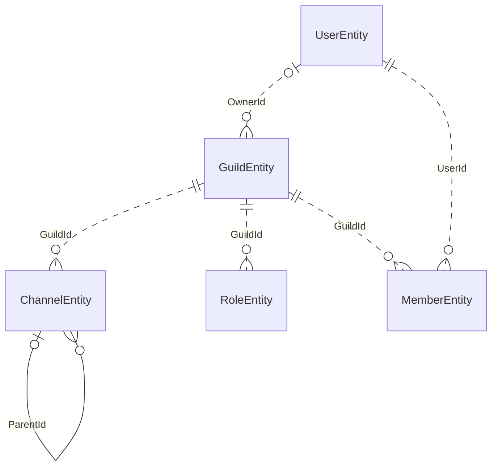
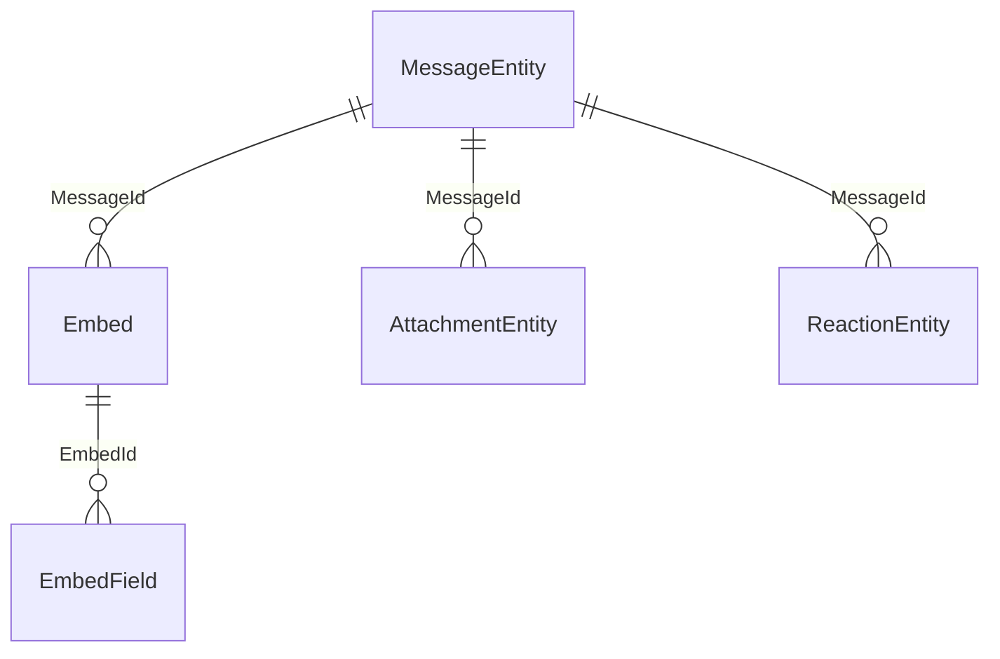
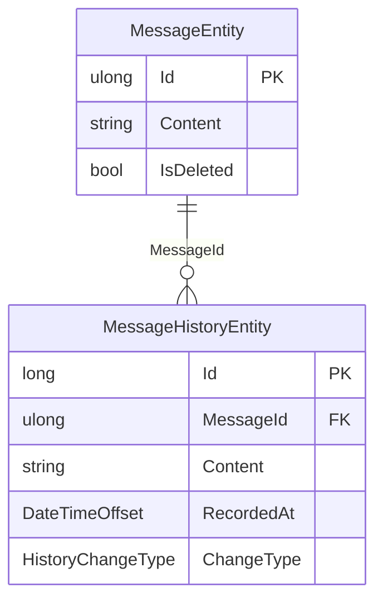
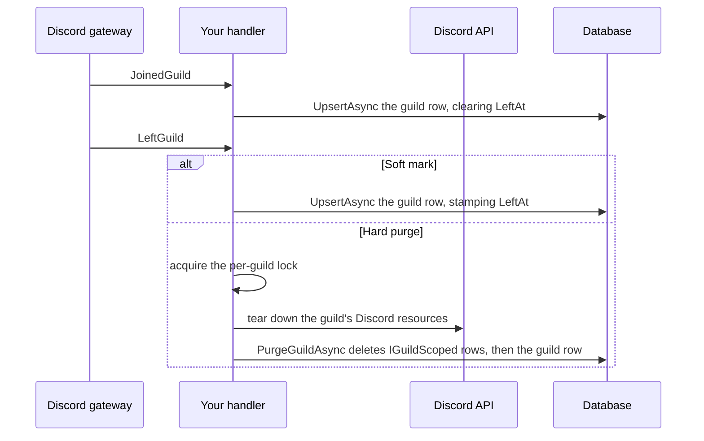
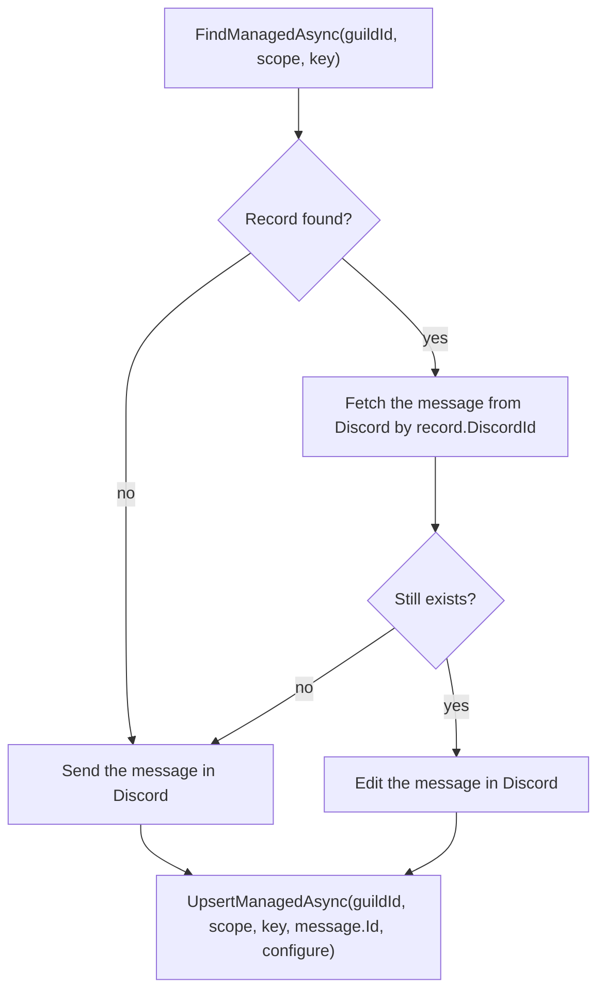
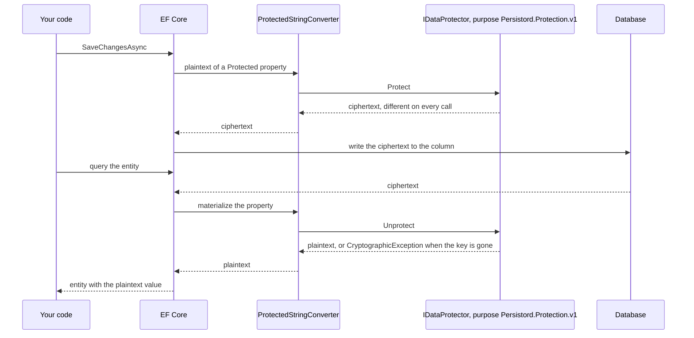

# Docs Site Revamp — PR 3: Information Architecture and Content — Implementation Plan

> **For agentic workers:** REQUIRED SUB-SKILL: Use superpowers:subagent-driven-development (recommended) or superpowers:executing-plans to implement this plan task-by-task. Steps use checkbox (`- [ ]`) syntax for tracking.

**Goal:** Restructure the documentation site's navigation into **Docs · Packages · API** with a six-group Docs sidebar, add `articles/upgrading.md`, and enrich every article (front-matter description, one-sentence lede, uniform "See also", callouts, tabs and Mermaid diagrams where spec section 4 names them), correcting every statement that contradicts the shipped source.

**Architecture:** Navigation is pure `toc.yml` work plus a one-line `docfx.json` content change. Content work edits Markdown only. A new harness suite, `content.test.mjs`, enforces the article skeleton statically (it reads the Markdown), then checks the built pages in Chromium: meta descriptions, tab ids, rendered diagrams, diagram edges against the same source evidence the landing diagram uses, and adapter/provider snippets against source. A second new suite, `nav.test.mjs`, pins the navbar, the sidebar and URL stability. One small `start()` enhancement, `carryTabChoice()`, makes a tab choice follow the reader to the next page, which DocFX alone does not do.

**Tech Stack:** DocFX 2.78.5 (pinned), DocFX-flavoured Markdown (`> [!NOTE]` callouts, `# [Label](#tab/id)` tabs, `mermaid` fences), vanilla ES modules, Node ≥ 22 `node:test`, Playwright 1.63.0 (Chromium).

**Spec:** `docs/superpowers/specs/2026-09-14-docs-site-revamp-design.md` — section 4 and section 6 (PR 3 row of its Delivery table), plus the section 5.3 sentence "after PR 3, every page in `_site` has exactly one [meta description]". Task 8 amends the spec with the deviations recorded below.

## Global Constraints

- **No template overrides.** Never add a `.tmpl`, `.tmpl.partial`, or `layout/` file under `docs/templates/persistord`.
- **`main.js` extension points only:** `defaultTheme`, `iconLinks`, `mermaid`, `configureHljs`, `start`. DOM enhancements live inside `start()`.
- **No CSS changes are expected.** PR 1 already styles callouts, tabs and Mermaid. If a screenshot shows a styling defect, fix it in the owning PR 1 stylesheet, keep every colour a token (`tests/tokens.test.mjs`), and add a test.
- **No moved or renamed article files;** every pre-existing URL keeps resolving (spec 4.2). New file: `docs/articles/upgrading.md` only.
- **Do not modify:** `.github/workflows/**`, anything under `src/` (including every `src/*/README.md`) or `samples/` (including `samples/README.md`), `docs/index.md`, `docs/templates/persistord/public/css/**`. `docs/docfx.json` changes in exactly one place (Task 1).
- **Callouts** replace prose that is *already* a note, warning or caution. At most two per page. No callout introduces a claim the article did not already make. Syntax: `> [!NOTE]` / `[!TIP]` / `[!IMPORTANT]` / `[!WARNING]` / `[!CAUTION]` on its own line, body lines prefixed `> `. No bold-blockquote pseudo-callouts (`> **…**`) remain.
- **Tabs** only on the pages in the table below, with exactly these ids, in this order. DocFX syntax: one `# [Label](#tab/id)` heading per tab, a `---` line closing the group.

  | Page | Tab groups |
  | --- | --- |
  | `getting-started.md` | `postgresql` · `sqlserver` · `sqlite`, then `discordnet` · `dsharpplus` · `netcord` |
  | `providers.md` | `postgresql` · `sqlserver` · `sqlite` |
  | `recipes.md` | `discordnet` · `dsharpplus` · `netcord` |
  | `adapters.md` | `discordnet` · `dsharpplus` · `netcord` |

  Labels: `PostgreSQL`, `SQL Server`, `SQLite`, `Discord.Net`, `DSharpPlus`, `NetCord`.
- **Mermaid diagrams** only on: `packages.md` (its existing dependency graph, kept), `core-graph.md`, `messages.md`, `history.md`, `guild-lifecycle.md`, `managed-resources.md`, `protection.md` — one each.
- **ER diagram rule (same as the landing diagram, user decision 2026-09-15):** a **solid** line (`--`) is a foreign key the model configures; a **dotted** line (`..`) is a snowflake id column that refers to another entity with **no** foreign key. Write every relationship as `Referenced <cardinality>--<cardinality> Holder : "Column"`. `tests/content.test.mjs` compares these lines with `lib/model-edges.mjs`.
- **Page skeleton** for every article: YAML front matter with a single-line `description:` (50–160 characters, no `: ` sequence, no leading quote) as the first lines of the file; `# Title`; a one-sentence lede paragraph ending in `.` immediately after the title; the last `##` section is `## See also`, holding only `- [Title](target) — reason` items (continuation lines indented two spaces).
- **Accuracy:** every signature, snippet, tab panel, diagram node and edge, and version range matches the source that ships it. The **Source facts** section below is the reference; re-open the cited file whenever a step touches a claim not listed there.
- **Snowflake claims (spec 3.2):** never show an id changing value; never claim that *no* relational provider has an unsigned 64-bit type (name PostgreSQL and SQL Server); never add a Steam64 example (the two existing mentions in `snowflake-conversion.md` and the upgrade text stay as they are); never claim the model fails to build without the converter.
- **Links:** link an article by its source file (`upsert.md`), a package README from an article as `../../src/<Package>/README.md`. Link targets that are headings use DocFX's slug (lowercase, punctuation dropped, spaces to `-`).
- **DocFX build gate:** `dotnet docfx docs/docfx.json --warningsAsErrors` exits 0. In `docs/tools/site-check`: `npm run build` (full, first time), `npm run build:fast` (seconds), `npm test`, `npm run shots`.
- **Markdown lint:** `npx --no-install markdownlint-cli2 "docs/articles/*.md"` reports 0 issues (MD013, MD033, MD041 are disabled in `.markdownlint.json`).
- **Repository facts:** repo `https://github.com/HandyS11/Persistord`; work on branch `docs/information-architecture` off `develop`; Pages base URL `https://handys11.github.io/Persistord/`.
- **Commits** end with the trailer `Co-Authored-By: Claude Opus 5 <noreply@anthropic.com>`.

### Recorded deviations from the spec (Task 8 amends the spec text)

1. **Sidebar children.** `development/components.md` (added by PR 1) and `samples/README.md` are not in spec 4.2's table, but each needs a sidebar entry to show the Docs sidebar. They appear as nested children: *Contributing → Component reference* and *Samples → All samples*.
2. **Folder TOCs are deleted.** Probed 2026-09-15: DocFX gives a page the TOC of its **own folder** when one exists, even if another TOC references the page. `docs/development/toc.yml` and `docs/samples/toc.yml` must be deleted, not just left unreferenced, and `samples/toc.yml` leaves `docfx.json`'s content list.
3. **Tab sync across pages.** Probed 2026-09-15: DocFX syncs same-id tab groups within a page and writes the choice to `?tabs=<id>`, and a page loaded with `?tabs=<id>` opens that tab, but no link carries the parameter. Spec 4.2's "DocFX's tab sync carries a reader's choice across pages" is therefore delivered by `carryTabChoice()` in `start()` (Task 2).
4. **`packages.md` keeps its dependency-graph Mermaid diagram,** which spec 4.2's diagram list omits.
5. **`404.html` gains a meta description,** so that "every page in `_site` has exactly one" (spec 5.3) holds; `toc.html` partials are not pages.

### Decisions on PR 2's deferred items

- **Landing adapter picker vs DocFX tab sync:** stays independent. It is a custom ARIA widget, not a DocFX `tabGroup`, and it does not write `?tabs=`. Joining them is out of scope.
- The PR 1 review follow-ups (API class meta descriptions, table squeeze at 375px, `--bs-*-rgb` duplication, `:root` token fallback, oklch in the tokens test, `@import` concatenation, the `search.test.mjs` query, IMPORTANT vs NOTE callouts, `READING_LINE`), PR 2's dashed-edge machine check, duplicated test helpers, and the `components.test.mjs` flake stay out of scope. **Exception:** Task 4 moves the landing diagram's `EDGES` into `lib/model-edges.mjs` because `content.test.mjs` needs them.

### Source facts (verified 2026-09-15 against `develop` at `7899a3f`)

| Fact | Source |
| --- | --- |
| `Embed` is a keyed entity (`HasKey(e => e.Id)`, `long Id` generated on add, `ulong MessageId`); `EmbedFooter`/`EmbedAuthor` are owned (`OwnsOne`), stored in the `Embed` row; `EmbedField` has `long Id`, `long EmbedId` | `src/Persistord.Messages/Configurations/EmbedEntityConfiguration.cs:16-22`, `Owned/Embed.cs` |
| `MessageEntity.Embeds`, `Attachments`, `Reactions` are get-only `List<…> { get; } = []` | `src/Persistord.Messages/Entities/MessageEntity.cs:31,34,37` |
| `OwnsMany(m => m.Embeds, e => e.ToJson())` after `ApplyMessagesModule()` throws `InvalidOperationException: The entity type 'Embed' cannot be configured as owned because it has already been configured as a non-owned.` | probed 2026-09-15 with a throwaway xunit test in `tests/Persistord.Messages.Tests` |
| `AttachmentEntity.Id` is the caller-supplied snowflake (`ValueGeneratedNever`); `ReactionEntity.Id` is an EF-generated `long` | `AttachmentEntityConfiguration.cs:17`, `Entities/ReactionEntity.cs` |
| Tables for the messages module: `Messages` (DbSet name), `Embed`, `EmbedField`, `AttachmentEntity`, `ReactionEntity`; history: `MessageHistory` (DbSet name); graph: `Guilds`, `Channels`, `Users`, `Members`, `Roles` | `samples/Persistord.Sample/Migrations/20260613224938_Initial.cs` |
| `MessageHistoryEntity` FK to `MessageEntity` is `DeleteBehavior.Restrict` — a hard delete of the message is **blocked**, never cascaded | `src/Persistord.History/Configurations/MessageHistoryEntityConfiguration.cs:27` |
| `ApplyHistoryModule()` does not check that `ApplyMessagesModule()` ran | `src/Persistord.History/ModelBuilderExtensions.cs:17-18` |
| `ChannelEntity.Type` is a plain enum column; there is no discriminator and no subclass | `src/Persistord.Core/Configurations/ChannelEntityConfiguration.cs:16-24` |
| The Core skeleton's only FK is `ChannelEntity.ParentId` (self, `Restrict`); `GuildId`/`UserId`/`OwnerId` are plain columns | same file; `lib/model-edges.mjs` after Task 4 |
| `UpsertAsync` reads with `set.IgnoreQueryFilters().AsTracking()`; the dirty check is `context.ChangeTracker.HasChanges()` | `src/Persistord.Core/UpsertExtensions.cs:89,142` |
| `PurgeGuildAsync(this DbContext, ulong guildId, CancellationToken)` deletes `IGuildScoped` rows dependents-first, then the `GuildEntity` row, in a transaction it opens unless one is active | `src/Persistord.Core/GuildPurgeExtensions.cs:47-90` |
| `UpsertManagedAsync<T>(guildId, string? scope, string key, ulong discordId, Action<T>? configure = null, ct)`; `FindManagedAsync<T>(guildId, scope, key, ct)` | `src/Persistord.Managed/ManagedStoreExtensions.cs:32-40,69-75` |
| Protection write path: EF → `ProtectedStringConverter` → `protector.Protect(value)`; read path: `protector.Unprotect(value)` during materialization, `CryptographicException` on a missing or revoked key; protector purpose `ProtectionPurposes.V1 = "Persistord.Protection.v1"` | `src/Persistord.Protection/ProtectedStringConverter.cs:21-31`, `ProtectionPurposes.cs:11` |
| Adapter mappers: Discord.Net `IGuild`/`IGuildChannel`/`IUser`/`IGuildUser`/`IRole`/`IMessage`; DSharpPlus `ToMemberEntity(this DiscordMember, ulong guildId)`, `ToRoleEntity(this DiscordRole, ulong guildId)`; NetCord `RestGuild`/`IGuildChannel`/`User`/`GuildUser`/`Role`/`RestMessage` | `src/Persistord.Adapters.*/*MappingExtensions.cs` |
| Adapter namespaces: `Persistord.Adapters.DiscordNet`, `Persistord.Adapters.DSharpPlus`, `Persistord.Adapters.NetCord`; `HistoryChangeType` lives in `Persistord.History.Entities` | same files; `src/Persistord.History/Entities/HistoryChangeType.cs:1` |
| Discord.Net channel kinds, in match order: `ICategoryChannel` → `Category`, `IThreadChannel` → `Thread`, `IVoiceChannel` → `Voice`, `ITextChannel` → `Text`, anything else → `Text` | `src/Persistord.Adapters.DiscordNet/DiscordNetMappingExtensions.cs:100-107` |
| Every adapter mapper sets `AttachmentEntity.Id` from the attachment's snowflake | `DiscordNetMappingExtensions.cs:134` (and the DSharpPlus/NetCord equivalents) |
| Provider packages: `Npgsql.EntityFrameworkCore.PostgreSQL` (`UseNpgsql`), `Microsoft.EntityFrameworkCore.SqlServer` (`UseSqlServer`), `Microsoft.EntityFrameworkCore.Sqlite` (`UseSqlite`) | `Directory.Packages.props`, `docs/development/components.md` |
| `MessageHistoryEntity.RecordedAt` is a `DateTimeOffset` (SQLite cannot `ORDER BY` it) | `src/Persistord.History/Entities/MessageHistoryEntity.cs:17`, `providers.md` |

**Out-of-scope source defects to list in the PR description as follow-ups (do not fix here):** the XML docs call embeds "owned" (`src/Persistord.Messages/ModelBuilderExtensions.cs:10`, `Entities/MessageEntity.cs:30`); `ChannelType.cs:3` calls `Type` a TPH discriminator; `DiscordNetMappingExtensions.cs:106`'s comment says the `Text` fallback covers stage channels; `src/Persistord.Adapters.DiscordNet/README.md:52-53` says mappers "throw only on a null source argument".

---

## File Structure

### Created

| Path | Responsibility |
| --- | --- |
| `docs/articles/upgrading.md` | Breaking changes by release; starts with the 1.0.0-beta2 notes moved out of `core-graph.md` |
| `docs/tools/site-check/tests/nav.test.mjs` | Navbar tabs, Docs sidebar groups and order, the sidebar on development and samples pages, URL stability |
| `docs/tools/site-check/tests/content.test.mjs` | Article skeleton, callout budget, tab and diagram placement, snippet and diagram accuracy, rendered descriptions/tabs/diagrams, tab carry-over |
| `docs/tools/site-check/lib/model-edges.mjs` | The model's edges with source evidence, shared by `model.test.mjs` and `content.test.mjs` |

### Modified

| Path | Change |
| --- | --- |
| `docs/toc.yml` | Three tabs: Docs · Packages · API |
| `docs/articles/toc.yml` | Six groups; nested Component reference and All samples; Release notes and Contributing links |
| `docs/docfx.json` | Drop `samples/toc.yml` from `build.content` |
| `docs/404.html` | One `<meta name="description">` |
| `docs/articles/*.md` (22 files) | Skeleton, enrichment, accuracy fixes |
| `docs/templates/persistord/public/main.js` | `carryTabChoice()` wired in `start()` |
| `docs/tools/site-check/tests/model.test.mjs` | Imports `EDGES` and `flatten` from `lib/model-edges.mjs` |
| `docs/tools/site-check/tests/infra.test.mjs` | Every page in `_site` has exactly one description |
| `docs/tools/site-check/shots.mjs` | Three more pages in the matrix |
| `docs/superpowers/specs/2026-09-14-docs-site-revamp-design.md` | Deviation amendments |

### Deleted

`docs/development/toc.yml`, `docs/samples/toc.yml`.

---

### Task 1: Navigation — three tabs, the Docs sidebar, and the Upgrading page

**Files:**

- Create: `docs/tools/site-check/tests/nav.test.mjs`, `docs/articles/upgrading.md`
- Modify: `docs/toc.yml`, `docs/articles/toc.yml`, `docs/docfx.json`, `docs/articles/core-graph.md`, `docs/articles/snowflake-conversion.md`
- Delete: `docs/development/toc.yml`, `docs/samples/toc.yml`

**Interfaces:**

- Consumes: nothing.
- Produces: the sidebar labels and order that later tasks' "See also" lists and `content.test.mjs` assume; `upgrading.md` with the headings `## Upgrading from 1.0.0-beta2` and the three `###` subsections below (their slugs are linked from `snowflake-conversion.md` and `core-graph.md`).

- [ ] **Step 1: Branch**

```bash
git switch develop && git pull --ff-only && git switch -c docs/information-architecture
```

- [ ] **Step 2: Write the failing navigation suite**

Create `docs/tools/site-check/tests/nav.test.mjs`:

```js
import assert from 'node:assert/strict'
import { after, before, test } from 'node:test'
import { launchSite } from '../lib/site.mjs'

/* Spec 4.2: the Docs sidebar, by what the reader is trying to do. */
const SIDEBAR = [
  ['Start', ['Introduction', 'Getting Started', 'Packages']],
  ['Concepts', ['Snowflake Conversion', 'Core Graph', 'Messages', 'History', 'Soft-delete & Query Filters', 'DbContext Lifetime']],
  ['Guides', ['Migrations', 'Providers', 'Upsert', 'Guild Lifecycle', 'Recipes']],
  ['Add-ons', ['Managed Resources', 'Protection', 'Testing']],
  ['Adapters', ['Choosing an Adapter', 'Discord.Net', 'DSharpPlus', 'NetCord']],
  ['Resources', ['Samples', 'Troubleshooting', 'Upgrading', 'Release notes', 'Contributing']],
]

const ARTICLES = [
  'adapters', 'core-graph', 'dbcontext-lifetime', 'discord-net-adapter', 'dsharpplus-adapter',
  'getting-started', 'guild-lifecycle', 'history', 'introduction', 'managed-resources', 'messages',
  'migrations', 'netcord-adapter', 'packages', 'protection', 'providers', 'recipes', 'samples',
  'snowflake-conversion', 'soft-delete-and-query-filters', 'testing', 'troubleshooting', 'upsert',
]

const PACKAGES = [
  'Persistord', 'Persistord.Core', 'Persistord.Messages', 'Persistord.History',
  'Persistord.Adapters.DiscordNet', 'Persistord.Adapters.DSharpPlus', 'Persistord.Adapters.NetCord',
  'Persistord.Managed', 'Persistord.Protection', 'Persistord.Testing',
]

/* Every page URL that existed before the restructure (spec 4.3); none may move. */
const URLS = [
  'index.html',
  'license.html',
  'api/index.html',
  'development/index.html',
  'development/components.html',
  'samples/README.html',
  ...ARTICLES.map(slug => `articles/${slug}.html`),
  ...PACKAGES.map(name => `src/${name}/README.html`),
]

/* Pages outside articles/ that must borrow the Docs sidebar. */
const BORROWERS = ['development/index.html', 'development/components.html', 'samples/README.html']

/* Reads the sidebar's top level as [group label, [entry names]]. */
const sidebar = page =>
  page.$$eval('#toc .flex-fill > ul > li', items => {
    const groups = []
    for (const item of items) {
      const label = item.querySelector(':scope > span.name-only')
      if (label) {
        groups.push([label.textContent.trim(), []])
      } else {
        groups.at(-1)?.[1].push(item.querySelector(':scope > a').textContent.trim())
      }
    }
    return groups
  })

let site

before(async () => {
  site = await launchSite()
})

after(async () => {
  await site.close()
})

test('the navbar has three tabs: Docs, Packages, API', async () => {
  const { page, close } = await site.open('articles/upsert.html')
  try {
    await page.waitForSelector('#navbar .nav-link')
    const tabs = await page.$$eval('#navbar .navbar-nav .nav-link', links => links.map(link => link.textContent.trim()))
    assert.deepEqual(tabs, ['Docs', 'Packages', 'API'])
  } finally {
    await close()
  }
})

test('the Docs sidebar groups pages by what the reader is doing', async () => {
  const { page, close } = await site.open('articles/upsert.html')
  try {
    await page.waitForSelector('#toc li a')
    assert.deepEqual(await sidebar(page), SIDEBAR)
    assert.ok(await page.$('#toc a[href="https://github.com/HandyS11/Persistord/releases"]'), 'Release notes does not link to GitHub releases')
  } finally {
    await close()
  }
})

for (const path of BORROWERS) {
  test(`${path} shows the Docs sidebar under the Docs tab`, async () => {
    const { page, close } = await site.open(path)
    try {
      await page.waitForSelector('#toc li a')
      await page.waitForSelector('#navbar .nav-link.active')
      assert.deepEqual(await sidebar(page), SIDEBAR)
      assert.equal(await page.$eval('#navbar .nav-link.active', link => link.textContent.trim()), 'Docs')
      const own = path.split('/').at(-1)
      assert.ok(await page.$(`#toc a[href$="${path}"]`), `${own} is not listed in its own sidebar`)
    } finally {
      await close()
    }
  })
}

test('every page that existed before the restructure still resolves', async () => {
  for (const path of [...URLS, 'articles/upgrading.html']) {
    const response = await fetch(site.server.url(path))
    assert.equal(response.status, 200, `${path} answered ${response.status}`)
  }
})
```

(`ARTICLES` lists the 22 articles that existed before this PR; the new `upgrading.html` is fetched separately.)

- [ ] **Step 3: Run it to verify it fails**

Run:

```bash
cd docs/tools/site-check && npm run build:fast && node --test tests/nav.test.mjs
```

Expected: FAIL — tabs are `Guides, Packages, Samples, Development, API Reference`; the sidebar groups differ; the borrower pages show their own TOC; `articles/upgrading.html` answers 404.

- [ ] **Step 4: Rewrite the TOCs**

Replace `docs/toc.yml` with:

```yaml
- name: Docs
  href: articles/
- name: Packages
  href: packages/
- name: API
  href: api/
  homepage: api/index.md
```

Replace `docs/articles/toc.yml` with:

```yaml
- name: Start
- name: Introduction
  href: introduction.md
- name: Getting Started
  href: getting-started.md
- name: Packages
  href: packages.md

- name: Concepts
- name: Snowflake Conversion
  href: snowflake-conversion.md
- name: Core Graph
  href: core-graph.md
- name: Messages
  href: messages.md
- name: History
  href: history.md
- name: Soft-delete & Query Filters
  href: soft-delete-and-query-filters.md
- name: DbContext Lifetime
  href: dbcontext-lifetime.md

- name: Guides
- name: Migrations
  href: migrations.md
- name: Providers
  href: providers.md
- name: Upsert
  href: upsert.md
- name: Guild Lifecycle
  href: guild-lifecycle.md
- name: Recipes
  href: recipes.md

- name: Add-ons
- name: Managed Resources
  href: managed-resources.md
- name: Protection
  href: protection.md
- name: Testing
  href: testing.md

- name: Adapters
- name: Choosing an Adapter
  href: adapters.md
- name: Discord.Net
  href: discord-net-adapter.md
- name: DSharpPlus
  href: dsharpplus-adapter.md
- name: NetCord
  href: netcord-adapter.md

- name: Resources
- name: Samples
  href: samples.md
  items:
  - name: All samples
    href: ../../samples/README.md
- name: Troubleshooting
  href: troubleshooting.md
- name: Upgrading
  href: upgrading.md
- name: Release notes
  href: https://github.com/HandyS11/Persistord/releases
- name: Contributing
  href: ../development/index.md
  items:
  - name: Component reference
    href: ../development/components.md
```

Delete the folder TOCs (see deviation 2 — a folder TOC wins over a referencing one):

```bash
git rm docs/development/toc.yml docs/samples/toc.yml
```

In `docs/docfx.json`, replace `{ "files": [ "packages/toc.yml", "samples/toc.yml" ] },` with `{ "files": [ "packages/toc.yml" ] },`.

- [ ] **Step 5: Create `docs/articles/upgrading.md`**

Move the upgrade notes out of `core-graph.md`: the whole `## Upgrading from 1.0.0-beta2` section (core-graph.md lines 66–94 at `7899a3f`) and the `**Breaking change from 1.0.0-beta2:**` paragraph under `### GuildEntity` (lines 130–135). Create `docs/articles/upgrading.md` with exactly:

````markdown
---
description: The breaking changes between Persistord releases, and what each asks of your code and your next migration.
---

# Upgrading

This page lists the breaking changes between Persistord releases and what each one asks of your code and your next migration.

New notes are added at the top, one `##` section per release.

## Upgrading from 1.0.0-beta2

### `DiscordDbContext` no longer maps the skeleton

If you use `Guilds`/`Channels`/`Users`/`Members`/`Roles`, change your base class to
`DiscordGraphDbContext`. If you never did but your derived context's committed
model snapshot still has those five tables in it (any `DiscordDbContext`
consumer from beta2 does), your next `dotnet ef migrations add` diffs against
that snapshot and emits `DropTable` for `Guilds`, `Channels`, `Users`,
`Members` and `Roles` — usually what you want.

> [!CAUTION]
> Review the generated migration before running `database update`: this is the most likely way
> to lose data on this upgrade.

`ApplyCoreConfiguration()` is renamed `ApplyCoreGraph()`; the old name forwards for one release.

### A bare `ulong` primary key is no longer store-generated

On `1.0.0-beta2`, a consumer's own `public ulong Id { get; set; }` primary key
was `ValueGenerated.OnAdd` by EF's own convention — SQLite emitted `"Id"
INTEGER NOT NULL ... PRIMARY KEY AUTOINCREMENT` for it. `SnowflakeKeyConvention`
(see [Snowflake Conversion](snowflake-conversion.md)) now marks every `ulong`
or `ulong?` primary-key property `ValueGenerated.Never`, because a Discord
snowflake, a Steam64 id, or any other unsigned 64-bit key is a value the
caller already owns, never one the database should assign — intended
behaviour, not a regression. Two things follow for an upgrading consumer: your next
`dotnet ef migrations add` drops the identity/autoincrement from that column,
and code that relied on EF assigning the key (leaving `Id` as `0` on a new
row before `SaveChangesAsync`) now inserts a literal `0` and collides on the
second such row. If you genuinely want a store-generated `ulong` key, call
`.Property(e => e.Id).ValueGeneratedOnAdd()` explicitly on that entity —
explicit fluent configuration wins over the convention.

### `GuildEntity.Name` and `OwnerId` are optional

`Name` and `OwnerId` were required; they are now optional, and `JoinedAt`/`LeftAt` are new
columns. A consumer with an existing `Guilds` table needs a migration — on SQLite, relaxing a
column to nullable is a table rebuild, which `dotnet ef migrations add` emits for you. Code
reading `guild.Name` or `guild.OwnerId` now gets a nullable value and must handle `null`.

## See also

- [Core Graph](core-graph.md) — the two base contexts and the skeleton entities these changes touch.
- [Snowflake Conversion](snowflake-conversion.md) — `SnowflakeKeyConvention`, behind the key change.
- [Migrations](migrations.md) — generating the migration each change needs.
- [Release notes](https://github.com/HandyS11/Persistord/releases) — every release, on GitHub.
````

(The only wording changes from the moved text: the first sentence is split under its own heading, the caution is lifted into a callout, "**Third break:**" becomes a heading, and the link to the repository root labelled "spec" is dropped because it pointed at no spec.)

- [ ] **Step 6: Leave pointers behind**

In `docs/articles/core-graph.md`, delete the `## Upgrading from 1.0.0-beta2` section (from that heading up to, not including, `## Entity shapes`) and the `**Breaking change from \`1.0.0-beta2\`:**` paragraph under `### GuildEntity`. Directly after the paragraph that ends ``if you'd rather opt in without the extra base class.`` add:

```markdown
Upgrading from `1.0.0-beta2`, where `DiscordDbContext` still mapped the skeleton? See [Upgrading](upgrading.md).
```

In `docs/articles/snowflake-conversion.md`, replace `[Upgrading from 1.0.0-beta2](core-graph.md#upgrading-from-100-beta2)` with `[Upgrading from 1.0.0-beta2](upgrading.md#a-bare-ulong-primary-key-is-no-longer-store-generated)`.

Confirm nothing else links to the removed anchor:

```bash
grep -rn "upgrading-from-100-beta2" docs README.md src samples --include=*.md
```

Expected: no output.

- [ ] **Step 7: Run the suite and the gate**

Run:

```bash
rm -rf docs/_site/development docs/_site/samples
cd docs/tools/site-check && npm run build:fast && node --test tests/nav.test.mjs tests/crawl.test.mjs tests/chrome.test.mjs tests/keyboard.test.mjs
cd ../../.. && npx --no-install markdownlint-cli2 "docs/articles/*.md"
```

(The `rm` clears the stale `toc.html` files a fast build leaves behind.)

Expected: all pass, 0 lint issues. If a borrower page still shows its own TOC, a folder `toc.yml` survived Step 4. If `chrome.test.mjs`'s sidebar tests fail, check that group labels still render as `span.name-only` — a group entry must have no `href`.

- [ ] **Step 8: Commit**

```bash
git add -A docs/toc.yml docs/articles/toc.yml docs/docfx.json docs/development docs/samples docs/articles/upgrading.md docs/articles/core-graph.md docs/articles/snowflake-conversion.md docs/tools/site-check/tests/nav.test.mjs
git commit -m "docs: three-tab navigation, task-ordered Docs sidebar, and an Upgrading page

Co-Authored-By: Claude Opus 5 <noreply@anthropic.com>"
```

---

### Task 2: The content guard, tab carry-over, and the Start group's Introduction and Packages

**Files:**

- Create: `docs/tools/site-check/tests/content.test.mjs`
- Modify: `docs/templates/persistord/public/main.js`, `docs/articles/introduction.md`, `docs/articles/packages.md`

**Interfaces:**

- Consumes: Task 1's sidebar (the carry-over test clicks a sidebar link).
- Produces: `content.test.mjs` with the constants `ENRICHED` (array of article slugs), `TABS`, `DIAGRAMS`, and the helpers `article(slug)`, `tabGroups(prose)`, `tabPanels(body)`. Tasks 3–7 **append slugs to `ENRICHED`** and add page-specific tests; they never weaken a rule. `carryTabChoice()` in `main.js`.

- [ ] **Step 1: Write the content suite**

Create `docs/tools/site-check/tests/content.test.mjs`:

````js
import assert from 'node:assert/strict'
import { readdir, readFile } from 'node:fs/promises'
import { after, before, test } from 'node:test'
import { launchSite } from '../lib/site.mjs'

const ARTICLES = new URL('../../../articles/', import.meta.url)
const REPO = new URL('../../../../', import.meta.url)

/* Articles that follow the page skeleton. Each content task appends its pages;
   Task 8 asserts this covers every article. */
const ENRICHED = ['introduction', 'packages']

/* Tab ids per page, one array per group, in page order (spec 4.2). */
const TABS = {
  'getting-started': [['postgresql', 'sqlserver', 'sqlite'], ['discordnet', 'dsharpplus', 'netcord']],
  providers: [['postgresql', 'sqlserver', 'sqlite']],
  recipes: [['discordnet', 'dsharpplus', 'netcord']],
  adapters: [['discordnet', 'dsharpplus', 'netcord']],
}

/* Mermaid diagrams per page (spec 4.2, plus packages.md's existing graph). */
const DIAGRAMS = { packages: 1, 'core-graph': 1, messages: 1, history: 1, 'guild-lifecycle': 1, 'managed-resources': 1, protection: 1 }

const CALLOUT = /^> \[!(?:NOTE|TIP|IMPORTANT|WARNING|CAUTION)\]$/gm
const TAB_HEADING = /^# \[[^\]]+\]\(#tab\/([\w-]+)\)$/

/**
 * Splits an article into its description, its body, and its prose: the body
 * with every fenced block blanked line for line, so a heading, callout or tab
 * marker inside code never counts.
 */
async function article(slug) {
  const text = await readFile(new URL(`${slug}.md`, ARTICLES), 'utf8')
  const header = /^---\n([\s\S]*?)\n---\n/.exec(text)
  const body = header ? text.slice(header[0].length) : text
  const description = header ? /^description: (.+)$/m.exec(header[1])?.[1] ?? null : null
  const prose = body.replace(/^(`{3,}|~{3,})[^\n]*\n[\s\S]*?^\1[ \t]*$/gm, block => block.replace(/[^\n]/g, ''))
  return { text, body, prose, description }
}

/** Tab ids grouped as DocFX groups them: consecutive tab headings until a `---` line. */
function tabGroups(prose) {
  const groups = []
  let open = null
  for (const line of prose.split('\n')) {
    const tab = TAB_HEADING.exec(line)
    if (tab) {
      if (!open) {
        open = []
        groups.push(open)
      }
      open.push(tab[1])
    } else if (line === '---') {
      open = null
    }
  }
  return groups
}

/** Each tab's raw Markdown (code included), keyed `id#n` for the n-th group using that id. */
function tabPanels(body) {
  const panels = new Map()
  let current = null
  let fence = null
  for (const line of body.split('\n')) {
    const marker = /^(`{3,}|~{3,})/.exec(line)?.[1]
    if (marker && (!fence || marker === fence)) {
      fence = fence ? null : marker
    }
    const tab = fence ? null : TAB_HEADING.exec(line)
    if (tab) {
      let n = 0
      while (panels.has(`${tab[1]}#${n}`)) {
        n++
      }
      current = `${tab[1]}#${n}`
      panels.set(current, '')
    } else if (!fence && line === '---') {
      current = null
    } else if (current) {
      panels.set(current, `${panels.get(current)}${line}\n`)
    }
  }
  return panels
}

/** The lede: the first paragraph after the `# ` title. */
function lede(prose) {
  const lines = prose.split('\n')
  let index = lines.findIndex(line => line.startsWith('# '))
  index++
  while (index < lines.length && !lines[index].trim()) {
    index++
  }
  const paragraph = []
  while (index < lines.length && lines[index].trim()) {
    paragraph.push(lines[index])
    index++
  }
  return paragraph.join(' ')
}

let site

before(async () => {
  site = await launchSite()
})

after(async () => {
  await site.close()
})

for (const slug of ENRICHED) {
  test(`${slug}: front matter carries a one-line description`, async () => {
    const { description } = await article(slug)
    assert.ok(description, 'no description: in front matter')
    assert.ok(description.length >= 50 && description.length <= 160, `description is ${description.length} characters`)
    assert.ok(!description.includes(': '), 'a ": " breaks the YAML plain scalar')
    assert.ok(!/^['"]/.test(description), 'description is quoted')
  })

  test(`${slug}: the title is followed by a one-sentence lede`, async () => {
    const { prose } = await article(slug)
    const text = lede(prose)
    assert.ok(text, 'no paragraph after the title')
    assert.ok(!/^(?:[>|#-]|\d+\.|!\[)/.test(text), `the first block after the title is not a paragraph: ${text.slice(0, 40)}`)
    const plain = text.replace(/`[^`]*`/g, 'code').replace(/\]\([^)]*\)/g, ']')
    assert.equal(plain.match(/[.!?](?=\s|$)/g)?.length ?? 0, 1, `lede is not one sentence: ${text}`)
    assert.ok(plain.trimEnd().endsWith('.'), 'lede does not end with a full stop')
  })

  test(`${slug}: the last section is a uniform See also list`, async () => {
    const { prose } = await article(slug)
    const sections = prose.split(/^## /m)
    const last = sections.at(-1)
    assert.match(last, /^See also\n/, 'the last ## section is not See also')
    assert.equal(sections.filter(section => /^(?:See also|Next steps)\n/.test(section)).length, 1, 'more than one See also / Next steps section')
    const lines = last.split('\n').slice(1).filter(line => line.trim())
    assert.ok(lines.some(line => line.startsWith('- ')), 'See also is empty')
    for (const line of lines) {
      assert.ok(/^- \[[^\]]+\]\([^)]+\) — \S/.test(line) || /^ {2}\S/.test(line), `not a See also item: ${line}`)
    }
  })

  test(`${slug}: callouts are real callouts, at most two`, async () => {
    const { prose } = await article(slug)
    assert.ok((prose.match(CALLOUT)?.length ?? 0) <= 2, 'more than two callouts')
    assert.doesNotMatch(prose, /^> \*\*/m, 'a bold blockquote should be a callout')
  })

  test(`${slug}: tabs and diagrams appear only where spec 4.2 puts them`, async () => {
    const { prose, body } = await article(slug)
    assert.deepEqual(tabGroups(prose), TABS[slug] ?? [])
    assert.equal(body.match(/^```mermaid$/gm)?.length ?? 0, DIAGRAMS[slug] ?? 0)
  })

  test(`${slug}: the built page carries its description exactly once`, async () => {
    const { description } = await article(slug)
    const { page, close } = await site.open(`articles/${slug}.html`)
    try {
      const contents = await page.$$eval('meta[name="description"]', metas => metas.map(meta => meta.content))
      assert.deepEqual(contents, [description])
    } finally {
      await close()
    }
  })
}

test('a tab choice carries to the next page the reader opens', async () => {
  const { page, close } = await site.open('development/components.html')
  try {
    await page.waitForSelector('.tabGroup a[data-tab="sqlite"]')
    await page.click('.tabGroup a[data-tab="sqlite"]')
    await page.waitForURL(/[?&]tabs=sqlite/)
    await page.waitForSelector('#toc a[href$="articles/getting-started.html"]')
    await page.click('#toc a[href$="articles/getting-started.html"]')
    await page.waitForURL(/articles\/getting-started\.html\?tabs=sqlite$/)
  } finally {
    await close()
  }
})

test('links leave the tabs parameter alone when the reader chose no tab', async () => {
  const { page, close } = await site.open('development/components.html')
  try {
    await page.waitForSelector('#toc a[href$="articles/getting-started.html"]')
    await page.click('#toc a[href$="articles/getting-started.html"]')
    await page.waitForURL(/articles\/getting-started\.html$/)
  } finally {
    await close()
  }
})
````

(`readdir` and `REPO` are used by tests Tasks 3 and 8 add; leave the imports.)

- [ ] **Step 2: Run it to verify it fails**

Run:

```bash
cd docs/tools/site-check && npm run build:fast && node --test tests/content.test.mjs
```

Expected: FAIL — `introduction`/`packages` have no front matter, the Packages lede is two sentences, Introduction has no See also, and the carry-over test times out waiting for `?tabs=sqlite` on `getting-started.html`.

- [ ] **Step 3: Implement `carryTabChoice()`**

In `docs/templates/persistord/public/main.js`, add above `/** Runs a callback once the document has parsed. */`:

```js
/**
 * docfx syncs tab groups that share an id within a page and records the
 * reader's choice in the `tabs` query parameter, but its links drop that
 * parameter. Adding it to a same-site page link as the link is followed lets
 * a choice made on one page (PostgreSQL, say) open the matching tab on the
 * next. Capture phase, so the href is final before any other click handler
 * or the navigation reads it.
 */
function carryTabChoice() {
  document.addEventListener(
    'click',
    event => {
      const tabs = new URLSearchParams(location.search).get('tabs')
      const link = event.target instanceof Element ? event.target.closest('a[href]') : null
      if (!tabs || !link || link.closest('.tabGroup')) {
        return
      }
      const url = new URL(link.href, location.href)
      if (url.origin !== location.origin || !url.pathname.endsWith('.html') || url.searchParams.has('tabs')) {
        return
      }
      url.searchParams.set('tabs', tabs)
      link.href = url.href
    },
    true
  )
}
```

In `start()`, add `carryTabChoice()` after `wireTabs()`.

- [ ] **Step 4: Enrich `introduction.md`**

Apply these edits to `docs/articles/introduction.md`:

1. Insert at the very top of the file:

```markdown
---
description: What Persistord is, the promise it makes, and what it deliberately leaves to your bot.
---

```

2. Leave the lede (lines 3–4, `Persistord is a **provider-agnostic, Discord-library-agnostic** persistence layer for Discord bots, built on EF Core 10.`) as it is; it is already one sentence.

3. **Tightening (one home per fact):** replace the entire `## Packages` section (from `## Packages` through the paragraph ending `independently of that chain and of each other.`) with:

```markdown
## Packages

Persistord ships ten NuGet packages. The `Persistord` meta package bundles the library-neutral
mirror stack — `Persistord.Core`, `Persistord.Messages` and `Persistord.History` — and is the
recommended starting point. Three adapters map Discord.Net, DSharpPlus and NetCord types, and
`Persistord.Managed`, `Persistord.Protection` and `Persistord.Testing` are opt-in add-ons outside
the meta package. [Packages](packages.md) lists what each one adds, what it depends on, and how to
choose.
```

(The heading stays so `introduction.md#packages` links keep landing. This also removes the inaccurate "owned embeds" wording.)

4. Replace the closing line `To get started, see [Getting Started](getting-started.md).` with:

```markdown
## See also

- [Getting Started](getting-started.md) — build a context and write your first records.
- [Packages](packages.md) — the ten packages, what each adds, and which ones you need.
- [Snowflake Conversion](snowflake-conversion.md) — how `ulong` snowflakes are stored.
```

- [ ] **Step 5: Enrich `packages.md`**

Apply these edits to `docs/articles/packages.md`:

1. Insert at the very top:

```markdown
---
description: The ten Persistord NuGet packages, what each adds and depends on, and how to pick the ones your bot needs.
---

```

2. Replace the lede paragraph (lines 3–7, `Persistord ships ten NuGet packages: … your bot needs.`) with:

```markdown
Persistord ships ten NuGet packages: a meta package, the three-package mirror stack it bundles, three Discord-library adapters, and three opt-in add-ons.

This page lists what each one adds, what it depends on, how the packages fit together, and how to
decide which ones your bot needs.
```

3. In `## See also`, replace the Introduction item (two lines) with:

```markdown
- [Introduction](introduction.md) — what Persistord is and what it leaves to your bot.
```

- [ ] **Step 6: Run the suite**

Run:

```bash
cd docs/tools/site-check && npm run build:fast && node --test tests/content.test.mjs tests/nav.test.mjs
cd ../../.. && npx --no-install markdownlint-cli2 "docs/articles/*.md"
```

Expected: all pass; 0 lint issues.

- [ ] **Step 7: Commit**

```bash
git add docs/tools/site-check/tests/content.test.mjs docs/templates/persistord/public/main.js docs/articles/introduction.md docs/articles/packages.md
git commit -m "docs: article skeleton guard, tab choice carried across pages, Start group pages

Co-Authored-By: Claude Opus 5 <noreply@anthropic.com>"
```

---

### Task 3: Getting Started as a tutorial

**Files:**

- Modify: `docs/articles/getting-started.md`, `docs/tools/site-check/tests/content.test.mjs`

**Interfaces:**

- Consumes: `ENRICHED`, `TABS`, `article`, `tabPanels` from Task 2.
- Produces: the tests `mapper calls in adapter tabs match the adapter source` and `provider tabs install and register their provider`, which run for every page in `TABS` that is in `ENRICHED` — Tasks 5 and 7 inherit them.

- [ ] **Step 1: Add the failing tests**

In `docs/tools/site-check/tests/content.test.mjs`, append `'getting-started'` to `ENRICHED`. Below the `DIAGRAMS` constant add:

```js
const ADAPTERS = {
  discordnet: { namespace: 'Persistord.Adapters.DiscordNet', source: 'src/Persistord.Adapters.DiscordNet/DiscordNetMappingExtensions.cs' },
  dsharpplus: { namespace: 'Persistord.Adapters.DSharpPlus', source: 'src/Persistord.Adapters.DSharpPlus/DSharpPlusMappingExtensions.cs' },
  netcord: { namespace: 'Persistord.Adapters.NetCord', source: 'src/Persistord.Adapters.NetCord/NetCordMappingExtensions.cs' },
}

const PROVIDERS = {
  postgresql: { package: 'Npgsql.EntityFrameworkCore.PostgreSQL', call: 'UseNpgsql(' },
  sqlserver: { package: 'Microsoft.EntityFrameworkCore.SqlServer', call: 'UseSqlServer(' },
  sqlite: { package: 'Microsoft.EntityFrameworkCore.Sqlite', call: 'UseSqlite(' },
}

/* Whitespace-insensitive source, so a signature split over lines matches. */
const flatten = text => text.replace(/\s+/g, ' ')
```

Append at the end of the file:

```js
for (const slug of ENRICHED.filter(slug => TABS[slug])) {
  test(`${slug}: mapper calls in adapter tabs match the adapter source`, async () => {
    const panels = tabPanels((await article(slug)).body)
    for (const [key, markdown] of panels) {
      const adapter = ADAPTERS[key.split('#')[0]]
      if (!adapter) {
        continue
      }
      const source = flatten(await readFile(new URL(adapter.source, REPO), 'utf8'))
      const calls = [...markdown.matchAll(/\.To(\w+)Entity\(([^)]*)\)/g)]
      assert.ok(calls.length > 0, `${key}: no mapper call`)
      assert.ok(markdown.includes(`using ${adapter.namespace};`), `${key}: does not import ${adapter.namespace}`)
      for (const [call, name, args] of calls) {
        const signature = new RegExp(`public static \\w+ To${name}Entity\\(this [\\w.<>?]+ \\w+((?:, [\\w.<>?]+ \\w+)*)\\)`).exec(source)
        assert.ok(signature, `${key}: ${call} has no To${name}Entity in ${adapter.source}`)
        const declared = signature[1] ? signature[1].split(',').length - 1 : 0
        const passed = args.trim() ? args.split(',').length : 0
        assert.equal(passed, declared, `${key}: ${call} passes ${passed} argument(s), the mapper takes ${declared}`)
      }
    }
  })

  test(`${slug}: provider tabs install and register their provider`, async () => {
    const panels = tabPanels((await article(slug)).body)
    for (const [key, markdown] of panels) {
      const provider = PROVIDERS[key.split('#')[0]]
      if (!provider) {
        continue
      }
      assert.ok(markdown.includes(`dotnet add package ${provider.package}`), `${key}: does not install ${provider.package}`)
      assert.ok(markdown.includes(provider.call), `${key}: does not call ${provider.call}`)
    }
  })

  test(`${slug}: the built page renders the tab groups`, async () => {
    const { page, close } = await site.open(`articles/${slug}.html`)
    try {
      await page.waitForSelector('.tabGroup a[data-tab]')
      const groups = await page.$$eval('.tabGroup', elements =>
        elements.map(group => [...group.querySelectorAll(':scope > ul a[data-tab]')].map(link => link.dataset.tab))
      )
      assert.deepEqual(groups, TABS[slug])
    } finally {
      await close()
    }
  })
}

test('getting-started: reads as a tutorial', async () => {
  const { prose } = await article('getting-started')
  const headings = [...prose.matchAll(/^## (.+)$/gm)].map(match => match[1])
  assert.deepEqual(headings, [
    "What you'll build",
    'Prerequisites',
    '1. Install the packages',
    '2. Derive a context',
    '3. Register a provider',
    '4. Write your first records',
    '5. Map from your Discord library',
    '6. Run it',
    'See also',
  ])
})

test('a carried tab choice opens the matching tab on the next page', async () => {
  const { page, close } = await site.open('articles/providers.html?tabs=sqlite')
  try {
    await page.waitForSelector('#toc a[href$="articles/getting-started.html"]')
    await page.click('#toc a[href$="articles/getting-started.html"]')
    await page.waitForURL(/getting-started\.html\?tabs=sqlite$/)
    await page.waitForSelector('.tabGroup a[data-tab="sqlite"][aria-selected="true"]')
  } finally {
    await close()
  }
})
```

(The last test opens `providers.html` only as a starting page carrying `?tabs=`; it does not need tabs there yet.)

- [ ] **Step 2: Run to verify it fails**

Run: `cd docs/tools/site-check && npm run build:fast && node --test tests/content.test.mjs`

Expected: FAIL on every `getting-started` test (no front matter, no tabs, headings `Install`, `1. Derive a context`, …, `Next steps`), and the matching-tab test (no SQLite tab on the page).

- [ ] **Step 3: Rewrite `getting-started.md` into the tutorial skeleton**

Replace the whole of `docs/articles/getting-started.md` with the following. It reorders and relabels the existing content; the new text is the tutorial frame (what you'll build, prerequisites, provider/adapter tabs, run it), and the install list no longer calls the adapters part of the library-neutral stack (it contradicted `src/Persistord/Persistord.csproj`).

`````markdown
---
description: Build a context that persists Discord messages and their edit history, register a database provider, and create its schema with a migration.
---

# Getting Started

This tutorial takes a bot project from no Persistord reference to a database schema ready for its first messages and history rows.

## What you'll build

A `MyBotContext` that stores Discord messages and an append-only history of their changes,
registered against the database provider you choose, with its schema created by an EF Core
migration. Along the way you pick a base context, write your first records through a short-lived
context, and, if your bot uses one, map messages straight from your Discord library.

## Prerequisites

- The [.NET 10 SDK](https://dotnet.microsoft.com/download/dotnet/10.0) and a bot project to add
  Persistord to.
- The EF Core command-line tools, for the last step: `dotnet tool install --global dotnet-ef`,
  plus a reference to `Microsoft.EntityFrameworkCore.Design` in the bot project.
- A database: a PostgreSQL or SQL Server instance, or nothing at all for SQLite.

## 1. Install the packages

The easiest way is the meta package, which pulls in `Core`, `Messages`, and
`History` in one reference:

```bash
# Recommended: the full library-neutral stack in one package
dotnet add package Persistord
```

Or install the same modules individually:

```bash
dotnet add package Persistord.Core
dotnet add package Persistord.Messages      # optional: message persistence
dotnet add package Persistord.History       # optional: requires Messages
```

That is the library-neutral mirror stack the meta package bundles. Step 5 adds a Discord-library
adapter if you want one. Three more packages exist outside the stack, opt in and installed
separately when you need them: `Persistord.Managed` (records of resources your bot creates and
owns), `Persistord.Protection` (encrypts `[Protected]` columns at rest), and `Persistord.Testing`
(in-memory SQLite fixtures for tests). See [Packages](packages.md) for the full list.

## 2. Derive a context

`Persistord.Core` splits the base context in two: `DiscordDbContext` applies
only the snowflake conventions and maps nothing, while `DiscordGraphDbContext`
adds the guild/channel/user/member/role skeleton on top.

If your bot doesn't mirror Discord's own objects — it just persists messages,
say — derive `DiscordDbContext` and apply the module configurations you want in
`OnModelCreating`:

```csharp
using Microsoft.EntityFrameworkCore;
using Persistord.Core;
using Persistord.History;
using Persistord.History.Entities;
using Persistord.Messages;
using Persistord.Messages.Entities;

public sealed class MyBotContext : DiscordDbContext
{
    public MyBotContext(DbContextOptions<MyBotContext> options) : base(options) { }

    public DbSet<MessageEntity> Messages => Set<MessageEntity>();
    public DbSet<MessageHistoryEntity> MessageHistory => Set<MessageHistoryEntity>();

    protected override void OnModelCreating(ModelBuilder modelBuilder)
    {
        base.OnModelCreating(modelBuilder);   // snowflake convention only
        modelBuilder.ApplyMessagesModule();   // omit if you don't persist messages
        modelBuilder.ApplyHistoryModule();    // requires ApplyMessagesModule()
    }
}
```

If your bot also mirrors guilds, channels, users, members or roles, derive
`DiscordGraphDbContext` instead — it exposes those `DbSet`s automatically:

```csharp
public sealed class MyBotContext : DiscordGraphDbContext
{
    public MyBotContext(DbContextOptions<MyBotContext> options) : base(options) { }

    public DbSet<MessageEntity> Messages => Set<MessageEntity>();
    public DbSet<MessageHistoryEntity> MessageHistory => Set<MessageHistoryEntity>();

    protected override void OnModelCreating(ModelBuilder modelBuilder)
    {
        base.OnModelCreating(modelBuilder);   // core skeleton + snowflake convention
        modelBuilder.ApplyMessagesModule();   // omit if you don't persist messages
        modelBuilder.ApplyHistoryModule();    // requires ApplyMessagesModule()
    }
}
```

Core entities (`Guilds`, `Channels`, `Users`, `Members`, `Roles`) are already
exposed by `DiscordGraphDbContext` — you only declare the module `DbSet`s.

## 3. Register a provider

The consumer owns the provider choice. Install the provider package and register a context
factory:

# [PostgreSQL](#tab/postgresql)

```bash
dotnet add package Npgsql.EntityFrameworkCore.PostgreSQL
```

```csharp
services.AddDbContextFactory<MyBotContext>(options =>
    options.UseNpgsql(builder.Configuration.GetConnectionString("Bot")));
```

# [SQL Server](#tab/sqlserver)

```bash
dotnet add package Microsoft.EntityFrameworkCore.SqlServer
```

```csharp
services.AddDbContextFactory<MyBotContext>(options =>
    options.UseSqlServer(builder.Configuration.GetConnectionString("Bot")));
```

# [SQLite](#tab/sqlite)

```bash
dotnet add package Microsoft.EntityFrameworkCore.Sqlite
```

```csharp
services.AddDbContextFactory<MyBotContext>(options =>
    options.UseSqlite(builder.Configuration.GetConnectionString("Bot")));
```

---

Any EF Core 10 relational provider works. The snowflake `ulong → long` conversion is applied
automatically. [Providers](providers.md) covers the SQLite and PostgreSQL behaviour worth knowing
before you ship.

## 4. Write your first records

A bot is long-lived and concurrent; a `DbContext` is neither thread-safe nor meant
to live forever. Create one per unit of work via the factory and dispose it:

```csharp
await using var db = await factory.CreateDbContextAsync();

db.Messages.Add(new MessageEntity
{
    Id = message.Id,
    ChannelId = message.ChannelId,
    AuthorId = message.Author.Id,
    Content = message.Content,
});
db.MessageHistory.Add(new MessageHistoryEntity
{
    MessageId = message.Id,
    Content = message.Content,
    RecordedAt = DateTimeOffset.UtcNow,
    ChangeType = HistoryChangeType.Created,
});

await db.SaveChangesAsync();
```

## 5. Map from your Discord library

This step is optional. An adapter replaces the hand-written mapping above with one call per
entity. Install the one for the library your bot uses:

# [Discord.Net](#tab/discordnet)

```bash
dotnet add package Persistord.Adapters.DiscordNet
```

`message` is any Discord.Net `IMessage`, gateway or REST:

```csharp
using Persistord.Adapters.DiscordNet;
using Persistord.History.Entities;

db.Messages.Add(message.ToMessageEntity());
db.MessageHistory.Add(message.ToHistoryEntity(HistoryChangeType.Created));
await db.SaveChangesAsync();
```

# [DSharpPlus](#tab/dsharpplus)

```bash
dotnet add package Persistord.Adapters.DSharpPlus
```

`message` is a DSharpPlus `DiscordMessage`:

```csharp
using Persistord.Adapters.DSharpPlus;
using Persistord.History.Entities;

db.Messages.Add(message.ToMessageEntity());
db.MessageHistory.Add(message.ToHistoryEntity(HistoryChangeType.Created));
await db.SaveChangesAsync();
```

# [NetCord](#tab/netcord)

```bash
dotnet add package Persistord.Adapters.NetCord
```

`message` is a NetCord `RestMessage`, or the gateway `Message` that derives from it:

```csharp
using Persistord.Adapters.NetCord;
using Persistord.History.Entities;

db.Messages.Add(message.ToMessageEntity());
db.MessageHistory.Add(message.ToHistoryEntity(HistoryChangeType.Created));
await db.SaveChangesAsync();
```

---

[Choosing an Adapter](adapters.md) compares the three.

## 6. Run it

Create the schema from your context with a migration:

```bash
dotnet ef migrations add Initial
dotnet ef database update
```

`database update` ends with `Done.`. The database now holds a `Messages` and a `MessageHistory`
table, plus `Embed`, `EmbedField`, `AttachmentEntity` and `ReactionEntity` for the message's
children and EF Core's own `__EFMigrationsHistory`. With `DiscordGraphDbContext` it also holds
`Guilds`, `Channels`, `Users`, `Members` and `Roles`. Run the bot, and every message that reaches
the code from step 4 or step 5 adds one `Messages` row and one `Created` row in `MessageHistory`.

> [!TIP]
> If `dotnet ef` cannot find or create your context, see
> [Troubleshooting](troubleshooting.md#dotnet-ef-cant-find-the-dbcontext).

## See also

- [Migrations](migrations.md) — generate and apply EF Core migrations against your
  own context and provider.
- [Snowflake Conversion](snowflake-conversion.md) — how `ulong ↔ long` storage
  works and when to care.
- [Messages](messages.md) — embeds, attachments, reactions, and how they are stored.
- [DbContext Lifetime](dbcontext-lifetime.md) — patterns for `IDbContextFactory`
  in a concurrent bot.
- [Guild Lifecycle](guild-lifecycle.md) — upserting the guild root on
  `JoinedGuild` and soft-marking or purging it on `LeftGuild`.
- [Upsert](upsert.md) — the natural-key upsert behind that recipe and its own
  gotchas.
- [Providers](providers.md) — the SQLite and PostgreSQL caveats worth knowing
  before you pick one.
`````

Accuracy check for this page before moving on:

- The table names in step 6 match `samples/Persistord.Sample/Migrations/20260613224938_Initial.cs` (its context is the `DiscordGraphDbContext` variant with the same two `DbSet` names). Open it and confirm the eleven `CreateTable` names.
- The troubleshooting anchor exists after Task 7 keeps that heading text; `crawl.test.mjs` does not check anchors, so confirm it in Task 7 Step 5.

- [ ] **Step 4: Run the suite**

Run:

```bash
cd docs/tools/site-check && npm run build:fast && node --test tests/content.test.mjs tests/components.test.mjs
cd ../../.. && npx --no-install markdownlint-cli2 "docs/articles/*.md"
```

Expected: all pass (the matching-tab test now finds a selected SQLite tab); 0 lint issues.

- [ ] **Step 5: Commit**

```bash
git add docs/articles/getting-started.md docs/tools/site-check/tests/content.test.mjs
git commit -m "docs: Getting Started as a tutorial with provider and adapter tabs

Co-Authored-By: Claude Opus 5 <noreply@anthropic.com>"
```

---

### Task 4: Concepts — six pages, three diagrams checked against the model

**Files:**

- Create: `docs/tools/site-check/lib/model-edges.mjs`
- Modify: `docs/tools/site-check/tests/model.test.mjs`, `docs/tools/site-check/tests/content.test.mjs`, `docs/articles/snowflake-conversion.md`, `docs/articles/core-graph.md`, `docs/articles/messages.md`, `docs/articles/history.md`, `docs/articles/soft-delete-and-query-filters.md`, `docs/articles/dbcontext-lifetime.md`

**Interfaces:**

- Consumes: Task 2's helpers.
- Produces: `lib/model-edges.mjs` exporting `EDGES` (array of `{ kind: 'fk' | 'id', from, to, column, evidence? }`), `flatten(text)`, and `edgeKey(edge)`; the tests `<slug>: ER relationships match the model` and `<slug>: diagrams render without a syntax error`, which Tasks 5–6 inherit.

- [ ] **Step 1: Share the model's edges**

Create `docs/tools/site-check/lib/model-edges.mjs` by **moving** lines 12–69 and line 72 of `tests/model.test.mjs` (the `flatten` constant, the `EDGES` comment and array, and `edgeKey`; line 71, `NODE_NAMES`, stays) into it, exported:

```js
/* Whitespace-insensitive source, so a fluent chain split over lines matches. */
export const flatten = text => text.replace(/\s+/g, ' ')

/*
 * Every edge of the model Persistord ships. `fk`: a foreign key the model
 * configures, proven by the `evidence` statements ([repo path, statement]).
 * `id`: a snowflake column that refers to another entity with no foreign key.
 * Edges run from the entity holding the column to the entity it refers to.
 * The landing diagram and the Concepts articles' ER diagrams both draw these.
 */
export const EDGES = [
  // … the 13 entries exactly as they were in model.test.mjs …
]

export const edgeKey = ({ kind, from, column, to }) => `${kind} ${from}.${column} -> ${to}`
```

Copy the 13 array entries verbatim — do not retype them. In `tests/model.test.mjs`, delete the moved lines, keep `const NODE_NAMES = [...new Set(EDGES.flatMap(edge => [edge.from, edge.to]))]`, and add after the existing imports:

```js
import { EDGES, edgeKey, flatten } from '../lib/model-edges.mjs'
```

Run: `cd docs/tools/site-check && node --test tests/model.test.mjs`

Expected: PASS, unchanged test count.

- [ ] **Step 2: Add the failing tests**

In `tests/content.test.mjs`:

- Append `'snowflake-conversion', 'core-graph', 'messages', 'history', 'soft-delete-and-query-filters', 'dbcontext-lifetime'` to `ENRICHED`.
- Delete the local `flatten` constant added in Task 3 and add `import { EDGES, edgeKey, flatten } from '../lib/model-edges.mjs'` to the imports.
- Below `PROVIDERS` add:

```js
/* The entities each ER diagram draws; it must draw every model edge between them, and nothing else. */
const ER_NODES = {
  'core-graph': ['GuildEntity', 'ChannelEntity', 'UserEntity', 'MemberEntity', 'RoleEntity'],
  messages: ['MessageEntity', 'Embed', 'EmbedField', 'AttachmentEntity', 'ReactionEntity'],
  history: ['MessageEntity', 'MessageHistoryEntity'],
}

/* `Referenced ||--o{ Holder : "Column"`; `--` is a foreign key, `..` a plain id column. */
const ER_LINE = /^\s*(\w+)\s+[|}o{]{2}(--|\.\.)[|}o{]{2}\s+(\w+)\s*:\s*"(\w+)"\s*$/gm

const diagramsRendered = page =>
  page.waitForFunction(
    () => {
      const diagrams = document.querySelectorAll('pre.mermaid')
      return diagrams.length > 0 && [...diagrams].every(pre => pre.querySelector(':scope > svg'))
    },
    null,
    { timeout: 15000 }
  )
```

- Append at the end of the file:

```js
for (const slug of ENRICHED.filter(slug => ER_NODES[slug])) {
  test(`${slug}: ER relationships match the model`, async () => {
    const { body } = await article(slug)
    const source = /^```mermaid\n([\s\S]*?)^```$/m.exec(body)?.[1] ?? ''
    assert.match(source, /^erDiagram$/m)
    const drawn = [...source.matchAll(ER_LINE)].map(([, to, line, from, column]) =>
      edgeKey({ kind: line === '--' ? 'fk' : 'id', from, to, column })
    )
    const nodes = ER_NODES[slug]
    const expected = EDGES.filter(edge => nodes.includes(edge.from) && nodes.includes(edge.to)).map(edgeKey)
    assert.deepEqual(drawn.toSorted(), expected.toSorted())
  })
}

for (const slug of ENRICHED.filter(slug => DIAGRAMS[slug])) {
  test(`${slug}: diagrams render without a syntax error`, async () => {
    const { page, close } = await site.open(`articles/${slug}.html`)
    try {
      await diagramsRendered(page)
      const diagrams = await page.$$eval('pre.mermaid', frames =>
        frames.map(frame => ({
          error: frame.querySelector('svg[aria-roledescription="error"]') !== null || /Syntax error/i.test(frame.textContent),
          overflow: frame.scrollWidth - frame.clientWidth,
        }))
      )
      assert.equal(diagrams.length, DIAGRAMS[slug])
      for (const [index, diagram] of diagrams.entries()) {
        assert.equal(diagram.error, false, `diagram ${index} failed to parse`)
        assert.ok(diagram.overflow <= 0, `diagram ${index} overflows the reading column by ${diagram.overflow}px at 1440px`)
      }
    } finally {
      await close()
    }
  })
}
```

Run: `cd docs/tools/site-check && npm run build:fast && node --test tests/content.test.mjs`

Expected: FAIL for the six Concepts pages (no front matter, no diagrams), while `packages`' diagram test passes.

- [ ] **Step 3: `snowflake-conversion.md`**

1. Insert at the top:

```markdown
---
description: How Persistord stores 64-bit Discord snowflakes in signed columns bit for bit, and why a snowflake key is never store-generated.
---

```

2. Replace the first paragraph (lines 3–6) with:

```markdown
Persistord stores every `ulong` snowflake in a signed 64-bit column through one global conversion, so you never annotate an id property.

Discord IDs are 64-bit `ulong` snowflakes. Most relational providers — including
PostgreSQL/Npgsql and SQL Server — lack native unsigned 64-bit support and store
integers as signed `long`. Persistord bridges the gap in one place.
```

3. Replace the paragraph that starts `**This is a breaking change from \`1.0.0-beta2\`,**` (and its link, as updated in Task 1) with:

```markdown
> [!IMPORTANT]
> This is a breaking change from `1.0.0-beta2`, where a bare `ulong` primary key was
> store-generated by EF's own default convention. See
> [Upgrading from 1.0.0-beta2](upgrading.md#a-bare-ulong-primary-key-is-no-longer-store-generated)
> for what changes in your next migration and how to opt back into a store-generated key if you
> genuinely want one.
```

4. Append to `## See also`:

```markdown
- [Providers](providers.md) — the `ulong ↔ long` round trip tested against real PostgreSQL.
- [Troubleshooting](troubleshooting.md#stored-ids-look-negative) — why a stored id can look negative.
```

- [ ] **Step 4: `core-graph.md`**

1. Insert at the top:

```markdown
---
description: The conventions-only DiscordDbContext, the DiscordGraphDbContext skeleton, and the shape and relationships of its five entities.
---

```

2. Replace the first paragraph (lines 3–6) with:

```markdown
`Persistord.Core` ships two abstract base contexts: `DiscordDbContext` for conventions only, and `DiscordGraphDbContext` for conventions plus a five-entity skeleton of Discord's object graph.

Derive whichever base class matches your context.
```

3. Immediately before `## Entity shapes`, insert:

````markdown
## Relationships

A solid line is a foreign key the model configures; a dotted line is a snowflake id column that
refers to another entity with no foreign key. `ChannelEntity.ParentId` is the skeleton's only
foreign key.



````

4. Replace the paragraph that starts `**None of the five skeleton entities below implements \`IGuildScoped\`.**` with:

```markdown
> [!IMPORTANT]
> None of the five skeleton entities below implements `IGuildScoped`. This is deliberate —
> marking them would move an existing consumer's migrations — and a consumer cannot retrofit the
> interface onto Persistord's own types. The practical effect: `ApplyGuildRoot` wires no cascading
> foreign key for `ChannelEntity`, `UserEntity`, `MemberEntity` or `RoleEntity`, and
> `PurgeGuildAsync` does not delete them. A consumer who mirrors Discord's graph and wants those
> rows purged with their guild must delete them itself.
```

5. **Accuracy fix** (no discriminator exists). In the `ChannelEntity` table, change the `Type` row's note from `Channel type discriminator (text, voice, category, thread, …)` to `Channel kind: \`Text\`, \`Voice\`, \`Category\` or \`Thread\``. Replace the paragraph `Channel polymorphism uses **table-per-hierarchy** … channel → thread hierarchy.` with:

```markdown
`Type` is a plain enum column holding the channel's kind; there is no subclass per kind. The
self-referencing `ParentId` models the category → channel → thread hierarchy.
```

6. Replace `## See also` with:

```markdown
## See also

- [Snowflake Conversion](snowflake-conversion.md) — how `ulong` IDs are stored as `long`.
- [Messages](messages.md) — the `MessageEntity` module that builds on the core graph.
- [Guild Lifecycle](guild-lifecycle.md) — `ApplyGuildRoot` and `PurgeGuildAsync` in a bot's event handlers.
- [Upgrading](upgrading.md) — what changed for the skeleton since `1.0.0-beta2`.
```

- [ ] **Step 5: `messages.md` (accuracy fixes included)**

1. Insert at the top:

```markdown
---
description: MessageEntity and its relational embeds, embed fields, attachments and reactions, as Persistord.Messages maps them.
---

```

2. Replace the first paragraph (lines 3–4, ending `Apply the module in \`OnModelCreating\`:`) with:

```markdown
`Persistord.Messages` adds `MessageEntity` and its embeds, attachments and reactions to your context.

Apply the module in `OnModelCreating`:
```

3. In the `MessageEntity` shape block, change the three list lines to the get-only shape the source has:

```csharp
    public List<Embed> Embeds { get; } = [];
    public List<AttachmentEntity> Attachments { get; } = [];
    public List<ReactionEntity> Reactions { get; } = [];
```

4. **Accuracy fix — embeds are entities, and the JSON opt-in does not work** (Source facts). Replace everything from `## Embeds — relational by default, JSON opt-in` up to, not including, `## Attachments and reactions` with:

````markdown
## Embeds are relational

`Embed` is an entity of its own: an EF-generated `long Id` and a `MessageId` foreign key back to
its message, in the `Embed` table. Its `EmbedFooter` and `EmbedAuthor` are owned types, stored as
columns of the embed's own row, and its `EmbedField`s are a relational child with their own
EF-generated key, in the `EmbedField` table.

This keeps the model portable across every provider, SQLite included.



Every line is a foreign key `ApplyMessagesModule()` configures; each cascades from its parent.

### Embed model

```csharp
public class Embed
{
    public long Id { get; set; }                  // EF-generated
    public ulong MessageId { get; set; }          // FK → MessageEntity.Id
    public string? Title { get; set; }
    public string? Description { get; set; }
    public int? Color { get; set; }
    public EmbedFooter? Footer { get; set; }   // owned
    public EmbedAuthor? Author { get; set; }   // owned
    public List<EmbedField> Fields { get; } = [];
}
```

> [!NOTE]
> Mapping `Embeds` as a JSON column is not supported. `ApplyMessagesModule()` configures `Embed` as
> a keyed entity, and EF Core rejects reconfiguring it as owned (`OwnsMany(...).ToJson()`) with an
> `InvalidOperationException`.

````

(Confirm the `Embed` property order against `src/Persistord.Messages/Owned/Embed.cs` and match it. Check that the cascade claim holds: the sample migration's `Embed`, `EmbedField`, `AttachmentEntity` and `ReactionEntity` foreign keys use `ReferentialAction.Cascade`.)

5. Append to `## See also`:

```markdown
- [Recipes](recipes.md#log-a-message-create-edit-and-delete) — logging a message's create, edit and delete.
```

- [ ] **Step 6: `history.md`**

1. Insert at the top:

```markdown
---
description: Append-only message history, one full snapshot per change, tied to its message by a foreign key that soft-delete keeps valid.
---

```

2. Replace the first paragraph (lines 3–4) with:

```markdown
`Persistord.History` records every change to a message as a new, full-content row.

It depends on `Persistord.Messages` and therefore `Persistord.Core`.
```

3. Under `## Relationship to messages`, after the paragraph that ends `always keep a valid reference.`, insert:

````markdown


````

4. **Accuracy fix** (nothing enforces the pairing; it is still required for a working model). Replace the bold blockquote (`> **History requires the Messages table to be persisted.** …`) with:

```markdown
> [!IMPORTANT]
> History requires the Messages table to be persisted. It is not a standalone audit log: call
> `ApplyMessagesModule()` whenever you call `ApplyHistoryModule()`, because the history foreign key
> points at the messages table.
```

- [ ] **Step 7: `soft-delete-and-query-filters.md` (accuracy fix included)**

1. Insert at the top:

```markdown
---
description: How a MessageEntity is soft-deleted, the query filter that hides deleted messages, and the two ways to read them anyway.
---

```

2. Replace everything from line 3 (`\`MessageEntity\` carries two soft-delete fields:`) up to, not including, `## Default query filter` with:

```markdown
Deleting a `MessageEntity` sets two soft-delete fields instead of removing its row.

- `IsDeleted` (`bool`) — set to `true` when the message is deleted.
- `DeletedAt` (`DateTimeOffset?`) — the timestamp of the deletion.

The row survives physically, which is what keeps the [History](history.md) foreign key valid:
`MessageHistoryEntity` holds a real FK to `MessageEntity` configured with
`DeleteBehavior.Restrict`, so the database refuses to hard-delete a message that has history rows,
and a soft-delete keeps every history row — including the one that logged the deletion — pointing
at an existing message.
```

3. Append to `## See also`:

```markdown
- [Troubleshooting](troubleshooting.md#soft-deleted-messages-are-missing-from-queries) — when a message you expect is missing.
```

- [ ] **Step 8: `dbcontext-lifetime.md` (accuracy fix included)**

1. Insert at the top:

```markdown
---
description: Why a Discord bot creates one short-lived DbContext per unit of work through IDbContextFactory, and what breaks when it does not.
---

```

2. Replace the first paragraph (lines 3–6) with:

```markdown
A Discord bot should create one short-lived `DbContext` per unit of work, because a context is neither thread-safe nor built to live as long as the bot.

A bot is long-lived and handles many concurrent gateway events, while a context's change tracker
accumulates tracked entities with every operation and grows unbounded if the context is never
disposed.
```

3. Replace the whole `## What goes wrong with a long-lived context` section body (its three bullets) with the callout below. The "stale data" bullet is corrected: a tracking query still runs against the database, but EF keeps the values of entities it already tracks.

```markdown
> [!WARNING]
> A context that lives as long as the bot fails in three ways:
>
> - **Memory leak** — the change tracker accumulates every entity it has ever seen until the
>   context is disposed.
> - **Stale data** — a tracking query still runs against the database, but an entity the context
>   already tracks keeps its tracked values rather than the ones the query just returned, so your
>   handlers can see outdated state.
> - **Thread-safety violations** — `DbContext` is not thread-safe; concurrent access to a shared
>   instance causes unpredictable failures.
```

4. Append to `## See also`:

```markdown
- [Providers](providers.md#journal_modewal-and-busy_timeout) — many short-lived contexts against one SQLite file.
- [Upsert](upsert.md) — the upsert every short-lived context in the guides calls.
```

(After building, open `_site/articles/providers.html` and confirm the heading id for `` `journal_mode=WAL` and `busy_timeout` ``; if DocFX slugs it differently, use the id it emits.)

- [ ] **Step 9: Run the suites**

Run:

```bash
cd docs/tools/site-check && npm run build:fast && node --test tests/content.test.mjs tests/model.test.mjs tests/components.test.mjs
cd ../../.. && npx --no-install markdownlint-cli2 "docs/articles/*.md"
```

Expected: all pass; 0 lint issues. If an ER test fails, the diagram is wrong, not the test: re-check the edge against `lib/model-edges.mjs` and its evidence.

- [ ] **Step 10: Commit**

```bash
git add docs/tools/site-check/lib/model-edges.mjs docs/tools/site-check/tests/model.test.mjs docs/tools/site-check/tests/content.test.mjs docs/articles/snowflake-conversion.md docs/articles/core-graph.md docs/articles/messages.md docs/articles/history.md docs/articles/soft-delete-and-query-filters.md docs/articles/dbcontext-lifetime.md
git commit -m "docs: Concepts pages with model-checked ER diagrams; correct embed, delete and tracking claims

Co-Authored-By: Claude Opus 5 <noreply@anthropic.com>"
```

---

### Task 5: Guides — Migrations, Providers, Upsert, Guild Lifecycle, Recipes

**Files:**

- Modify: `docs/articles/migrations.md`, `docs/articles/providers.md`, `docs/articles/upsert.md`, `docs/articles/guild-lifecycle.md`, `docs/articles/recipes.md`, `docs/tools/site-check/tests/content.test.mjs`

**Interfaces:**

- Consumes: every rule and inherited test from Tasks 2–4.
- Produces: nothing new for later tasks.

- [ ] **Step 1: Enrol the pages and watch them fail**

Append `'migrations', 'providers', 'upsert', 'guild-lifecycle', 'recipes'` to `ENRICHED`.

Run: `cd docs/tools/site-check && node --test tests/content.test.mjs`

Expected: FAIL for all five pages.

- [ ] **Step 2: `migrations.md`**

1. Insert at the top:

```markdown
---
description: Generate and apply EF Core migrations for your own derived context, because Persistord ships the model and never the migrations.
---

```

2. Replace the first paragraph (lines 3–5) with:

```markdown
Persistord ships the model, not migrations, so you generate them against your own derived context and database provider.

Migrations depend on the concrete provider you choose, which only your project knows.
```

3. Append:

```markdown
## See also

- [Getting Started](getting-started.md#6-run-it) — the first migration, end to end.
- [Upgrading](upgrading.md) — changes that show up in your next migration.
- [Troubleshooting](troubleshooting.md#dotnet-ef-cant-find-the-dbcontext) — when `dotnet ef` cannot find your context.
- [Samples](samples.md) — a runnable project with a generated SQLite migration.
```

- [ ] **Step 3: `providers.md`**

1. Insert at the top:

```markdown
---
description: Register PostgreSQL, SQL Server or SQLite, and the SQLite and PostgreSQL behaviour a Persistord bot needs to know before shipping.
---

```

2. Replace the first paragraph (lines 3–7) with the lede, a new registration section with the provider tabs, and the original scope sentence:

````markdown
Persistord's model runs on any EF Core 10 relational provider, but SQLite and PostgreSQL each have behaviour a bot needs to know before shipping on them.

This article collects the ones that actually bite; it is not a general provider tutorial.

## Register a provider

The model is the same on every provider — see
[Swap the database provider](recipes.md#swap-the-database-provider). Install the provider package
and pass it to the context factory:

# [PostgreSQL](#tab/postgresql)

```bash
dotnet add package Npgsql.EntityFrameworkCore.PostgreSQL
```

```csharp
services.AddDbContextFactory<MyBotContext>(options => options.UseNpgsql(connectionString));
```

# [SQL Server](#tab/sqlserver)

```bash
dotnet add package Microsoft.EntityFrameworkCore.SqlServer
```

```csharp
services.AddDbContextFactory<MyBotContext>(options => options.UseSqlServer(connectionString));
```

# [SQLite](#tab/sqlite)

```bash
dotnet add package Microsoft.EntityFrameworkCore.Sqlite
```

```csharp
var connectionString = "Data Source=bot.db;Default Timeout=5"; // busy_timeout, in seconds

services.AddDbContextFactory<MyBotContext>(options => options.UseSqlite(connectionString));
```

See [`journal_mode=WAL` and `busy_timeout`](#journal_modewal-and-busy_timeout) for why the timeout
is there.

---
````

(Use the heading id you confirmed in Task 4 Step 8 for both `#journal_modewal-and-busy_timeout` references.)

3. Under `### \`journal_mode=WAL\` and \`busy_timeout\``, replace the paragraph `\`journal_mode=WAL\` is not a connection-string keyword — it is a property of the database file itself, set once with a \`PRAGMA\` and then persistent across every future connection to that file:` with:

```markdown
> [!NOTE]
> `journal_mode=WAL` is not a connection-string keyword — it is a property of the database file
> itself, set once with a `PRAGMA` and then persistent across every future connection to that file.

Set it once:
```

- [ ] **Step 4: `upsert.md` (accuracy fixes included)**

1. Insert at the top:

```markdown
---
description: The natural-key UpsertAsync and UpsertIfChangedAsync, the unique index their race recovery needs, and the filters and tracking they override.
---

```

2. Replace the first paragraph (lines 3–7) with:

```markdown
`UpsertAsync` is `Persistord.Core`'s natural-key upsert: read by natural key, create or mutate, save, and recover exactly once from a lost insert race.

It collapses the find-then-add-or-update-with-a-recovery-block every consumer eventually
hand-writes into one call — see [Before and after](#before-and-after) below for the two side by
side.
```

3. **Accuracy fix** (line 31): replace `` `UpsertAsync` reads with `set.AsTracking().SingleOrDefaultAsync(naturalKey, ...)`. `` with `` `UpsertAsync` reads with `set.IgnoreQueryFilters().AsTracking().SingleOrDefaultAsync(naturalKey, ...)`. ``

4. **Query-filter caveat as a callout.** Under `## It ignores global query filters`, replace the paragraph that starts `This means \`UpsertAsync\` can revive a soft-deleted or soft-marked row instead of throwing.` with:

```markdown
> [!IMPORTANT]
> `UpsertAsync` can revive a soft-deleted or soft-marked row instead of throwing. That is exactly
> what the guild re-invite recipe in [Guild Lifecycle](guild-lifecycle.md) wants: a guild marked
> `LeftAt` and hidden by `ApplyGuildRoot(filterLeftGuilds: true)` is still the row a fresh
> `JoinedGuild` upsert must find and update, not a phantom unique constraint collision.

Without `IgnoreQueryFilters()`, the filtered-out row is invisible to the read, the upsert takes
the create branch, the insert fails against the still-present unique index, and the lost-race
recovery re-read is filtered too — so the original `DbUpdateException` surfaces instead of being
recovered from, and the row is left exactly as it was.
```

5. **Tracking section — accuracy fix and callout.** Replace the body of `## It forces tracking, even under \`QueryTrackingBehavior.NoTracking\`` (from `The natural-key read calls` to the end of that section) with:

```markdown
The natural-key read calls `.AsTracking()` explicitly, so the row `UpsertAsync`
hands back is tracked even in a context configured with
`UseQueryTrackingBehavior(QueryTrackingBehavior.NoTracking)`. This is
deliberate: the dirty check is `context.ChangeTracker.HasChanges()`, and a mutation
applied to an untracked row never reaches the change tracker — under a context-wide
`NoTracking` default, an untracked read would make every mutation look like a
no-op and silently drop it instead of saving it.
`tests/Persistord.Core.Tests/UpsertTests.cs`'s
`UpsertIfChanged_persists_the_change_under_context_wide_NoTracking` pins this
behaviour.

> [!NOTE]
> An entity returned from `UpsertAsync`/`UpsertIfChangedAsync` stays in the change tracker
> afterwards, even under a `NoTracking` context and even if nothing else in that unit of work is
> tracked.
```

Confirm the test name still exists: `grep -n "UpsertIfChanged_persists_the_change_under_context_wide_NoTracking" tests/Persistord.Core.Tests/UpsertTests.cs` prints one line.

- [ ] **Step 5: `guild-lifecycle.md`**

1. Insert at the top:

```markdown
---
description: Keep GuildEntity in step with JoinedGuild and LeftGuild by upserting the root row, then soft-marking or purging it behind a per-guild lock.
---

```

2. Replace the first paragraph (lines 3–11) with the lede, the rest of the paragraph, and the sequence diagram:

````markdown
This recipe keeps `GuildEntity` in step with the two gateway events that bracket a bot's presence in a guild: `JoinedGuild` and `LeftGuild`.

It builds on `UpsertAsync`, `ApplyGuildRoot`, and `PurgeGuildAsync` — see
[Upsert](upsert.md) and [Core Graph](core-graph.md) for those on their own.
Every snippet assumes a short-lived `DbContext` from `IDbContextFactory` (see
[DbContext Lifetime](dbcontext-lifetime.md)) built on `DiscordGraphDbContext`, so
`db.Guilds` is already exposed, and a constructor-injected `TimeProvider clock`
for the timestamps — the same clock `Persistord.Core`'s own
`TimestampInterceptor` takes.


````

(The lede contains a colon but one full stop — it passes the one-sentence rule.)

3. Replace the paragraph `**Pick one.** With neither policy wired to \`LeftGuild\`, a left guild's rows outlive the guild forever — nothing in Persistord removes them on its own.` with:

```markdown
> [!WARNING]
> Pick one. With neither policy wired to `LeftGuild`, a left guild's rows outlive the guild
> forever — nothing in Persistord removes them on its own.
```

4. Replace the paragraph that starts `\`PurgeGuildAsync\` only ranks \`IGuildScoped\` types in its delete order.` with:

```markdown
> [!IMPORTANT]
> `PurgeGuildAsync` only ranks `IGuildScoped` types in its delete order. The five skeleton
> entities from `DiscordGraphDbContext` are deliberately not `IGuildScoped` — see
> [Core Graph](core-graph.md#guildentity) for why — so a consumer who also mirrors `ChannelEntity`,
> `RoleEntity`, `MemberEntity`, and the rest must delete those itself, before or after calling
> `PurgeGuildAsync`.
```

- [ ] **Step 6: `recipes.md` (accuracy fix included)**

1. Insert at the top:

```markdown
---
description: Copy-paste patterns for common Persistord operations, from persisting a guild to mapping a message from your Discord library.
---

```

2. Replace the first paragraph (lines 3–5) with:

```markdown
Each recipe is a copy-pasteable pattern for one common Persistord operation.

Each snippet assumes you already have a short-lived `DbContext` obtained from
`IDbContextFactory` — see [DbContext Lifetime](dbcontext-lifetime.md).
```

3. **Accuracy fix** — the ordering recipe's snippet ordered by `RecordedAt` while its text said SQLite cannot. Replace the body of `## Query a message's history chronologically` (text and code) with:

````markdown
History rows are indexed on `(MessageId, RecordedAt)`. Order by `RecordedAt` on
providers that support `DateTimeOffset` ordering (PostgreSQL, SQL Server):

```csharp
var history = db.MessageHistory
    .Where(h => h.MessageId == id)
    .OrderBy(h => h.RecordedAt)
    .ToList();
```

SQLite cannot order by a `DateTimeOffset` column, so order by the surrogate `Id` there
(see [Providers](providers.md#order-by-on-a-datetimeoffset-column-fails)):

```csharp
var history = db.MessageHistory
    .Where(h => h.MessageId == id)
    .OrderBy(h => h.Id)
    .ToList();
```
````

4. Replace `## Map from Discord.Net` and everything after it with:

`````markdown
## Map from your Discord library

Install the adapter for your library and call `.To*Entity()` directly on its objects. Each
adapter's guide has the full mapper table.

# [Discord.Net](#tab/discordnet)

```csharp
using Persistord.Adapters.DiscordNet;

db.Messages.Add(message.ToMessageEntity());
await db.SaveChangesAsync();
```

See [Discord.Net Adapter](discord-net-adapter.md).

# [DSharpPlus](#tab/dsharpplus)

```csharp
using Persistord.Adapters.DSharpPlus;

db.Messages.Add(message.ToMessageEntity());
db.Members.Add(member.ToMemberEntity(guildId)); // DSharpPlus members and roles need the guild id
await db.SaveChangesAsync();
```

See [DSharpPlus Adapter](dsharpplus-adapter.md).

# [NetCord](#tab/netcord)

```csharp
using Persistord.Adapters.NetCord;

db.Messages.Add(message.ToMessageEntity());
await db.SaveChangesAsync();
```

See [NetCord Adapter](netcord-adapter.md).

---

## See also

- [Guild Lifecycle](guild-lifecycle.md) — the guild recipes above, wired to gateway events.
- [Managed Resources](managed-resources.md) — the reconcile loop around `UpsertManagedAsync`.
- [Choosing an Adapter](adapters.md) — comparing the three adapters.
`````

Confirm nothing links to the old anchor: `grep -rn "map-from-discordnet" docs --include=*.md` prints nothing.

- [ ] **Step 7: Run the suites**

Run:

```bash
cd docs/tools/site-check && npm run build:fast && node --test tests/content.test.mjs tests/chrome.test.mjs tests/keyboard.test.mjs
cd ../../.. && npx --no-install markdownlint-cli2 "docs/articles/*.md"
```

Expected: all pass (`chrome.test.mjs` and `keyboard.test.mjs` use `upsert.html`, whose h2 order is unchanged); 0 lint issues.

- [ ] **Step 8: Commit**

```bash
git add docs/articles/migrations.md docs/articles/providers.md docs/articles/upsert.md docs/articles/guild-lifecycle.md docs/articles/recipes.md docs/tools/site-check/tests/content.test.mjs
git commit -m "docs: Guides pages with provider and adapter tabs, lifecycle diagram; correct upsert and ordering claims

Co-Authored-By: Claude Opus 5 <noreply@anthropic.com>"
```

---

### Task 6: Add-ons — Managed Resources, Protection, Testing

**Files:**

- Modify: `docs/articles/managed-resources.md`, `docs/articles/protection.md`, `docs/articles/testing.md`, `docs/tools/site-check/tests/content.test.mjs`

**Interfaces:**

- Consumes: the inherited rules and diagram test.
- Produces: nothing new.

- [ ] **Step 1: Enrol the pages and watch them fail**

Append `'managed-resources', 'protection', 'testing'` to `ENRICHED`.

Run: `cd docs/tools/site-check && node --test tests/content.test.mjs` — Expected: FAIL for the three pages.

- [ ] **Step 2: `managed-resources.md`**

1. Insert at the top:

```markdown
---
description: Remember the categories, channels, messages and webhooks your bot creates, keyed by a name you chose, with Persistord.Managed.
---

```

2. Replace the first paragraph (lines 3–8) with:

```markdown
`Persistord.Managed` remembers the Discord resources your bot itself created and owns, keyed by a name you chose.

A category, a channel, a message it edits in place, a webhook: it is not a mirror. It does not
shadow every channel or message in a guild the way `Persistord.Core`'s skeleton graph or
`Persistord.Messages` do, and it never calls Discord. It only makes the record side of "did I
already create this?" trivial, so your bot stops re-discovering resources by name on every boot.
```

3. In the entity table, change the `ManagedWebhook` notes cell to `` stored in plaintext unless protected — see the warning below ``, and directly after the table insert:

```markdown
> [!WARNING]
> `ManagedWebhook.Token` is stored in plaintext unless you reference `Persistord.Protection` and
> either register `ProtectedStringConvention` or call `ApplyProtection`. See
> [Protection](protection.md).
```

(The table previously named only `ApplyProtection`; `protection.md` documents both routes.)

4. Under `## The reconcile loop`, after the paragraph ending `make the record side of that loop trivial:` and before its code block, insert:

````markdown


Only the two outer steps are Persistord calls; every Discord step is your reconciler's.

````

- [ ] **Step 3: `protection.md`**

1. Insert at the top:

```markdown
---
description: Encrypt [Protected] string columns at rest with ASP.NET Core Data Protection, and keep the key ring that can decrypt them.
---

```

2. Replace the first paragraph (lines 3–7) with:

```markdown
`Persistord.Protection` encrypts `[Protected]` string columns of a context at rest, using [ASP.NET Core Data Protection](https://learn.microsoft.com/aspnet/core/security/data-protection/introduction).

It replaces hand-rolled `protector.Protect(...)` calls scattered across every write path — miss
one, and that value silently lands in the database as plaintext — with one model-wide declaration.
```

(The lede's one full stop is at its end; the dots inside the URL are followed by no whitespace.)

3. Immediately before `## Setup`, insert:

````markdown
## How a value is encrypted and decrypted



````

4. Replace the paragraph under `## Key ring` that starts `**Losing the key ring means losing every protected value.**` with:

```markdown
> [!CAUTION]
> Losing the key ring means losing every protected value. There is no recovery path: without the
> key that encrypted a value, `Unprotect` cannot produce it back. The default key ring location is
> a per-user profile folder, which does not travel with your database and is easy to lose on
> redeploy, container recreation, or a new host. Persist it explicitly, next to the database, with
> `PersistKeysToFileSystem`, and back that folder up on the same schedule as the database itself —
> a database backup without its matching key-ring backup is a database full of ciphertext you
> cannot read.
```

5. Replace the body of `## The plaintext warning` with:

```markdown
> [!WARNING]
> `Persistord.Managed`'s `ManagedWebhook.Token` is annotated `[Protected]`, but the attribute alone
> changes nothing. Without a reference to `Persistord.Protection` and either registering
> `ProtectedStringConvention` or calling `ApplyProtection`, `ManagedWebhook.Token` is stored in
> plaintext. See [Managed Resources](managed-resources.md) for the entity shape.
```

6. Append to `## See also`:

```markdown
- [Troubleshooting](troubleshooting.md#cryptographicexception-when-reading-a-token) — recovering from a missing or revoked key.
```

- [ ] **Step 4: `testing.md`**

1. Insert at the top:

```markdown
---
description: In-memory SQLite fixtures, schema modes, and model assertions for testing a Persistord-based context with Persistord.Testing.
---

```

2. Replace the first paragraph (lines 3–6) with:

```markdown
`Persistord.Testing` ships an in-memory SQLite fixture and model assertions built on it, so a schema test is one line instead of a seed-mutate-assert round trip.

Reference it from test projects only — it ships no runtime dependency your bot needs in production.
```

3. Replace the paragraph `**\`Options<TContext>()\` never builds the schema — only \`CreateContext<TContext>()\` does.** Calling …no such table\`.` with:

```markdown
> [!WARNING]
> `Options<TContext>()` never builds the schema — only `CreateContext<TContext>()` does. Calling
> `Options` alone and querying against it before any `CreateContext` call has run against the same
> database fails with a raw `SqliteException: no such table`.
```

4. Append to `## See also`:

```markdown
- [Snowflake Conversion](snowflake-conversion.md) — the key shape `AssertSnowflakeKey` checks.
```

- [ ] **Step 5: Run the suites**

Run:

```bash
cd docs/tools/site-check && npm run build:fast && node --test tests/content.test.mjs tests/components.test.mjs
cd ../../.. && npx --no-install markdownlint-cli2 "docs/articles/*.md"
```

Expected: all pass; 0 lint issues. A diagram "failed to parse" usually means a character Mermaid reserves (`;`, `#`, unquoted `(` in a flowchart node) — quote the label or reword it, never loosen the test.

- [ ] **Step 6: Commit**

```bash
git add docs/articles/managed-resources.md docs/articles/protection.md docs/articles/testing.md docs/tools/site-check/tests/content.test.mjs
git commit -m "docs: Add-ons pages with reconcile and encryption diagrams and callouts

Co-Authored-By: Claude Opus 5 <noreply@anthropic.com>"
```

---

### Task 7: Adapters and Resources — five guides, Samples, Troubleshooting, Upgrading

**Files:**

- Modify: `docs/articles/adapters.md`, `docs/articles/discord-net-adapter.md`, `docs/articles/dsharpplus-adapter.md`, `docs/articles/netcord-adapter.md`, `docs/articles/samples.md`, `docs/articles/troubleshooting.md`, `docs/tools/site-check/tests/content.test.mjs`

**Interfaces:**

- Consumes: the inherited rules, and the mapper/tab tests (`adapters.md` has tabs).
- Produces: the `troubleshooting: every entry reads Symptom, Cause, Fix` test.

- [ ] **Step 1: Enrol the pages and add the troubleshooting test**

Append `'adapters', 'discord-net-adapter', 'dsharpplus-adapter', 'netcord-adapter', 'samples', 'troubleshooting', 'upgrading'` to `ENRICHED`. Append to the file:

```js
test('troubleshooting: every entry reads Symptom, Cause, Fix', async () => {
  const { prose } = await article('troubleshooting')
  const entries = prose.split(/^## /m).slice(1).filter(section => !section.startsWith('See also\n'))
  assert.ok(entries.length >= 8, `only ${entries.length} entries`)
  for (const entry of entries) {
    const title = entry.split('\n')[0]
    const labels = [...entry.matchAll(/^\*\*(Symptom|Cause|Fix):\*\*/gm)].map(match => match[1])
    assert.deepEqual(labels, ['Symptom', 'Cause', 'Fix'], title)
  }
})
```

Run: `cd docs/tools/site-check && node --test tests/content.test.mjs` — Expected: FAIL for the six changed pages; `upgrading` already passes (Task 1 wrote it to the skeleton).

- [ ] **Step 2: `adapters.md`**

1. Insert at the top:

```markdown
---
description: Compare the Discord.Net, DSharpPlus and NetCord adapters by what each binds to, its version range, and the one signature difference.
---

```

2. Replace the first paragraph (lines 3–7) with:

```markdown
An adapter maps one Discord client library's model types onto Persistord entities, and your bot needs at most one.

Persistord's core packages (`Persistord.Core`, `Persistord.Messages`,
`Persistord.History`, and the opt-in `Persistord.Managed` / `Persistord.Protection` /
`Persistord.Testing`) never reference a Discord client library. Persistord entities
are plain EF Core models — nothing about them requires Discord.Net, DSharpPlus, or
NetCord.
```

3. Directly before `## Comparing the three`, insert:

`````markdown
## Install and map

# [Discord.Net](#tab/discordnet)

```bash
dotnet add package Persistord.Adapters.DiscordNet
```

```csharp
using Persistord.Adapters.DiscordNet;

db.Guilds.Add(guild.ToGuildEntity());
db.Members.Add(guildUser.ToMemberEntity());
db.Messages.Add(message.ToMessageEntity());
```

# [DSharpPlus](#tab/dsharpplus)

```bash
dotnet add package Persistord.Adapters.DSharpPlus
```

```csharp
using Persistord.Adapters.DSharpPlus;

db.Guilds.Add(guild.ToGuildEntity());
db.Members.Add(member.ToMemberEntity(guild.Id));
db.Messages.Add(message.ToMessageEntity());
```

# [NetCord](#tab/netcord)

```bash
dotnet add package Persistord.Adapters.NetCord
```

```csharp
using Persistord.Adapters.NetCord;

db.Guilds.Add(guild.ToGuildEntity());
db.Members.Add(guildUser.ToMemberEntity());
db.Messages.Add(message.ToMessageEntity());
```

---

`````

(These are the landing page's snippets, which `adapters.test.mjs` already checks against source.)

4. Append to `## See also`:

```markdown
- [Discord.Net Adapter](discord-net-adapter.md) — the Discord.Net mappers and channel types.
- [DSharpPlus Adapter](dsharpplus-adapter.md) — the DSharpPlus mappers and coverage gaps.
- [NetCord Adapter](netcord-adapter.md) — the NetCord mappers and prerelease packing.
```

- [ ] **Step 3: The three adapter guides**

**`discord-net-adapter.md`** (accuracy fixes included):

1. Insert at the top:

```markdown
---
description: Map Discord.Net interfaces such as IGuild and IMessage to Persistord entities, from gateway and REST objects alike.
---

```

2. Replace the first paragraph (lines 3–6) with:

```markdown
`Persistord.Adapters.DiscordNet` maps [Discord.Net](https://github.com/discord-net/Discord.Net) interface types to Persistord entities.

The core Persistord packages never reference a Discord client library — install this package only
if you use Discord.Net.
```

3. **Accuracy fix** (`AttachmentEntity.Id` is the snowflake). Replace the bullet `- EF-generated surrogate keys on embed, attachment, and reaction child entities.` with:

```markdown
- EF-generated surrogate keys on embed, embed field, and reaction child entities
  (`Embed.Id`, `EmbedField.Id`, `ReactionEntity.Id`). `AttachmentEntity.Id` is the
  attachment's snowflake, copied from Discord.
```

4. **Accuracy fix** (mappers dereference required members such as `message.Author`). Replace `Mappers tolerate partial gateway data (null optional fields) and throw only on a null source argument.` with `Mappers tolerate partial gateway data (null optional fields) and throw \`ArgumentNullException\` on a null source argument.`

5. **Missing section promised by `adapters.md`.** Directly before `## Versioning`, insert:

```markdown
## Channel types

Persistord's `ChannelType` has four members. The mapper tests the channel's Discord.Net interfaces
in this order and takes the first match, so a channel class Discord.Net adds later is classified
by the interfaces it implements:

| Discord.Net interface | `ChannelType` |
| --- | --- |
| `ICategoryChannel` | `Category` |
| `IThreadChannel` | `Thread` |
| `IVoiceChannel` | `Voice` |
| `ITextChannel` | `Text` |
| any other `IGuildChannel` | `Text` |

```

6. Append to `## See also`: `- [Recipes](recipes.md#map-from-your-discord-library) — mapping snippets for all three libraries.`

**`dsharpplus-adapter.md`:**

1. Insert at the top:

```markdown
---
description: Map DSharpPlus model classes to Persistord entities, including the guild id two mappers ask for and the fields DSharpPlus cannot fill.
---

```

2. Replace the first paragraph (lines 3–6) with:

```markdown
`Persistord.Adapters.DSharpPlus` maps [DSharpPlus](https://github.com/DSharpPlus/DSharpPlus) model types to Persistord entities.

The core Persistord packages never reference a Discord client library — install this package only
if you use DSharpPlus.
```

3. Replace the paragraph `**4.5.3 is the latest *listed* stable release.** A \`DSharpPlus 5.0.0\` … rather than a floor bump.` with:

```markdown
> [!NOTE]
> 4.5.3 is the latest *listed* stable release. A `DSharpPlus 5.0.0` exists on NuGet and sorts
> higher, but it is unlisted — a withdrawn package — and the `5.0.0-nightly-*` line is the
> in-progress v5 rewrite, published as prereleases only. This adapter therefore tracks the 4.5.x
> line. DSharpPlus v5 reorganises the entity model substantially; when it reaches a listed stable
> release, this adapter needs a new major of its own rather than a floor bump.
```

4. Append to `## See also`: `- [Recipes](recipes.md#map-from-your-discord-library) — mapping snippets for all three libraries.`

**`netcord-adapter.md`:**

1. Insert at the top:

```markdown
---
description: Map NetCord gateway and REST model types to Persistord entities, and pack locally despite NetCord's prerelease-only dependency.
---

```

2. Replace the first paragraph (lines 3–6) with:

```markdown
`Persistord.Adapters.NetCord` maps [NetCord](https://netcord.dev) model types to Persistord entities.

The core Persistord packages never reference a Discord client library — install this package only
if you use NetCord.
```

3. Replace the paragraph that starts `**NetCord has no stable release.**` with:

```markdown
> [!IMPORTANT]
> NetCord has no stable release. Every published version is a prerelease, so this adapter carries a
> prerelease dependency. A local `dotnet pack` without a version override fails with **NU5104**
> (stable package with a prerelease dependency): `Directory.Build.props` sets a local-build
> placeholder `<Version>1.0.0</Version>`, which NuGet reads as stable, and the repo's
> `TreatWarningsAsErrors` turns that mismatch into a hard pack failure. To pack locally, pass a
> prerelease version explicitly: `dotnet pack -p:Version=1.0.0-beta.1`. CD is unaffected — it packs
> with `-p:Version=$VERSION`, and release tags are themselves prerelease (`1.0.0-beta4` and the
> like), so the stable/prerelease mismatch never arises there.
```

4. Append to `## See also`: `- [Recipes](recipes.md#map-from-your-discord-library) — mapping snippets for all three libraries.`

For all three guides, check the version ranges against `Directory.Packages.props` (`Discord.Net` `[3.20.1, 4.0.0)`, `DSharpPlus` `[4.5.3, 5.0.0)`, `NetCord` `[1.0.0-beta.19, 2.0.0)`).

- [ ] **Step 4: `samples.md`**

1. Insert at the top:

```markdown
---
description: The five runnable Persistord sample projects, what each one demonstrates, and how to run one on SQLite with no setup.
---

```

2. Replace the first paragraph (lines 3–7) with:

```markdown
The `samples/` directory holds five runnable console projects that demonstrate Persistord end to end.

Every sample uses **SQLite** for zero setup — no database server required. Because Persistord is
provider-agnostic, the same model and context code runs on PostgreSQL, SQL Server, or any other
EF Core 10 relational provider without changes.
```

3. Replace `## Source` and its paragraph with:

```markdown
## Source

All sample projects live in the repository's
[`samples/`](https://github.com/HandyS11/Persistord/tree/develop/samples)
directory; its [README](../../samples/README.md) is also published on this site.

## See also

- [Getting Started](getting-started.md) — the same setup, step by step, in your own project.
- [Migrations](migrations.md) — generating the migration `Persistord.Sample` ships.
- [Choosing an Adapter](adapters.md) — the adapters beyond the Discord.Net sample.
```

- [ ] **Step 5: `troubleshooting.md` (accuracy fix included)**

1. Insert at the top, and add the lede under the title:

```markdown
---
description: Symptoms you may hit with Persistord, from negative ids and missing messages to SQLite ordering and decryption failures, with causes and fixes.
---

# Troubleshooting

Each entry names a symptom, its cause, and the fix.
```

(Replace the existing `# Troubleshooting` line with this block.)

2. In each existing entry, insert a `**Symptom:**` paragraph directly under the `##` heading, before `**Cause:**`, keeping every heading's text unchanged so anchors hold:

| Entry heading | Symptom paragraph |
| --- | --- |
| `## Stored IDs look negative` | `**Symptom:** An id column read with a database tool shows a negative number.` |
| `## Soft-deleted messages are missing from queries` | `**Symptom:** A message you know was stored is absent from a query's results.` |
| ``## `dotnet ef` can't find the DbContext`` | ``**Symptom:** `dotnet ef migrations add` reports that it cannot find or create your `DbContext`.`` |
| ``## My unique index accepts duplicates`` | `**Symptom:** A unique index lets two rows with the same natural key insert.` |
| ``## `ORDER BY` on a `DateTimeOffset` fails on SQLite`` | ``**Symptom:** A query ordered by a `DateTimeOffset` column throws on SQLite.`` |
| ``## `CryptographicException` when reading a token`` | ``**Symptom:** Reading an entity with a `[Protected]` column throws `CryptographicException`.`` |
| `## History foreign-key violation when deleting a message` | ``**Symptom:** Deleting a `MessageEntity` row fails with a foreign-key violation.`` |

3. **Accuracy fix** — the embeds entry described owned collections, shadow keys and a working `ToJson()` opt-in, all contradicted by source. Replace the whole `## Owned embed collections create extra tables` entry (heading through `provider. See [Messages](messages.md).`) with:

````markdown
## Embeds, fields, attachments and reactions get their own tables

**Symptom:** A migration creates `Embed`, `EmbedField`, `AttachmentEntity` and `ReactionEntity`
tables your context never declared.

**Cause:** `ApplyMessagesModule()` maps embeds, embed fields, attachments and reactions as
relational child entities of `MessageEntity`, each in its own table. Only `EmbedFooter` and
`EmbedAuthor` are owned, stored as columns of the `Embed` row.

**Fix:** Nothing is broken; this is the model, and it works on every provider. Mapping `Embeds` as
a JSON column instead is not supported: EF Core rejects reconfiguring the keyed `Embed` entity as
owned with an `InvalidOperationException`. See [Messages](messages.md#embeds-are-relational).
````

4. Append:

```markdown
## See also

- [Providers](providers.md) — the SQLite and PostgreSQL behaviour behind several entries.
- [Migrations](migrations.md) — generating and applying migrations for your context.
- [Upgrading](upgrading.md) — breaking changes that surface as migration surprises.
```

5. Confirm the anchors other pages link to exist in the built page:

```bash
cd docs/tools/site-check && npm run build:fast && cd ../../.. && grep -oE 'id="(dotnet-ef-cant-find-the-dbcontext|soft-deleted-messages-are-missing-from-queries|stored-ids-look-negative|cryptographicexception-when-reading-a-token)"' docs/_site/articles/troubleshooting.html
grep -oE 'id="(embeds-are-relational|journal_modewal-and-busy_timeout|order-by-on-a-datetimeoffset-column-fails|6-run-it|map-from-your-discord-library|log-a-message-create-edit-and-delete|a-bare-ulong-primary-key-is-no-longer-store-generated)"' docs/_site/articles/*.html
```

Expected: the first command prints four ids; the second prints seven. For any missing id, read the id DocFX actually emitted for that heading and update every link to it (`grep -rn "#<old-id>" docs/articles`).

- [ ] **Step 6: Run the suites**

Run:

```bash
cd docs/tools/site-check && node --test tests/content.test.mjs tests/adapters.test.mjs tests/crawl.test.mjs
cd ../../.. && npx --no-install markdownlint-cli2 "docs/articles/*.md"
```

Expected: all pass; 0 lint issues.

- [ ] **Step 7: Commit**

```bash
git add docs/articles/adapters.md docs/articles/discord-net-adapter.md docs/articles/dsharpplus-adapter.md docs/articles/netcord-adapter.md docs/articles/samples.md docs/articles/troubleshooting.md docs/tools/site-check/tests/content.test.mjs
git commit -m "docs: Adapters and Resources pages; Symptom/Cause/Fix troubleshooting; correct attachment and embed claims

Co-Authored-By: Claude Opus 5 <noreply@anthropic.com>"
```

---

### Task 8: Site-wide guards, the 404 description, spec amendments, and the full gate

**Files:**

- Modify: `docs/tools/site-check/tests/content.test.mjs`, `docs/tools/site-check/tests/infra.test.mjs`, `docs/404.html`, `docs/tools/site-check/shots.mjs`, `docs/superpowers/specs/2026-09-14-docs-site-revamp-design.md`

**Interfaces:**

- Consumes: everything above.
- Produces: guards that keep every future article on the skeleton, and a spec that matches what shipped.

- [ ] **Step 1: Add the failing site-wide guards**

Append to `tests/content.test.mjs`:

```js
test('every article follows the skeleton, and every tab and diagram page is enriched', async () => {
  const slugs = (await readdir(ARTICLES)).filter(name => name.endsWith('.md')).map(name => name.slice(0, -3))
  assert.deepEqual(slugs.filter(slug => !ENRICHED.includes(slug)), [], 'articles missing from ENRICHED')
  assert.deepEqual([...Object.keys(TABS), ...Object.keys(DIAGRAMS)].filter(slug => !ENRICHED.includes(slug)), [])
})
```

In `tests/infra.test.mjs`, append:

```js
test('every page in _site carries exactly one meta description', async () => {
  const offenders = []
  for (const entry of await readdir(SITE_ROOT, { recursive: true })) {
    /* toc.html files are sidebar fragments docfx fetches, not pages. */
    if (!entry.endsWith('.html') || entry.endsWith('toc.html')) {
      continue
    }
    const html = await readFile(join(SITE_ROOT, entry), 'utf8')
    const count = html.match(/<meta\b[^>]*\bname=["']description["'][^>]*>/gi)?.length ?? 0
    if (count !== 1) {
      offenders.push(`${entry}: ${count}`)
    }
  }
  assert.deepEqual(offenders, [])
})
```

Run:

```bash
rm -rf docs/_site && cd docs/tools/site-check && npm run build:fast && node --test tests/content.test.mjs tests/infra.test.mjs
```

Expected: the content guard passes (all 23 articles are enrolled); the infra guard FAILS with exactly `404.html: 0`. Any other offender is an article that lost its front matter — fix the article.

- [ ] **Step 2: Describe the 404 page**

In `docs/404.html`, directly after the `<link rel="icon" href="/Persistord/icon.png">` line, add with the same indentation:

```html
    <meta name="description" content="This page does not exist in the Persistord documentation. Head back to the docs, the packages or the API reference.">
```

Run: `cd docs/tools/site-check && npm run build:fast && node --test tests/infra.test.mjs` — Expected: PASS.

- [ ] **Step 3: Widen the screenshot matrix**

In `docs/tools/site-check/shots.mjs`, add to `PAGES` after `['guide-protection', 'articles/protection.html'],`:

```js
  ['guide-guild-lifecycle', 'articles/guild-lifecycle.html'],
  ['guide-troubleshooting', 'articles/troubleshooting.html'],
  ['samples-readme', 'samples/README.html'],
```

- [ ] **Step 4: Amend the spec to match what shipped**

Edit `docs/superpowers/specs/2026-09-14-docs-site-revamp-design.md`:

1. Section 4.2, after the sidebar table, replace the paragraph that starts `"Release notes" is an external link` and ends `the fix is a TOC change, not a file move.` with:

```markdown
"Release notes" is an external link to `https://github.com/HandyS11/Persistord/releases`.
"Contributing" links to `development/index.md` and nests "Component reference"
(`development/components.md`); "Samples" nests "All samples" (`samples/README.md`). DocFX gives a
page the `toc.yml` of its own folder whenever one exists, even if another TOC references the page,
so `docs/development/toc.yml` and `docs/samples/toc.yml` are deleted; no page file moves.
```

2. Section 4.2, **Tabs** bullet. Replace `so DocFX's tab sync carries a reader's choice across pages.` with:

```markdown
  so a reader's choice carries across pages: DocFX syncs same-id groups within a page and records
  the choice as `?tabs=<id>`, and `carryTabChoice()` in `start()` adds that parameter to same-site
  links as they are followed.
```

3. Section 4.2, **Mermaid diagrams** bullet. After `` `protection.md` (encrypt/decrypt path). `` add: `` `packages.md` keeps its existing dependency graph. ER diagrams follow the landing diagram's edge rule (solid = configured foreign key, dotted = id column with no foreign key) and are checked against the same source evidence. ``

4. Section 4.3. Replace `- Tabs and diagrams appear on exactly the pages listed above, and each was reviewed against source.` with:

```markdown
- Tabs and diagrams appear on exactly the pages listed above (plus `packages.md`'s dependency
  graph), and each was reviewed against source; `tests/content.test.mjs` re-checks placement, the
  ER edges, and the adapter and provider snippets on every run.
```

5. Section 5.3. After `after PR 3, every page in \`_site\` has exactly one.` add: `` (`toc.html` sidebar fragments are not pages; `404.html` carries its own.) ``

Then run: `npx --no-install markdownlint-cli2 docs/superpowers/specs/2026-09-14-docs-site-revamp-design.md` — Expected: 0 issues.

- [ ] **Step 5: Run the full gate from a clean build**

Run:

```bash
rm -rf docs/_site docs/api/*.yml docs/api/.manifest docs/api/toc.yml
cd docs/tools/site-check && npm run build && npm test
```

Expected: the full build exits 0 with `0 warning(s)`; every suite passes — PR 1's eleven, PR 2's three, and this PR's `nav` and `content`. If `components.test.mjs`'s known Mermaid-marker flake fails once, re-run that file alone and record the result; do not change it here.

- [ ] **Step 6: Take and review the screenshot matrix**

Run: `cd docs/tools/site-check && npm run shots`

Expected: 52 PNGs in `out/` (13 pages × 2 themes × 2 widths). Use the Read tool on all `guide-*`, `samples-readme-*` and `components-*` shots, and one shot of every other page. Check that:

- the navbar shows Docs · Packages · API with Docs underlined on guides and on `samples-readme`;
- the sidebar shows the six groups, with no emoji;
- on `guide-getting-started`, both tab groups render with one panel visible each;
- on `guide-core-graph` and `guide-guild-lifecycle`, the diagram is legible in both themes, dotted and solid lines are distinct, and at 375px it scrolls inside its frame;
- callouts on `guide-protection` show their status colours in both themes;
- `guide-troubleshooting` reads as repeated Symptom / Cause / Fix blocks;
- nothing is clipped or overflowing at 375px; landing, API, README, search and 404 shots are unchanged from PR 2.

Fix any defect at its source, add a test that would have caught it to the owning suite, and re-run `npm run build:fast && npm test && npm run shots`.

- [ ] **Step 7: Confirm scope**

Run:

```bash
git diff --stat develop -- .github src samples docs/index.md docs/templates/persistord/public/css
git diff develop -- docs/docfx.json
npx --no-install markdownlint-cli2 "docs/articles/*.md" docs/index.md docs/development/*.md
```

Expected: the first `git diff` prints nothing; the second shows only the `samples/toc.yml` removal from `build.content`; lint reports 0 issues.

- [ ] **Step 8: Commit**

```bash
git add docs/tools/site-check/tests/content.test.mjs docs/tools/site-check/tests/infra.test.mjs docs/404.html docs/tools/site-check/shots.mjs docs/superpowers/specs/2026-09-14-docs-site-revamp-design.md
git commit -m "docs: site-wide skeleton and description guards; amend the revamp spec for PR 3

Co-Authored-By: Claude Opus 5 <noreply@anthropic.com>"
```

(If Steps 5–6 required fixes, commit those first with their own messages.)

---

## After this plan

Hand off with superpowers:finishing-a-development-branch. The PR (base `develop`) description must:

- link the spec and this plan;
- list the six spec section 6 checks with their results, noting that contrast, links, keyboard and motion run inside `npm test`;
- attach the `guide-*` and `samples-readme-*` screenshots and note that the landing, API, README, search and 404 shots are unchanged;
- include the **Source facts** table verbatim, and list every accuracy correction made to an article (Tasks 3–7 mark each one "Accuracy fix");
- list the five recorded deviations and point to the Task 8 spec amendments;
- list the out-of-scope source defects (XML docs calling embeds owned, the TPH comment on `ChannelType`, the Discord.Net stage-channel comment, the Discord.Net README's "throw only" sentence) as follow-ups.

This is the last PR of the revamp. The deferred PR 1/PR 2 review items listed under "Decisions on PR 2's deferred items" remain open for a follow-up.
